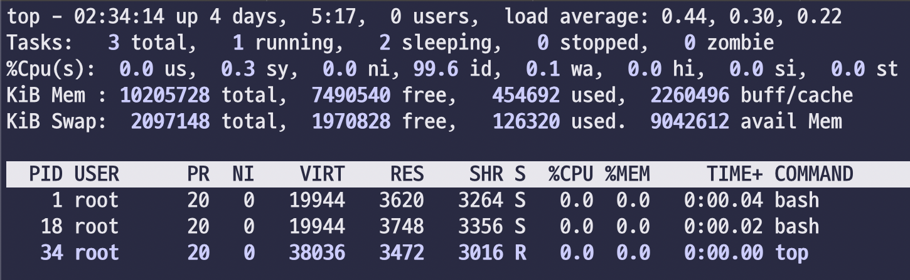

# 1일차. 데이터 엔지니어링 기본

> 전체 과정에서 사용하는 기본적인 명령어(docker, docker-compose)에 대해 실습하고 사용법을 익힙니다.

- 범례
  * :green_book: : 기본, :blue_book: : 중급, :closed_book: : 고급

- 목차
  * [1. 클라우드 장비에 접속](#1-클라우드-장비에-접속)
  * [2. 도커 컴포즈 명령어 실습](#2-Docker-Compose-명령어-실습)
  * [3. Linux 커맨드라인 명령어 실습](#3-Linux-커맨드라인-명령어-실습)
    - [3-1. Linux 기본 명령어](#Linux-기본-명령어)
    - [3-2. Linux 고급 명령어](#Linux-고급-명령어)
  * [4. 참고 자료](#3-참고-자료)
<br>


## 1. 클라우드 장비에 접속

> 개인 별로 할당 받은 `ubuntu@vm[number].aiffelbiz.co.kr` 에 putty 혹은 terminal 을 이용하여 접속합니다


### 1-1. 원격 서버로 접속합니다
```bash
# terminal
# ssh ubuntu@vm001.aiffelbiz.co.kr
# password: ******
```

### 1-2. 패키지 설치 여부를 확인합니다
```bash
docker --version
docker-compose --version
git --version
```

<details><summary> :green_book: [실습] 출력 결과 확인</summary>

> 출력 결과가 오류가 발생하지 않고, 아래와 같다면 성공입니다

```text
Docker version 20.10.6, build 370c289
docker-compose version 1.29.1, build c34c88b2
git version 2.17.1
```

</details>

[목차로 돌아가기](#1일차-데이터-엔지니어링-기본)

<br>
<br>


## 2. Docker Compose 명령어 실습

> 도커 컴포즈는 **도커의 명령어들을 반복적으로 수행되지 않도록 yml 파일로 저장해두고 활용**하기 위해 구성되었고, *여러개의 컴포넌트를 동시에 기동하여, 하나의 네트워크에서 동작하도록 구성*한 것이 특징입니다. 내부 서비스들 간에는 컨테이너 이름으로 통신할 수 있어 테스트 환경을 구성하기에 용이합니다. 
<br>

### 실습을 위한 기본 환경을 가져옵니다

```bash
# terminal
mkdir -p /home/ubuntu/work
cd /home/ubuntu/work
git clone https://github.com/psyoblade/data-engineer-intermediate-training.git
cd /home/ubuntu/work/data-engineer-intermediate-training/day1
```
<br>


### Docker Compose 기본 명령어

> 도커 컴포즈는 **컨테이너를 기동하고 작업의 실행, 종료 등의 명령어**를 주로 다룬다는 것을 알 수 있습니다. 아래에 명시한 커맨드 외에도 도커 수준의 명령어들(pull, create, start, stop, rm)이 존재하지만 잘 사용되지 않으며 일부 deprecated 되어 자주 사용하는 명령어 들로만 소개해 드립니다

<br>


### 2-1. 컴포즈 명령어 옵션

#### 2-1-1. [config](https://docs.docker.com/compose/reference/config/) : 컨테이너 실행 설정을 확인합니다
  - <kbd>-q, --quiet</kbd> : 설정의 정상여부만 확인하고 출력하지 않습니다
```bash
# docker-compose config [options]
docker-compose config
```
<br>

#### 2-1-2. [up](https://docs.docker.com/compose/reference/up/) : `docker-compose.yml` 파일을 이용하여 컨테이너를 이미지 다운로드(pull), 생성(create) 및 시작(start) 시킵니다
  - <kbd>-d, --detach <filename></kbd> : 서비스들을 백그라운드 모드에서 수행합니다
```bash
# docker-compose up [options] <services>
docker-compose up -d
```
<br>

#### 2-1-3. [exec](https://docs.docker.com/compose/reference/exec/) : 컨테이너 내부에서 커맨드를 실행합니다
  - <kbd>-d, --detach</kbd> : 백그라운드 모드에서 실행합니다
  - <kbd>-e, --env `KEY=VAL`</kbd> : 환경변수를 전달합니다
  - <kbd>-u, --user [string]</kbd> : 이용자를 지정합니다
  - <kbd>-w, --workdir [string]</kbd> : 워킹 디렉토리를 지정합니다

```bash
# docker-compose exec [options] [-e KEY=VAL...] [--] SERVICE COMMAND [ARGS...]
docker-compose exec ubuntu echo hello world
```
<br>

#### 2-1-4. [down](https://docs.docker.com/compose/reference/down/) : 컨테이너를 종료 시킵니다
  - <kbd>-t, --timeout [int] <filename></kbd> : 셧다운 타임아웃을 지정하여 무한정 대기(SIGTERM)하지 않고 종료(SIGKILL)합니다 (default: 10초)
```bash
# docker-compose down [options] <services>
docker-compose down
```
<br>

<details><summary> :green_book: [실습] `up -d` 과 down 명령어를 통해 컨테이너를 기동하고, `hello data engineer` 출력 후, 종료해 보세요</summary>

> 출력 결과가 오류가 발생하지 않고, 아래와 같다면 성공입니다

```text
[+] Running 2/2
 ⠿ Container ubuntu Started
 ⠿ Container mysql  Started
```

> 아래와 같은 방법으로 실행할 수 있습니다
```bash
docker-compose up -d
docker-compose exec ubuntu echo hello data engineer
docker-compose down
```

</details>

<br>
<br>


### 2-2. 컴포즈 옵션

<br>

#### 2-2-1. compose options : 반드시 docker-compose 명령어 다음에 입력해야 하는 옵션 
  - <kbd>--file, -f [filename]</kbd> : 별도 yml 파일을 통해 기동시킵니다 (default: `-f docker-compose.yml`)
  - <kbd>--env-file [env-file]</kbd> : 별도 env 파일을 통해 환경변수를 지정합니다l (default: `--env-file .env`)
```bash
# docker-compose [compose options] [command] [command options]
docker-compose -f docker-compose.yml up -d
```
<br>

> [MySQL 서버에 접속](https://dev.mysql.com/doc/refman/8.0/en/connecting.html) 하는 방법

* 로컬 환경에서는 `--host` 정보는 입력하지 않아도 됩니다
```bash
mysql --host=localhost --user=scott --password=tiger default
mysql -hlocalhost -uscott -ptiger default
```
<br>


#### 2-2-2. 접속정보를 별도의 환경변수 파일에 저장하는 방법
> 코드와 동일한 수준에서 형상관리가 되는 docker-compose.yml 파일에 접속정보를 저장하는 것은 위험할 수 있으므로 별도로 관리(ansible 등)하는 경우 `.env` 파일에 저장관리될 수 있습니다

* default 값이 같은 경로에 `.env` 파일로 `KEY=VALUE` 형식으로 저장될 수 있습니다
```bash
# cat .env
MYSQL_ROOT_PASSWORD=root
MYSQL_DATABASE=default
MYSQL_USER=scott
MYSQL_PASSWORD=tiger
```

* `docker-compose.yml` 설정에서 environment 설정은 아래와 같이 변수로 치환됩니다
```yaml
# grep 'environment' -a5 docker-compose.yml
environment:
  MYSQL_ROOT_PASSWORD: $MYSQL_ROOT_PASSWORD
  MYSQL_DATABASE: $MYSQL_DATABASE
  MYSQL_USER: $MYSQL_USER
  MYSQL_PASSWORD: $MYSQL_PASSWORD
```

* 현재 설정된 값을 출력하고 싶다면 `config` 명령으로 확인할 수 있습니다
```bash
$ docker-compose config | more
services:
  mysql:
    container_name: mysql
    environment:
      MYSQL_DATABASE: default
      MYSQL_PASSWORD: tiger
      MYSQL_ROOT_PASSWORD: root
      MYSQL_USER: scott
    healthcheck:
...
```

<details><summary> :green_book: [실습] .env 파일을 env 파일로 생성하고, 패스워드(=pass), 계정정보(=user) 및 데이터베이스(testdb)으로 변경하여 --env-file 옵션으로 config 를 통해 제대로 수정 되었는지 확인해 보세요</summary>

> 아래와 같이 config 결과가 나온다면 정답입니다
```bash
docker-compose --env-file env config | head -15
services:
  mysql:
    container_name: mysql
    environment:
      MYSQL_DATABASE: testdb
      MYSQL_PASSWORD: pass
      MYSQL_ROOT_PASSWORD: root
      MYSQL_USER: user
```

> `env` 파일 
```text
MYSQL_ROOT_PASSWORD=root
MYSQL_DATABASE=testdb
MYSQL_USER=user
MYSQL_PASSWORD=pass
```

> `docker-compose.yml` 파일
```yaml
version: "3"

services:
  mysql:
    container_name: mysql
    image: psyoblade/data-engineer-mysql:1.1
    restart: always
    environment:
      MYSQL_ROOT_PASSWORD: $MYSQL_ROOT_PASSWORD
      MYSQL_DATABASE: $MYSQL_DATABASE
      MYSQL_USER: $MYSQL_USER
      MYSQL_PASSWORD: $MYSQL_PASSWORD
    ports:
      - '3306:3306'
    networks:
      - default
    healthcheck:
      test: ["CMD", "mysqladmin" ,"ping", "-h", "localhost"]
      interval: 3s
      timeout: 1s
      retries: 3
    volumes:
      - ./mysql/etc:/etc/mysql/conf.d

networks:
  default:
    name: default_network
```

> 아래와 같은 방법으로 실행할 수 있습니다

```bash
docker-compose --env-file env config
```

> 기존의 데이터베이스를 종료하고 다시 기동하여 접속합니다

```bash
docker-compose down
docker-compose --env-file env up -d
docker-compose exec mysql mysql -uuser -ppass testdb
```

</details>

<br>
<br>


### 2-3. 기타 명령어

#### 2-3-1. [logs](https://docs.docker.com/compose/reference/logs/) : 컨테이너의 로그를 출력합니다
  - <kbd>-f, --follow</kbd> : 출력로그를 이어서 tailing 합니다
```bash
# terminal
docker-compose up -d mysql
docker-compose logs -f mysql
```
<br>

#### 2-3-2. [pull](https://docs.docker.com/compose/reference/pull/) : 컨테이너의 모든 이미지를 다운로드 받습니다
  - <kbd>-q, --quiet</kbd> : 다운로드 메시지를 출력하지 않습니다 
```bash
# terminal
docker-compose pull
```
<br>

#### 2-3-3. [ps](https://docs.docker.com/compose/reference/ps/) : 컨테이너 들의 상태를 확인합니다
  - <kbd>-a, --all</kbd> : 모든 서비스의 프로세스를 확인합니다
```bash
# terminal
docker-compose ps -a
```
<br>

#### 2-3-4. [cp](https://docs.docker.com/engine/reference/commandline/compose_cp/) : 컴포즈 컨테이너와 파일을 복사합니다
```bash
# docker compose cp [OPTIONS] SERVICE:SRC_PATH DEST_PATH|-
docker-compose cp ./local/path/filename ubuntu:/container/path/filename
```
<br>

#### 2-3-5. [top](https://docs.docker.com/compose/reference/top/) : 컨테이너 내부에 실행되고 있는 프로세스를 출력합니다
```bash
# docker-compose top <services>
docker-compose top
```
<br>

### Bash 스크립트 생성 예제

* 환경변수에 따라 다르게 동작하는 스크립트를 생성합니다
  - `cat > run.sh` <kbd>enter</kbd> 후에 아래 내용을 붙여넣고 <kbd>Ctrl+C</kbd> 하면 파일이 생성됩니다
```bash
#!/bin/bash
if [[ $DEBUG -eq 1 ]]; then
    echo "this is debug mode"
else
    echo "this is release mode"
fi
```

* 아래의 도커 `cp` 명령어로 컨테이너 내부로 스크립트를 복사합니다
```bash
docker cp ./run.sh ubuntu:/run.sh
```

<details><summary> :green_book: [실습] 환경변수 값(DEBUG=1)에 따라 결과가 달라지는 bash 스크립트를 생성 및 실행해 보세요</summary>

> 출력 결과가 오류가 발생하지 않고, 아래와 같다면 성공입니다

```text
$ this is debug mode
```

> 아래와 같은 방법으로 실행할 수 있습니다 (-e 옵션의 위치가 중요합니다)
```bash
docker-compose exec -e DEBUG=0 ubuntu bash run.sh
docker-compose exec -e DEBUG=1 ubuntu bash run.sh
```

</details>


[목차로 돌아가기](#1일차-데이터-엔지니어링-기본)

<br>


## 3. Linux 커맨드라인 명령어 실습

> 리눅스 터미널 환경에서 활용할 수 있는 CLI 도구들을 소개하고 실습합니다. 대부분의 **오픈소스 인프라 및 서비스는 리눅스 서버 환경**에서 운영되며, 장애 혹은 서비스 모니터링 환경에서 디버깅의 가장 기본이 되는 것이 리눅스 커맨드라인 도구들이며, 독립적인 도구들로 하나의 실행파일로 가성비가 가장 높은 효과적인 도구들이기도 합니다


### 환경 구성 및 예제 데이터 다운로드
```bash
# terminal
cd /home/ubuntu/work
git clone https://github.com/psyoblade/linux-for-dummies
cd /home/ubuntu/work/linux-for-dummies
```

### Linux 기본 명령어

### 3-1. 수집 및 탐색

> 수집 및 탐색을 위한 다양한 도구([wget](https://www.gnu.org/software/wget/), [w3m](http://w3m.sourceforge.net/), [lynx](https://invisible-island.net/lynx/))들이 많지만, 하나로 통일해서 사용하는 것이 혼란을 줄일 수 있어, 가장 널리 사용되는 curl 에 대해서만 학습합니다

#### 3-1-1. [curl](https://linuxize.com/post/curl-command-examples/) : URL 을 통해 데이터를 송수신 하는 명령어

  - <kbd>-O</kbd> : 원본 파일명을 그대로 다운로드
  - <kbd>-o</kbd> : 다운로드 파일명을 직접 지정
  - <kbd>-I</kbd> : 헤더를 받아옴 (ex_ --http2)
  - <kbd>-A</kbd> : 유저 에이전트를 지정 (ex_ "Mozilla/5.0...")
  - <kbd>-u</kbd> : FTP 서버에 접속하여 다운로드 (ex_ ftp://ftp.example.com)
  - <kbd>-b</kbd> : 쿠키를 전달함 (ex_ oraclelicense=a)
  - <kbd>-U, --proxy-user</kbd> : 프록시 유저를 지정함
  - <kbd>-x</kbd> : 프록시 서버를 이용함

```bash
# curl [OPTIONS] [URL...]
curl -I --http2 https://www.ubuntu.com/
curl -A "Mozilla/5.0 (X11; Linux x86_64; rv:60.0) Gecko/20100101 Firefox/60.0" https://getfedora.org/
curl -T newfile.tar.gz -u FTP_USERNAME:FTP_PASSWORD ftp://ftp.example.com/
curl -L -b "oraclelicense=a" -O http://download.oracle.com/otn-pub/java/jdk/10.0.2+13/19aef61b38124481863b1413dce1855f/jdk-10.0.2_linux-x64_bin.rpm
curl -U username:password -x 192.168.44.1:8888 http://linux.com/
```

<br>

<details><summary> :green_book: 15. [기본] -o 옵션을 이용하여 `https://cdn.jsdelivr.net/npm/vue/dist/vue.js` 파일을 `vue-v2.6.10.js` 파일로 저장하세요   </summary>

> 출력 결과가 오류가 발생하지 않고, 아래와 유사하다면 성공입니다

```text
curl -o vue-v2.6.10.js https://cdn.jsdelivr.net/npm/vue/dist/vue.js
```

</details>
<br>


### 3-2. 출력 및 확인

#### 3-2-1. cat : 텍스트 파일의 내용을 출력
  - <kbd>-n, --number</kbd> : 라인 번호를 출력
```bash
# cat [OPTION] ... [FILE] ... 
cat -n helloworld.py
```
<br>

#### 3-2-2. more : 텍스트 파일의 일부를 지속적으로 출력

  - <kbd>-p</kbd> : 화면을 지우고 위에서부터 출력합니다
  - <kbd>-s</kbd> : 여러 줄의 빈 라인을 하나의 빈 라인으로 대체합니다
  - <kbd>-number</kbd> : 한 번에 출력하는 라인 수를 지정합니다
  - <kbd>+number</kbd> : 지정된 라인 부터 출력합니다
  - <kbd>+/string</kbd> : 지정된 문자열을 찾은 라인부터 출력합니다

```bash
# more [OPTIONS] ... [FILE] ... 
more -5 data/apache-access.log
```
> more 명령어는 <kbd>Q</kbd> 키를 통해서 빠져나올 수 있습니다

<details><summary> :green_book: 16. [기본] data/hadoop-hdfs-secondarynamenode.log 파일에서 exception 문자열이 발견된 위치부터 10줄씩 출력하세요 </summary>

> 출력 결과가 오류가 발생하지 않고, 아래와 유사하다면 성공입니다

```bash
more +/Exception -10 data/hadoop-hdfs-secondarynamenode.log
```

</details>
<br>

#### 3-2-3. head : 텍스트 파일의 처음부터 일부를 출력

  - <kbd>-c, --bytes=[-]NUM</kbd> : 첫 번째 NUM bytes 크기 만큼 출력하되, NUM 이 음수인 경우는 마지막 NUM bytes 를 제외한 전체를 출력합니다
    - `b: 512, kB 1000, K 1024, MB 1000*1000, M 1024*1024, GB 1000*1000*1000, G 1024*1024*1024, T, P, E, Z, Y`.
  - <kbd>-n, --lines=[-]NUM</kbd> : 파일의 처음부터 NUM 라인 수만큼 출력하고, 마찬가지로 음수 NUM 은 마지막 NUM 라인을 제외한 전체를 출력합니다
```bash
# head [OPTION] ... [FILE] ... 
head -c 1K data/apache-access.log > 1k.log
```
> 로그의 처음부터 1024 bytes 만큼 읽어서 파일을 생성합니다

<details><summary> :green_book: 17. [기본] data/apache-access.log 로그의 첫 번째 30라인만 출력하세요</summary>

```bash
head -n 30 data/apache-access.log
```

</details>
<br>

#### 3-2-4. tail : 텍스트 파일의 마지막부터 일부를 출력

  - <kbd>-c, --bytes=[+]NUM</kbd> : 첫 번째 NUM bytes 크기 만큼 출력하되, NUM 이 양수인 경우는 처음 NUM bytes 를 제외한 전체를 출력합니다
    - `b: 512, kB 1000, K 1024, MB 1000*1000, M 1024*1024, GB 1000*1000*1000, G 1024*1024*1024, T, P, E, Z, Y`.
  - <kbd>-f, --follow</kbd> : 파일에 추가되는 내용을 계속 출력합니다
  - <kbd>-F</kbd> : 파일이 접근되지 않는 경우에도 계속 재시도 합니다 (-f --retry 와 같은 효과)
  - <kbd>-n, --lines=[+]NUM</kbd> : 파일의 끝에서 NUM 라인 수만큼 출력하고, 마찬가지로 양수 NUM 은 처음 NUM 라인을 제외한 전체를 출력합니다
```bash
# tail [OPTION] ... [FILE] ...
tail -n 30 data/apache-access.log
```
> 로그의 마지막 30라인만 출력합니다

<details><summary> :green_book: 18. [기본] noexists.log 로그가 없어도 계속 tail 하고 해당 파일에 로그가 추가되면 계속 tailing 하는 명령을 수행하세요
</summary>

```bash
tail -F data/notexist.log
```
```bash
# 별도의 터미널에서 아래와 같이 파일생성 후 append 합니다
cd /home/ubuntu/work/linux-for-dummies
touch data/notexist.log
echo "hello world" >> data/notexist.log
```

</details>

[목차로 돌아가기](#1일차-데이터-엔지니어링-기본)

<br>


### Linux 고급 명령어

### 3-3. 계산 및 정렬

#### 3-3-1. wc : 텍스트 파일의 단어의 수를 계산합니다

  - <kbd>-c, --bytes</kbd> : 파일의 바이트 수를 출력합니다
  - <kbd>-m, --chars</kbd> : 파일의 문자열의 수를 출력합니다
  - <kbd>-l, --lines</kbd> : 파일의 라인 수를 출력합니다
  - <kbd>-w, --words</kbd> : 파일의 워드의 수를 출력합니다
```bash
# wc [OPTION] ... [FILE] ...
wc -l data/apache-access.log
wc -l data/*
```
> 개별 파일의 라인수와 전체 라인수를 출력합니다

<details><summary> :green_book: 19. [기본] data/apache-access.log 로그에 포함된 단어의 수를 출력하세요</summary>

```bash
wc -w data/apache-access.log
```

</details>
<br>


#### 3-3-2. nl : 라인 수를 계산합니다

  - <kbd>-b, --body-numbering=STYLE</kbd> : 라인 수를 출력합니다
  - <kbd>-n, --number-format=FORMAT</kbd> : 포맷을 지정하여 라인 수를 출력합니다
    - `ln : 좌측 정렬, rn : 우측 정렬,  rz : 0을 패딩 후 출력`
  - <kbd>-s, --number-separator=STRING</kbd> : 라인 수와 내용을 구분자로 분리하여 출력합니다

```bash
# nl [OPTION] ... [FILE] ...
nl data/apache-access.log
```
<br>

* head 출력 결과에 대해 라인 수를 출력합니다
```bash
head data/apache-access.log | nl
```
<br>

* 000123,<line> 와 같이 구분자를 넣어 출력합니다
```bash
nl -s ',<tab>' data/apache-access.log
```
<br>

<details><summary> :blue_book: 20. [중급] data/apache-access.log '000123' 과 같이 0을 패딩 후 출력하세요</summary>

```bash
head data/apache-access.log | nl -n rz 
```

</details>
<br>


#### 3-3-3. sort : 데이터를 정렬합니다

  - <kbd>-d, --dictionary-order</kbd> : 사전에 표기된 순서대로 정렬 즉, 공백, 알파벳 및 숫자 순으로 정렬
  - <kbd>-f, --ignore-case</kbd> : 대소문자를 구분하지 않고 정렬
  - <kbd>-n, --numeric-sort</kbd> : 숫자로 인식하여 정렬
  - <kbd>-R, --random-sort</kbd> : 랜덤 순서대로 정렬
  - <kbd>-r, --reverse</kbd> : 역순으로 정렬
  - <kbd>--debug</kbd> : 정렬 기준에 대해 디버깅 정보를 같이 출력
  - <kbd>-k, --key=KEYDEF</kbd> : 구분자 (SEP)에 의해 구분된 컬럼 (KEYDEF)을 기준으로 정렬 (ex order by k1, k2)
    - `KEYDEF -> F[.C][OPTS][,F[.C][OPTS]], OPTS -> [bdfgiMhnRrV]`
  - <kbd>-t, --field-separator=SEP</kbd> : 구분자에 의해 컬럼을 구분
  - <kbd>-u, --unique</kbd> : 동일한 라인이 여러개 등장하는 경우 첫 번째 라인만 출력합니다

* 컬럼에 대한 정보는 데이터 컬럼 -> 1:국가, 2:확진자, 3:사망자
```bash
# sort [OPTION] ... [FILE] ...
cat data/corona.body.tsv | sed 's/,//g' | cut --output-delimiter=',' -f1,2,3 | sort -t, -k3nr | head     # 사망자 톱 10
```

<details><summary> :closed_book: 21. [고급] 확진자 톱 10을 구하세요 </summary>

```bash
cat data/corona.body.tsv | sed 's/,//g' | sed 's/N\/A/0.0/g' | cut --output-delimiter=',' -f1,2,3 | sort -t, -k2nr | head     # 확진자 톱 10
```

</details>
<br>


#### 최신 데이터를 통한 실습 

> 최근에 업데이트(2021.07.24) 된 [코로나 정보를 업데이트](https://coronaboard.kr/)한 파일을 `data/corona.2021.body.tsv` 에 저장되어 있습니다. 하지만 몇 가지 변경 사항이 있는데 그러한 내용을 고려하여 결과를 출력해 주세요

* 요구사항
  - 이번에는 제일 처음 컬럼에 번호가 있어 컬럼의 순서가 다르며 `data/corona.2021.header.tsv` 파일을 통해 확인할 수 있습니다
  - 데이터 값 가운데 `N/A` 으로 명시된 값들을 `0` 으로 변경하여 처리할 수 있도록 해주세요

<details><summary> :closed_book: 22. [고급] 사망자/확진자 톱 10을 구하세요 </summary>

* 출력 컬럼 기준이 1:국가,2:확진자,3:사망자,4:완치 (-f2,3,4,5) 이므로 사망자(3), 확진자(2)
```bash
# 사망자 많은 순서
cat data/corona.2021.body.tsv | sed 's/,//g' | sed 's/N\/A/0.0/g' | cut --output-delimiter=',' -f2,3,4,5 | sort -t, -k3nr | head
```
```bash
# 확진자 많은 순서
cat data/corona.2021.body.tsv | sed 's/,//g' | sed 's/N\/A/0.0/g' | cut --output-delimiter=',' -f2,3,4,5 | sort -t, -k2nr | head
```

</details>
<br>


#### 3-3-4. uniq : 유일한 값을 추출합니다

  - <kbd>-c, --count</kbd> : 중복 횟수와 라인을 같이 출력 합니다
  - <kbd>-d, --repeated</kbd> : 중복이 발생한 라인만 출력하되, 같은 문장은 한 번만 출력합니다
  - <kbd>-D</kbd> : 중복된 모든 라인을 출력합니다
  - <kbd>-i --ignore-case</kbd> : 대소문자 구분을 하지 않고 중복 여부를 판단합니다
  - <kbd>-u, --unique</kbd> : 중복되지 않은 유일한 라인만 출력합니다
```bash
# uniq [OPTION] ... [INPUT [OUTPUT]] ...
cat /etc/passwd | cut -d: -f4 | sort | uniq -d    # 패스워드 파일에서 중복 그룹만 출력합니다
```
<br>


### 3-4. 변환 및 기타

#### 3-4-1. cut : 데이터를 구분자로 잘라서 출력합니다

  - <kbd>-b, --bytes=LIST	</kbd> : 지정한 바이트 수 만큼의 컬럼 값들을 출력합니다
    - `N` : 첫 번째 컬럼을 1로 계산하여 N 번째 바이트만 출력 
    - `N-` : N번째 바이트 부터 라인 끝까지 출력  
    - `N-M` : N~M 바이트까지 출력 
    - `-M` : 라인 처음부터 M 바이트까지 출력 
  - <kbd>-d, --delimiter=DELIM</kbd> :	기본 구분자 TAB 대신 지정한 문자를 구분자로 동작합니다
  - <kbd>-f, --fields=LIST</kbd> :	구분자를 기준으로 컬럼을 지정하여 지정된 컬럼만 출력합니다
  - <kbd>--complement</kbd> :	선택한 조건의 컬럼을 제외한 나머지를 출력합니다
  - <kbd>--output-delimiter=STRING</kbd> : 출력시에 사용할 구분자를 지정합니다

* 탭으로 구분된 라인들의 2번째 컬럼만 출력합니다
```bash
# cut OPTION ... [FILE] ...
# cut -f2 filename
```

```bash
# terminal ':'으로 구분된 컬럼을 '#'으로 구분하여 출력합니다
cat /etc/passwd | cut -f1- -d':' --output-delimiter='#'
```

```bash
# terminal : ls -al 결과의 앞 10바이트를 제외한 나머지 컬럼 들만 출력합니다
ls -al | cut -b -10 --complement
```
<br>


* /etc/passwd 파일구성
  - `root:x:0:0:root:/root:/bin/bash`
  - 계정명 : 비밀번호 : 사용자UID : 그룹UID : 사용자정보 : 홈디렉토리 : 로그인쉘

<details><summary> :blue_book: 23. [중급] 패스워드 파일에서 로그인 쉘 가운데 가장 빈도가 높은 3개를 찾아보세요</summary>

```bash
cat /etc/passwd | cut -d: -f7 | sort | uniq -c | sort -nr | head -3
```

</details>
<br>


#### 3-4-2. tr : 데이터를 변환하여 출력합니다

  - <kbd>-c, --complement</kbd> : SET1 에 지정한 범위 외의 문자를 선택합니다
  - <kbd>-d, --delete</kbd> : SET1 에 지정한 범위 외의 문자를 삭제합니다 (단, 변환은 -d 옵션이 없을 경우에만 발생합니다)
    - `CHAR1-CHAR2` : CHAR1 부터 CHAR2 까지를 선택합니다 (ex_ a-z)
    - `[:alnum:]` : 알파벳 + 숫자
    - `[:alpha:]` : 알파벳
    - `[:blank:]` : 공백
    - `[:space:]` : 공백 + 줄바꿈
    - `[:lower:]` / `[:upper:]` : 소문자 / 대문자

```bash
# terminal : 패스워드 파일의 구분자 콜론을 공백으로 치환합니다
# tr [OPTION] ... SET1 [SET2]
head /etc/passwd | tr ':' ' '
```

```bash
# terminal : ls -al 결과의 한 줄의 문자열로 출력합니다
# tr [OPTION] ... SET1 [SET2]
ls -al | tr -d [:space:]
```

<details><summary> :blue_book: 24. [중급] 패스워드 파일의 계정 이름만 대문자로 출력하세요</summary>

```bash
head /etc/passwd | cut -d : -f 1 | tr [:lower:] [:upper:]
```

</details>
<br>


#### 3-4-3. sed : 반환 데이터를 정규실에 맞추어 변경 및 출력합니다

  - <kbd>-n, --quiet, --silent</kbd> : 패턴에 만족하는 기본 출력을 하지 않습니다
  - <kbd>-i[SUFFIX], --in-place[=SUFFIX]</kbd> : 파일을 직접 수정합니다. SUFFIX 가 주어진 경우는 백업 파일을 생성해 둡니다
  - <kbd>-E, -r, --regexp-extended</kbd> : SET1 에 지정한 범위 외의 문자를 삭제합니다 (단, 변환은 -d 옵션이 없을 경우에만 발생합니다)
    - `{RANGE}p` : range 내의 라인을 출력합니다 (단, 패턴에 만족하는 출력까지 포함하면 2번 출력될 수 있습니다)
    - `{RANGE}d` : range 내의 라인을 삭제합니다
    - `/pattern/p` : pattern 에 만족하는 라인을 출력합니다
    - `/pattern/d` : pattern 에 만족하는 라인을 제거합니다
    - `s/pattern/replaced/g` : pattern 에 만족하는 부분을 replaced 로 교체합니다

```bash
# sed [OPTION] ... {script-only-if-no-other-script} [FILE]
# sed 's/before/after/g' -i\.bak sed_text     # 파일의 before 를 after 로 모두 치환하고 원본 파일을 .bak 파일로 저장합니다
sed -n '3,5p' /etc/passwd                     # 패스워드 파일의 3~5번째 줄을 출력합니다
```

<details><summary> :closed_book: 25. [고급] 예제 패스워드 파일(/example/passwd)을 읽어서 nobody 계정을 찾고, somebody 로 변경하세요</summary>

```bash
sed -i 's/nobody/somebody/g' example/passwd
```

</details>
<br>


#### 3-4-4. awk : 데이터를 변환하여 출력합니다

  - <kbd>-F</kbd> : 필드 구분자
  - <kbd>-f</kbd> : 입력 파일 명을 지정합니다 (-f 옵션을 여러번 사용할 수 있습니다)
  - <kbd>-v VAR=VALUE</kbd> : 변수(VAR)를 할당(VALUE)하여 사용할 수 있습니다
  - <kbd>pattern { action }</kbd> : 
    - `NR (Number of Records)` : 레코드 수
    - `NF (Number of Fields)` : 필드 수
    - `FS (Field Separator, default: 공백)` : 필드 구분자
    - `RS (Record Separator, default: 줄바꿈)` : 레코드 구분자
    - `OFS (Output Field Separator)` : 출력시 필드 구분자
    - `ORS (Output Record Separator)` : 출력시 레코드 구분자

* 패스워드 파일을 읽어서 레코드 수와 아이디를 출력합니다
```bash
# awk [-W OPTION] [-F VALUE] [-v VAR=VALUE] [--] 'PATTERN { ACTION }' [FILE ...]
# awk '{$7 = $1 * $3 ; print $3, $1, "*", $2, "=", $1 * $2}' address  # 주소록에서 1번 숫자와 2번 숫자의 곱과 3번째 컬럼을 출력합니다
awk -F: '{ print NR, $1 }' /etc/passwd
```

* 패스워드 파일의 root 문자가 존재하는 라인을 출력합니다
```bash
awk '/root/ { print $0 }' /etc/passwd
```
<br>


* `/etc/passwd` 파일구성
  - 파일포맷 : `root:x:0:0:root:/root:/bin/bash`
  - 계정이름 : 비밀번호 : 사용자UID : 그룹UID : 사용자정보 : 홈디렉토리 : 로그인쉘

<details><summary> :blue_book: 26. [중급] /etc 경로에 존재하는 파일의 user 와 group 의 유일한(uniq) 값만 출력하세요</summary>

```bash
ls -l /etc | awk '{ print $3, $4 }' | sort | uniq
```

</details>
<br>

#### 3-4-5. rsync : 소스경로와 타겟 경로를 동기화 합니다

> 데이터를 백업하거나 원격지에 파일 전송 시에 주로 사용합니다

  - <kbd>-v, --verbose</kbd> : 상세하게 내용을 출력합니다
  - <kbd>-q, --quiet</kbd> : 에러가 아닌 메시지 출력을 하지 않습니다
  - <kbd>-a, --archive</kbd> : symlink, permission, group, owner 등을 완전히 동일하게 유지합니다
  - <kbd>-r, --recursive</kbd> : 디렉토리 하위까지 재귀적으로 복사합니다
  - <kbd>-u, --update</kbd> : 새로운 파일 들만 복사합니다
  - <kbd>-n, --dry-run</kbd> : 실제 복사가 이루어지지 않고 복사될 파일 목록을 체크합니다
  - <kbd>-z, --compress</kbd> : 전송 시에 압축하여 전송합니다
  - <kbd>-F, --exclude=PATTERN</kbd> : PATTERN에 해당하는 파일을 제외하고 복사합니다
  - <kbd>    --include=PATTERN</kbd> : PATTERN에 해당하는 파일만 복사합니다

```bash
# rsync [OPTION ...] SRC ... [DEST]
# apt-get install ssh rsync                               # 기본 패키지에 포함되어 있지 않으므로 ssh 및 rsync 는 별도로 설치되어야 합니다
# rsync -av ./data ubuntu@hostname:/home/ubuntu/archive   # 같은 네트워크의 원격지 ubuntu 계정의 archive 경로에 현재 data 경로 전체를 백업합니다
# rsync --dry-run -rave "ssh -i ~/.ssh/personal.pem" ubuntu@ec2.amazonaws.com:/home/ubuntu/data .    # EC2 장비의 data 경로를 로컬에 복사합니다
```

<details><summary> :closed_book: 27. [고급] /tmp/backup 경로를 생성하고 linux-for-dummies 폴더 전체를 백업하세요 </summary>

```bash
cd /home/ubuntu/work/linux-for-dummies
pwd
mkdir -p /tmp/backup
rsync -av . /tmp/backup
```

</details>
<br>


### 3-5. 운영 도구

> 프로세스 및 리소스 확인을 위한 명령어(ps, top)

#### 3-5-1. [ps](https://man7.org/linux/man-pages/man1/ps.1.html) : 현재 수행중인 프로세스의 상태를 출력하는 명령어

> 실행 중인 프로세스의 상태를 출력합니다

  - <kbd>-e, -A</kbd> : 실행 중인 모든 프로세스를 확인
  - <kbd>-a</kbd> : 터미널을 제외한 프로세스만 출력
  - <kbd>-f</kbd> : 모든 포맷을 출력 (UID PID PPID ... CMD)
  - <kbd>-o</kbd> : 출력 컬럼을 지정
  - <kbd>-p</kbd> : PID 로 필터하여 출력 (ex_ `ps -fp 1234`)
  - <kbd>-u</kbd> : 특정 이용자 이름으로 출력, 입력하지 않으면 현재 이용자 (ex_ `ps -u root`)
  - <kbd>-ww</kbd> : 프로세스 실행 명령이 잘리지 않고 모두 출력됩니다
  - <kbd>-x</kbd> : 현재 tty 와 연관되지 않은 모든 프로세스까지도 출력 (터미널이 끊어져도 보이는 데몬 프로세스 등)
  - <kbd>-C</kbd> : 프로세스 이름으로 PID 찾기 (ex_ `ps -C run.sh`)
  - <kbd>-L</kbd> : 쓰레드 까지 출력 (ex_ `ps -p 1234 -L`)
  - <kbd>-T</kbd> : 터미널과 관련있는 프로세스만 출력
  - <kbd>--forest</kbd> : 명령어 계층을 트리 형태로 출력 (ex_ `ps -f --forest`)
  - <kbd>au, aux</kbd> : BSD 포맷으로 출력 (USER PID ... COMMAND)

* 목록 키워드 설명 

| 키 | 값 | 설명 |
| --- | --- | --- |
| PID | 프로세스 ID | 프로세스를 유일한 양수인 정수 |
| PPID | 부모 프로세스 ID | 프로세스를 유일한 양수인 정수 |
| %CPU | CPU 사용 비율 추정치 | - |
| %MEM | MEM 사용 비율 추정치 | - |
| STIME | 프로세스가 시작된 시간 혹은 날짜 | - |
| VSZ | K단위 또는 페이지 단위 가상 메모리 사용량 | - |
| RSS | 실제 메모리 사용량 | - |
| TTY | 터미널의 접속 TTY 정보 | who, write, tty |
| S, STAT | 터미널의 상태 코드 | - |
| TIME | 프로세스가 실행된 이후 지나간 시간 | |
| COMMAND | 실행 프로세스의 이름 | - | 

* [tty](https://www.howtogeek.com/428174/what-is-a-tty-on-linux-and-how-to-use-the-tty-command/)는 `teletypewriter` 의 약자로써 원격지의 장비에 메시지를 보내는 `teleprinters` 에서 시작했으며, 발전하여 다양한 문자과 부호까지 전송이 가능하게 되었으며, 현대 리눅스에서는 모든 접속된 터미널 윈도우와 `pseudo-teletypes(pts)`를 가지게 되며 하나의 장치로 인식되어 `/dev/pts/0`와 같은 파일로 존재하게 되며 `tty`명령으로 확인할 수 있습니다
  - `multiplexer` 가 master 역할이며 pts 들은 slave 가 됩니다 (master: `/dev/ptmx`)

```bash
# terminal : 로그인 유저의 모든 프로세스를 출력
# ps [options]
ps -aufxww
```

<br>

<details><summary> :closed_book: 28. [고급] 프로세스가 시작된 정확한 시간(lstart 컬럼)을 출력하세요  </summary>

* 아래와 유사하게 실행했다면 정답입니다 
```bash
# terminal
ps -eo pid,lstart,cmd
```

</details>

<br>


#### 3-5-2. [top](https://www.booleanworld.com/guide-linux-top-command/) : 리눅스 시스템의 프로세스와 리소스의 사용량을 확인하는 명령어

> `ps` 명령과는 다르게 interactive 한 인터페이스를 가지며, 프로세스를 모니터링 및 관리할 수 있으며 <kbd>q</kbd> 입력으로 종료할 수 있습니다



  - <kbd>top</kbd> : 현재 시간 (3초)
  - <kbd>up</kbd> : 장비가 기동된 시간
  - <kbd>users</kbd> : 접속한 활성화 이용자 (tty)
  - <kbd>load average</kbd> : 1, 5, 15 분간의 평균 부하(load)를 말합니다
    - `load` 는 시스템이 수행하는 계산작업의 양을 측정하는 기준
    - 1 core 장비의 load average 가 0.4 는 40%를 1.0 이라면 100%를 2.12 는 수행 가능한 처리량 보다 112% 더 많은 작업을 수행하고 있다고 말할 수 있습니다
  - <kbd>tasks</kbd> : 전체 프로세스의 수(total)와 다양한 상태의 프로세스의 수를 나타냅니다 (running, sleeping, stopped, zombie)
  - <kbd>cpu(s)</kbd> : CPU 의 상태
    - 동작상태(`us`:userspace, `sy`:kernelspace, `ni`: nicer to other processes, `id`: idle status, `wa`: I/O wait time)별 프로세스 정보
    - 인터럽트(즉각적인 주의가 필요한 이벤트) 상태(`hi`:hardware-interrupt, `si`:software-interrupt)별 프로세스 정보
    - 가상화 환경에서 다른 VM 에 CPU가 사용되고 있어, 수행하지 못하여 손실된 시간을 (`st`: steal) 표현합니다
  - <kbd>memory</kbd> : 메모리 (Mem/Swap) 상태, 디스크 버퍼와 캐시(buff/cache) 상태

<br>

* 목록 키워드 설명 

| 키 | 값 | 설명 |
| --- | --- | --- |
| PID | 프로세스 ID | 프로세스를 유일한 양수인 정수 |
| USER | 프로세스를 기동한 이용자 이름 | su(substitute user)를 통한 접근도 실제 이용자를 표현합니다 |
| PR and NI | NI 는 프로세스의 "nice" 값을 말하고, PR 은 스케줄링 우선순위를 말합니다 | nice 값이 우선순위에 영향을 줍니다 |
| VIRT | 프로세스에 의해 사용되는 총 메모리의 양 | disk swap 을 포함한 메모리 양, Virtual Memory Usage |
| RES | 실제로 사용하는 메모리의 양 | Resident Memory Usage |
| SHR | 다른 프로세스와 공유하고 있는 메모리의 양 | Shared Memory Usage |
| %MEM | 총 메모리에서 차지하고 있는 비중을 말합니다 | - |
| S | 프로세스의 상태를 한 문자로 표현합니다 | Running, Sleeping, Stopped, Zombie |
| TIME+ | 해당 작업에 의해 사용된 총 CPU 시간을 말합니다 | CPU 시간으로 정확히 100분의 1초입니다 |
| COMMAND | 실행 프로세스의 이름 | - | 

<br>

* 단축키 설명 (대소문자 구분)

| 단축키 | 값 | 설명 |
| --- | --- | --- |
| 1 | 모든 CPU 를 출력 합니다 | - |
| d | 출력 지연시간을 조정합니다 | 기본은 3초 |
| f | 출력 컬럼을 선택합니다 | 스페이스바로 선택하고 `q`로 나오면 적용됩니다 |
| i | 대기중(idle) 프로세스 출력을 토글합니다 | - |
| k | 프로세스 종료 | PID 를 입력을 통해 SIGTERM(15) 을 보내며, SIGKILL(9)전송도 가능합니다 |
| o | 조건 입력으로 필터 | PID=0, USER=root, VIRT>30000 등의 포맷으로 입력하고, 필터 제거는 `=`키를 사용합니다 | 
| t | 화면 출력 방식을 변경합니다 | - |
| M | 메모리 사용량 기준 정렬 | - |
| N | process ID 기준 정렬 | - |
| P | CPU 사용량 기준 정렬 | - |
| R | 정렬 순서 변경 | - |
| T | running time 기준 정렬 | - |
| V | 트리 형태로 표현 | bash -> run.sh -> python -> sleep |

<br>

* 입력 옵션 기능

| 명령어 | 값 | 설명 |
| --- | --- | --- |
| top -c | 실행 명령의 전체 경로를 표현 | - |
| top -p <pid> | 특정 프로세스만 표현 | - |
| top -u root | 특정 이용자의 프로세스만 표현 | - |
| top -H | 스레드까지 표현 | - |

<br>

* root 이용자가 수행한 프로세스 PID 1234 의 프로세스 전체 명령어와 스레드까지 출력
  - `dockerd` 프로세스의 PID 를 확인하고 테스트 해보세요
```bash
# terminal
top -p <dockerd의 PID>
top -p <dockerd의 PID> -H
top -p <dockerd의 PID> -c
top -u ubuntu
top -u root
```
<br>

<details><summary> :blue_book: 29. [중급] `dockerd` 프로세스의 PID 를 확인하고, `-H`, `-c`, `-u` 옵션을 이용하여 top 명령어를 수행하세요 </summary>

* 아래와 유사하게 수행했다면 정답입니다
```bash
# terminal
PID=`ps -e | grep dockerd | awk '{ print $1 }'`
top -p $PID
top -p $PID -H
top -p $PID -c
top -u ubuntu
top -u root
```

</details>


<br>


#### 3-5-3. [find](https://man7.org/linux/man-pages/man1/find.1.html) : 파일을 찾는 명령어

> 이름 혹은 상태를 조건으로 원하는 파일을 찾는 명령입니다

  - <kbd>-name [expression]</kbd> : 파일명을 기준으로 찾기
  - <kbd>-iname [expression]</kbd> : 대소문자 구분없이 찾기
  - <kbd>-type d</kbd> : 디렉토리 타입만 찾기
  - <kbd>-type f</kbd> : 파일 타입만 찾기
  - <kbd>-perm [expression]</kbd> : 퍼미션에 해당하는 파일 찾기 (ex_ `find . -perm 777`)
  - <kbd>-exec [command] {} \;</kbd> : 찾아낸 파일에 대해 명령어 적용하기 (ex_ `find . -name "*.mp3" -exec rm -f {} \;`)
  - <kbd>-empty</kbd> : 빈 파일/디렉토리 찾기
  - <kbd>-user [username]</kbd> : 특정 유저 권한의 파일 찾기
  - <kbd>-ctime [days]</kbd> : 지정된 일자 이내에 변경된 파일 찾기 (change = {owner, mod} ex_ `chmod, chown`)
  - <kbd>-mtime [days]</kbd> : 지정된 일자 이내에 수정된 파일 찾기 (modified = {write, append}, ex_ `vi`)
  - <kbd>-atime [days]</kbd> : 지정된 일자 이내에 접근된 파일 찾기 (access = {read, view}, ex_ `cat, more`)
  - <kbd>-cmin [minutes]</kbd> : 지정된 시간 이내에 변경된 파일 찾기
  - <kbd>-mmin [minutes]</kbd> : 지정된 시간 이내에 수정된 파일 찾기
  - <kbd>-amin [minutes]</kbd> : 지정된 시간 이내에 접근된 파일 찾기
  - <kbd>-size [size]</kbd> : 지정된 파일 크기의 파일 찾기 (ex_ -size +50M -size -100M, 50~100MB 파일)

<br>

```bash
# terminal
# find [-H] [-L] [-P] [-D debugopts] [-Olevel] [starting-point...] [expression]
find . -name name_generator.py
find /root -name .profile
find / -type d -perm 777 -print -exec chmod 755 {} \;
find . -name "*.mp3" -exec rm -f {} \;
find /tmp -type f -empty
find /tmp -type d -empty
find / -user root -name "*.txt"
find / -type -f -size +100M -exec rm -f {} \;
```
<br>

<details><summary> :blue_book: 30. [중급] `/etc` 경로 아래에 `*.conf` 파일의 갯수가 몇 개인지 출력하세요 </summary>

> 출력 결과가 오류가 발생하지 않고, 아래와 유사하며, 대략 123개 정도면 정답입니다

```text
sudo find /etc -name "*.conf" | wc -l
```

</details>
<br>


#### 3-5-4. [df](https://man7.org/linux/man-pages/man1/df.1p.html) : 비어있는 디스크의 공간을 확인

> 현재 마운트된 모든 파일시스템의 디스크 여유 공간을 확인합니다

  - <kbd>-h</kbd> : 읽기 쉬운 포맷으로 출력 (ex_ 1.4G)
  - <kbd>-i</kbd> : 디스크 블록 대신 inode 정보를 출력
  - <kbd>-l</kbd> : 로컬 디스크 블록만 출력
  - <kbd>-T, --print-type</kbd> : 디스크의 타입을 출력
  - <kbd>--total</kbd> : 전체 디스크의 공간의 합을 같이 출력

```bash
# terminal
# df [OPTION]...[FILE]...
df -h
df -i
df -T
df --total
```

<br>


#### 3-5-5. [du](https://man7.org/linux/man-pages/man1/du.1p.html) : 디스크의 사용 공간을 확인

> 현재 사용하고 있는 디스크의 양을 확인합니다

  - <kbd>-d [depth]</kbd> : 하위 경로의 깊이를 지정 (-d 0는 -s 와 동일한 효과)
  - <kbd>-h</kbd> : 읽기 쉬운 포맷으로 출력 (ex_ 1.4G)
  - <kbd>-s</kbd> : 디렉토리 별 사용량을 모두 더해서 출력
  - <kbd>-S</kbd> : 하위 디렉토리 사용량을 *제외하고* 출력
  - <kbd>--exclude [pattern]</kbd> : 패턴에 해당하는 파일은 제외하고 계산

```bash
# terminal
# du [OPTIONS] [FILE or DIRECTORY NAME]
# du -d 1 --exclude=wordpress /root
du -sh .
```
<br>


#### 3-5-6. [sar](https://linuxhint.com/sar_linux_tutorial/) : 시스템 활동 리포트 (System Activity Report)

> 별도로 설치해야 하는 도구이며 `sysstat` 설치를 통해 사용할 수 있습니다

```bash
# terminal
sudo apt install sysstat -y
```

  - <kbd>-b</kbd> : 모든 I/O 관련된 상태를 확인
  - <kbd>-d</kbd> : 디스크의 상태를 확인
  - <kbd>-r</kbd> : 메모리 상태를 확인
  - <kbd>-u ALL</kbd> : CPU 상태를 확인
  - <kbd>-w</kbd> : 컨텍스트 스위칭 상태를 확인
  - <kbd>-B</kbd> : 페이징 상태를 확인
  - <kbd>-S</kbd> : 스왑 상태를 확인

```bash
# sar [options] [interval] [times]
sar -b 1 5
sar -r 1 5
sar -S 1 5
```

<br>


#### 3-5-7. [iostat](https://man7.org/linux/man-pages/man1/iostat.1.html) : I/O 통계 정보 확인 도구

> 별도로 설치해야 하는 도구이며 `sysstat` 패키지에 포함 되어 있습니다. 통계정보를 요약된 화면에서 출력해주기 때문에 최근 상태를 좀 더 직관적으로 이해할 수 있습니다

  - <kbd>-x</kbd> : 좀 더 상세한 리포트 출력
  - <kbd>-c</kbd> : CPU 통계 출력
  - <kbd>-d</kbd> : 장치 통계 출력
  - <kbd>-k [interval] [times]</kbd> : 인터벌과 횟수를 지정하여 측정
  - <kbd>-p</kbd> : 디스크 통계 출력

<br>

* `iostat - first` 통계 설명 

| 키 | 값 | 설명 |
| --- | --- | --- |
| %user | 이용자 수준의 CPU 사용율 | |
| %nice | nice priority 를 적용한 이용자 레벨의 CPU 사용 | |
| %system | 시스템(kernel) 수준의 CPU 사용율 | |
| %iowait | 디스크 I/O 에 의해 CPU 가 대기하는 비율 | |
| %steal | 다른 가상 프로세스를 Hypervisor 에의해 지원되어 가상의 CPU 대기 시간 | |
| %idle | CPU 가 idle 상태인 시간 비율 | |

* `iostat - second` 통계 설명 

| 키 | 값 | 설명 |
| --- | --- | --- |
| Device | 장치나 파티션 정보 | |
| tps | 초당 장치에서 발생하는 전송 횟수 | tps 가 높을 수록 프로세서가 바쁘다는 의미 | 
| Blk\_read/s | 초당 장치에서 읽는 블록(kb, mb)의 양을 말합니다 | |
| Blk\_wrtn/s | 초당 장치에서 쓰는 블록(kb, mb)의 양을 말합니다 | |
| Blk\_read | 총 읽은 블록의 수 | |
| Blk\_wrtn | 총 쓴 블록의 수 | |

<br>

* `iostat` 은 아래의 경로에 있는 파일을 참고하여 통계 리포트를 생성합니다
  - /proc/stat : 시스템 통계 
  - /proc/uptime : 시스템 uptime
  - /proc/diskstats : 디스크 통계 
  - /sys : 블록 장치들의 통계 
  - /proc/self/mountstats : 네트워크 파일 시스템의 통계
  - /dev/disk : 로컬 디스크 장치의 정보

```bash
# terminal
# iostat [options]
iostat -k 1 5
```
<br>


#### 3-5-8. [netstat](http://www.skrenta.com/rt/man/netstat.8.html) : 네트워크 통계를 출력합니다

> 현재 장비에 연결된 접속 혹은 서버의 소켓 상태를 확인할 수 있습니다

  - <kbd>-a, --all</kbd> : 모든 소켓을 출력 (default: connected)
  - <kbd>-i, --interfaces</kbd> : 네트워크 인터페이스를 출력
  - <kbd>-l, --listening</kbd> : Listening 중인 모든 서버 소켓 출력
  - <kbd>-n, --numeric</kbd> : 호스트 이름을 해석하지 않습니다
  - <kbd>-p, --programs</kbd> : 실행 프로그램의 이름과 PID를 출력
  - <kbd>-r, --route</kbd> : 라우팅 테이블을 확인합니다
  - <kbd>-s, --statistics</kbd> : 네트워크 통계를 출력
  - <kbd>-t, --tcp</kbd> : TCP 연결
  - <kbd>-u, --udp</kbd> : UDP 연결

* TCP/UDP 로 연결되 모든 소켓 가운데, ESTABLISHED 된 연결만 출력
```bash
# terminal
# netstat [options]
netstat -natu | grep ESTABLISHED
```

* 현재 LISTEN 중인 소켓 서버를 출력
```bash
netstat -na | grep LISTEN
```
* 특정 애플리케이션의 PID(1234) 기준으로 사용중인 포트를 확인
```bash
netstat -nalp | grep 1234
```

<br>

<details><summary> :closed_book: 31. [고급] 현재 장비의 소켓연결 가운데 'LISTENING 혹은 CONNECTED'는 몇 개인가? </summary>

> 출력 결과가 오류가 발생하지 않고, 아래와 유사하며, 대략 88개 정도라면 정답입니다

```bash
netstat -a | grep 'LISTENING\|CONNECTED' | wc -l
```

</details>
<br>


#### 3-5-9. 장비의 포트 오픈 여부 확인하는 방법 5가지

  - <kbd>nc -zvw10 [ip] [port]</kbd> : `[netcat]` 통한 ip:port 으로 UDP 패킷 전송 netcat
    - `z` : zero i/o mode
    - `v` : verbose
    - `w10` : timeout 10secs
  - <kbd>nmap [ip] -p [port]</kbd> : `[network mapper]` 통한 ip:port 으로 IP 패킷 이용한 접근
  - <kbd>telnet [ip] [port]</kbd> : `[telnet]` 통한 ip:port 로 TCP/IP 네트워크 기반으로 접근
  - <kbd>echo > /dev/[protocol]/[ip]/[port]</kbd> : 명령어 설치가 어렵거나 없는 경우 손쉽게 사용할 수 있는 명령입니다
    - `echo > /dev/tcp/127.0.0.1/80 && echo "Port is open"`
    - `echo > /dev/udp/127.0.0.1/80 && echo "Port is open"`
  - <kbd> netstat -tuplen</kbd> : `[netstat]` 통한 열려있는 ip/port 정보를 출력합니다 (외부에서 접근 가능한 포트 확인)

```bash
# echo 명령으로 원격지 tcp/udp 포트를 확인
echo > /dev/tcp/192.168.0.1/80 && echo "port is opened"
```

```bash
# telnet 
telnet 192.168.0.1 80
```

```bash
# netcat
nc -zvw10 192.168.0.1 80 
```

```bash
# nmap
nmap 192.168.0.1 -p 80
```

```bash
# netstat 통해서 외부에서 접근 가능한 포트를 출력 
netstat -tuplen
```

<br>

<details><summary> :blue_book: #. [중급] docker run 명령으로 mysql 을 띄우고 포트 오픈 여부를 확인해 보세요 </summary>

> 출력 결과가 오류가 발생하지 않고, 아래와 유사하다면 성공입니다

```text
# MySQL 서버를 띄웁니다
docker run --rm --name mysql -p 3306:3306 -e MYSQL_ROOT_PASSWORD=rootpass \
-e MYSQL_DATABASE=testdb -e MYSQL_USER=user -e MYSQL_PASSWORD=pass -d mysql

# IP 를 확인합니다
ifconfig | grep inet

# 포트 오픈을 확인합니다
echo > /dev/tcp/<확인한IP>/3306 && echo "3306 port is opened"

# 서버를 종료합니다
docker rm -f mysql
```
</details>

<br>


#### 3-5-10. [iptables](https://man7.org/linux/man-pages/man8/iptables.8.html) : 리눅스 장비의 In/Out Port 관리 도구

* 실습을 위해 기동된 컨테이너는 종료하고 별도의 컨테이너를 기동합니다
```bash
# terminal
cd /home/ubuntu/work/data-engineer-${course}-training/day1
docker-compose down
cd /home/ubuntu/work/data-engineer-${course}-training/day1/ubuntu
docker-compose up -d
```

* Command : iptables 가 수행할 작업을 지정합니다

  - <kbd>-A, --append chain</kbd> : 선택한 체인 끝의 하나 이상의 룰을 추가
  - <kbd>-C, --check chain</kbd> : 선택한 체임의 룰과 일치하는 룰이 있는지 확인
  - <kbd>-D, --delete chain [rulenum]</kbd> : 선택한 체인에서 하나 이상의 룰을 삭제합니다
  - <kbd>-I, --insert chain [rulenum]</kbd> : 룰 넘버로 선택한 체인에 하나 이상의 룰을 삽입 (default=1)
  - <kbd>-R, --replace chain rulenum</kbd> : 룰 넘버로 선택한 체인에서 룰을 교체
  - <kbd>-L, --list [chain [rulenum]]</kbd> : 선택한 체인의 모들 룰을 조회하고, 선택하지 않으면 모든 체인의 룰을 조회합니다 (화면 출력용)
  - <kbd>-S, --list-rules [chain [rulenum]]</kbd> : -L 옵션과 동일하지만 재사용을 위한 출력 포맷인 점이 다릅니다
  - <kbd>-F, --flush [chain]</kbd> : 선택한 체인의 모든 룰을 삭제
  - <kbd>-N, --new chain</kbd> : 이용자 체인을 생성합니다
  - <kbd>-E, --rename-chain [old] [new] </kbd> : 사용자 정의 체인의 이름을 변경
  - <kbd>-X, --delete-chain chain </kbd> : 사용자 정의 체인을 삭제합니다
  - <kbd>-v, --verbose</kbd> : 상세한 정보를 출력합니다

<br>

* Parameters : iptables 룰의 스펙을 구성할 때 사용합니다

  - <kbd>-4, --ipv4</kbd> : IPv4 허용
  - <kbd>-6, --ipv6</kbd> : IPv6 허용
  - <kbd>-p, --protocol</kbd> : 룰 또는 패킷의 프로토콜을 확인
  - <kbd>-s, --source</kbd> : **출발지 네트워크, 호스트, 네트워크 주소**를 확인합니다
  - <kbd>-d, --destination</kbd> : **목적지 네트워크, 호스트, 네트워크 주소**를 확인합니다
  - <kbd>-m, --match</kbd> : 사용할 확장 패킷 모듈을 지정
  - <kbd>-j, --jump</kbd> : 룰의 **타겟(target)을 지정**
  - <kbd>-g, --goto</kbd> : 사용자 지정 체인으로 계속 처리하도록 명시
  - <kbd>-i, --in-interface</kbd> : 패킷 수신을 위한 인터페이스 명시
  - <kbd>-o, --out-interface</kbd> : 패킷 송신을 위한 인터페이스 명시

<br>

* Target : packet 이 rule 과 일치할 때에 실행되는 명령

| 타겟 | 설명 | 기타 |
| --- | --- | --- |
| ACCEPT | 패킷을 허용 | - |
| DROP | 패킷을 차단 | 사용자에게 오류 메시지를 보내지 않음 |
| REJECT | 패킷을 차단 | 사용자에게 오류 메시지를 전송  |
| LOG | 패킷을 기록 | syslog |
| RETURN | 체인 통과를 중지하고, 이전(호출) 체인의 다음 규칙에 따라 다시 시작 | - |
| QUEUE | 애플리케이션에 패킷을 큐에 넣습니다 | - |
| SNAT | 소스 네트워크 주소 변환을 이용하여 패킷의 IP 헤더에 Source IP Address 재사용 시에 사용됩니다 | Source Network Address Translation |
| DNAT | 타겟 네트워크 주소 변환을 이용하여 패킷의 IP 헤더에 Destination IP Address 재사용 시에 사용됩니다 | Destination Network Address Translation |

<br>

* Chain
  - 순차적으로 검사하는 규칙(Rule) 집합
  - 패킷이 Rule에 일치하면 관련작업이 실행되고, *체인의 나머지 룰은 확인하지 않습*니다.
  - 필터 테이블에는 사전 정의된 3개의 체인(INPUT, FORWARD, OUTPUT)과 기타(PREROUTING, POSTROUTING)의 2개 체인이 존재합니다
	- 사전 정의된 3개의 체인은 삭제가 되지 않고 영구적으로 사용되며 `-N` 옵션으로 커스텀 구성이 가능합니다

| 체인 | 설명 | 기타 |
| --- | --- | --- |
| INPUT | 시스템으로 들어오는 패킷의 정책 룰 | - |
| OUTPUT | 시스템에서 나가는 패킷의 정책 룰 | - |
| FORWRD | 시스템에서 다른 시스템으로 전달하는 패킷의 정책 룰 | - |
| PREROUTING  | 패킷이 INPUT 체인에 도달하기 전에 패킷을 변경합니다 | - |
| POSTROUTING | 패킷이 OUTPUT 체인을 종료한 이후에 패킷을 변경합니다 | - |

<br>

* Table : iptables 에는 filter, nat, mangle, raw, security 의 5개 테이블이 존재합니다
  - filter : **기본 테이블이며 INPUT, OUTPUT, FORWARD 로 구성**
  - nat : 새로운 연결을 생성하는 패킷이 발견되면 참조됩니다
	- mangle : 특수한 패킷 변경에 사용
	- raw : NOTRAC 대상과 함께 연결 추적의 제외 구성시 사용
	- security : MAC 네트워킹 룰에 사용

<br>

* MySQL 서버에서 외부로 부터 접근하는 3306 포트 접속을 거절합니다
  - Append, Check, Delete 명령으로 테스트 합니다
```bash
# terminal @ mysql
iptables -A INPUT -p tcp --dport 3306 -j REJECT
```

<details><summary> :closed_book: 32. [고급] Ubuntu 서버에서 MySQL 서버로 접근하는 3306 포트를 막아보세요 </summary>

> 아래와 유사한 방법으로 접근하셨다면 정답입니다

```bash
# ubuntu 서버에 접속하여 포트가 열려 있음을 확인합니다
docker-compose exec ubuntu bash
echo > /dev/tcp/mysql/3306 && echo "OK"

# iptables 명령으로 나가는 포트를 막습니다
iptables -A OUTPUT -p tcp --dport 3306 -j REJECT
echo > /dev/tcp/mysql/3306 && echo "OK"

# iptables -D 명령으로 포트규칙을 제거합니다
iptables -D OUTPUT -p tcp --dport 3306 -j REJECT
echo > /dev/tcp/mysql/3306 && echo "OK"
```

</details>
<br>

#### 3-5-11. 컨테이너를 종료 시킵니다
```bash
docker-compose down
```
<br>


[목차로 돌아가기](#1일차-데이터-엔지니어링-기본)

<br>
<br>


## 4. 참고 자료
* [Docker Compose Cheatsheet](https://devhints.io/docker-compose)
* [Compose Cheatsheet](https://buildvirtual.net/docker-compose-cheat-sheet/)
* [Linux Password](https://www.cyberciti.biz/faq/understanding-etcpasswd-file-format/)
* [Hadoop Append](https://community.cloudera.com/t5/Support-Questions/Where-can-I-set-dfs-client-block-write-replace-datanode-on/td-p/2529)
* [35 practical examples of linux find command](https://www.tecmint.com/35-practical-examples-of-linux-find-command/)
* [df command in linux](https://www.geeksforgeeks.org/df-command-in-linux-with-examples/)
* [du command in linux](https://www.linuxfordevices.com/tutorials/linux/du-command-in-linux)
* [sar example](https://www.thegeekstuff.com/2011/03/sar-examples/)
* [iostat example](https://www.geeksforgeeks.org/iostat-command-in-linux-with-examples/)
* [netstat example](https://geekflare.com/netstat/)
* [5 ways to check if a Port is open on a remote Linux PC](https://www.fosslinux.com/35730/5-ways-to-check-if-a-port-is-open-on-a-remote-linux-pc.htm)
* [우분투(Ubuntu) 환경에 iptables 설정하기](https://lindarex.github.io/ubuntu/ubuntu-iptables-setting/)

