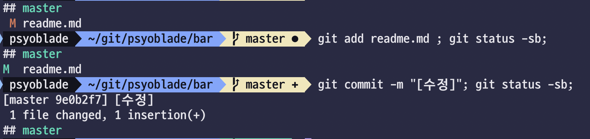
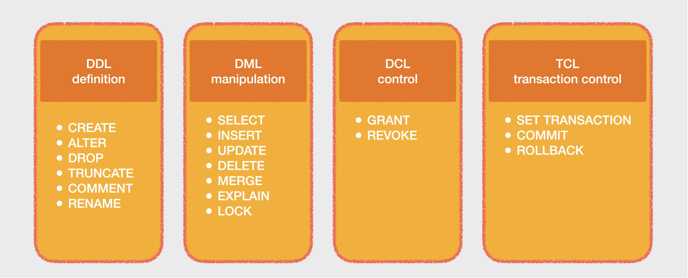

# 1일차. 데이터 엔지니어링 기본

> 전체 과정에서 사용하는 기본적인 명령어 혹은 서비스(git, docker, docker-compose, linux, hdfs, sql) 등에 대해 실습하고 사용법을 익힙니다.

- 목차
  * [1. 클라우드 장비에 접속](#1-클라우드-장비에-접속)
  * [2. Git 명령어 실습](#2-Git-명령어-실습)
    - [2-1. Git 기본 명령어](#Git-기본-명령어)
    - [2-2. Git 고급 명령어](#Git-고급-명령어)
  * [3. Docker 명령어 실습](#3-Docker-명령어-실습)
    - [3-1. Docker 기본 명령어](#Docker-기본-명령어)
    - [3-2. Docker 고급 명령어](#Docker-고급-명령어)
  * [4. Docker Compose 명령어 실습](#4-Docker-Compose-명령어-실습)
    - [4-1. Docker Compose 기본 명령어](#Docker-Compose-기본-명령어)
    - [4-2. Docker Compose 고급 명령어](#Docker-Compose-고급-명령어)
  * [5. Linux 커맨드라인 명령어 실습](#5-Linux-커맨드라인-명령어-실습)
    - [5-1. Linux 기본 명령어](#Linux-기본-명령어)
    - [5-2. Linux 고급 명령어](#Linux-고급-명령어)
  * [6. Hadoop 커맨드라인 명령어 실습](#6-Hadoop-커맨드라인-명령어-실습)
    - [6-1. Hadoop 기본 명령어](#Hadoop-기본-명령어)
    - [6-2. Hadoop 고급 명령어](#Hadoop-고급-명령어)
  * [7. SQL 기본 실습](#7-SQL-기본-실습)
  * [8. 참고 자료](#8-참고-자료)
<br>


## 1. 클라우드 장비에 접속

> 개인 별로 할당 받은 `ubuntu@vm<number>.aiffelbiz.co.kr` 에 putty 혹은 terminal 을 이용하여 접속합니다


### 1-1. 원격 서버로 접속합니다
```bash
# terminal
# ssh ubuntu@vm001.aiffelbiz.co.kr
# password: ******
```

### 1-2. 패키지 설치 여부를 확인합니다
```bash
docker --version
docker-compose --version
git --version
```

<details><summary>[실습] 출력 결과 확인</summary>

> 출력 결과가 오류가 발생하지 않고, 아래와 같다면 성공입니다

```text
Docker version 20.10.6, build 370c289
docker-compose version 1.29.1, build c34c88b2
git version 2.17.1
```

</details>

[목차로 돌아가기](#1일차-데이터-엔지니어링-기본)

<br>
<br>


## 2. Git 명령어 실습

> 모든 데이터 엔지니어링 작업은 **코드와 리소스로 구성**되어 있으며, 이에 대한 *형상관리를 하는 것이 가장 기본*입니다. *모든 수정내역 및 배포 내역은 반드시 형상관리 도구(SourceSafe, Subversion, Git 등)를 통해 운영관리* 되어야만, 만일의 상황에 대비할 수 있습니다. 

* Git 의 필요성
  - 애플리케이션 배포 이후 운영 과정에서 버그가 발생했을 때 Stable 버전으로 롤백해야 하는 경우
  - 다수의 사람이 동일한 프로젝트 혹은 애플리케이션 개발에 참여하여 진행되는 경우 유용함
  - 회사 혹은 메인 레포지토리와 항상 연결되기 어렵거나 인터넷 연결이 되지 않는 상황에도 개발에 용이
  - 개발 과정에서 다양한 방법으로 개발해보고, 버리거나 혹은 적용하는 상황에 Branch 를 활용한 개발이 용이
  - 클라이언트 장비의 오류나 다양한 장애 상황에서도 주기적으로 동기화된 코드의 안전성 보장
<br>

### Git 기본 명령어

### 2-1. 초기화

#### 2-1-1. init : 현재 디렉토리를 Git 레포지토리로 초기화 하고, 로컬 레포지토리로 관리됩니다
  - `.git` 경로가 생성되고, 하위에 index 및 object 들이 존재합니다
```bash
# git init
mkdir -p /home/ubuntu/work/git
cd /home/ubuntu/work/git
git init
```
  - tree 명령어로 `.git` 내부가 어떻게 구성되어 있는지 확인합니다
```bash
tree .git
```

#### 2-1-2 clone : 원격 저장소의 내용을 로컬 저장소에 다운로드 합니다
  - target directory 를 지정하지 않으면 프로젝트이름(`test`)이 자동으로 생성됩니다
```bash
# git clone [uri]
cd /home/ubuntu/work
git clone https://github.com/psyoblade/test.git
ls -al test/*
```

<details><summary>[실습] 터미널에 접속하여 /home/ubuntu/work 경로 아래에 https://github.com/psyoblade/helloworld.git 을 clone 하세요 </summary>

> 출력 결과가 오류가 발생하지 않고, 아래와 유사하다면 성공입니다

```bash
cd /home/ubuntu/work
git clone https://github.com/psyoblade/helloworld.git
# Cloning into 'helloworld'...
# remote: Enumerating objects: 86, done.
# remote: Counting objects: 100% (40/40), done.
# remote: Compressing objects: 100% (29/29), done.
# remote: Total 86 (delta 14), reused 34 (delta 8), pack-reused 46
# Unpacking objects: 100% (86/86), done.
```

</details>
<br>


### 2-2. 스테이징

#### 2-2-1. 기본 환경 구성

> 기본 실습 환경 구성 및 단축 명령어를 등록합니다 

```bash
cd /home/ubuntu/work/helloworld

sudo ./init.sh  # 명령을 통해 tree 패키지 및 rc 파일을 복사합니다
d # alias 로 docker-compose 를 등록되어 --help 가 뜨면 정상입니다
source ~/.bashrc  # .bashrc 내용을 현재 세션에 다시 로딩합니다
```
<br>


#### 2-2-2. add : 저장 대상 파일(들)을 인덱스에 스테이징 합니다
  - 빈 디렉토리는 추가되지 않으며, 하나라도 파일이 존재해야 추가됩니다
  - 모든 Unstage 된 파일을 추가하는 옵션(-A)은 주의해서 사용해야 하며 .gitignore 파일을 잘 활용합니다
```bash
# git add (-A, --all) [file]
touch README.md
git add README.md
```
<br>


#### 2-2-3. reset : 스테이징 된 파일을 언스테이징 합니다
```bash
# git reset [file]
git reset README.md
```
<br>


#### 2-2-4. status : 현재 경로의 스테이징 상태를 보여줍니다
```bash
# git status (-s, --short)
git status -s
```
<br>


#### 2-2-5. diff : 스테이징 된 파일에 따라 발생하는 이전 상태와 차이점을 보여줍니다
```bash
# git diff (--name-only)
echo "hello world" > README.md
git diff
git status -s
```
<br>


#### 2-2-6. commit : 스테이징(add) 된 내역을 스냅샷으로 저장합니다
  - 스테이징 된 내역이 없다면 커밋되지 않습니다
```bash
# git commit -m "descriptive message"
git commit -am "[수정] README 추가"
git status -sb
```
<br>


* 아래와 같은 경고 메시지는 현재 clone 한 원격지 레포지토리에 로그인이 되지 않았다는 의미이므로 신경쓰지 않으셔도 됩니다
```bash
Committer: Ubuntu <ubuntu@vm001.m0f4rvh4gmxe1gyfukcq2hpioc.syx.internal.cloudapp.net>
Your name and email address were configured automatically based
on your username and hostname. Please check that they are accurate.
You can suppress this message by setting them explicitly:

    git config --global user.name "Your Name"
    git config --global user.email you@example.com

After doing this, you may fix the identity used for this commit with:

    git commit --amend --reset-author

 1 file changed, 1 insertion(+)
```

> 수정된 파일은 " M" 으로 표현되고, 스테이징된 파일은  "M " 으로 표현되며, 커밋된 파일은 status 에서 보이지 않습니다.



[목차로 돌아가기](#1일차-데이터-엔지니어링-기본)

<br>


### 2-3. 브랜치

#### 2-3-1. branch : 로컬(-r:리모트, -a:전체) 브랜치 목록을 출력, 생성, 삭제 작업을 수행합니다
```bash
# git branch (-r, --remotes | -a, --all)
git branch -a
```
```bash
# git branch [create-branch]
git branch lgde/2021
```
```bash
# git branch (-d, --delete) [delete-branch]
git branch -d lgde/2021
```
<br>


#### 2-3-2. checkout : 해당 브랜치로 이동합니다
  - 존재하는 브랜치로만 체크아웃이 됩니다 (-b 옵션을 주면 생성하면서 이동합니다)
  - 이미 존재하는 경우에는 -b 옵션을 쓰면 오류가 발생합니다
```bash
# git checkout (-b) [branch-name]
git checkout -b lgde/2021
```
<br>


#### 2-3-3. merge : 대상 브랜치와 병합합니다. **대상 브랜치는 영향이 없고, 현재 브랜치가 변경**됩니다.
  - 병합을 실습하기 위해 master 브랜치에서 수정후 커밋 합니다
  - 아까 생성했던 lgde/2021 브랜치에서 수정내역을 확인 후 병합합니다
  - 변경하고자 하는 브랜치를 먼저 체크아웃하는 습관을 가지시면 좋습니다
```bash
git checkout master
echo "modified" >> README.md
cat README.md
git commit -am "[수정]"
```
```bash
git checkout lgde/2021
cat README.md
```
```bash
# git merge [merge-branch]
git merge master
cat README.md
git commit -am "[병합]"
```
```bash
# master 브랜치로 돌아옵니다
git checkout master
```
<br>

#### 2-3-4. log : 커밋 메시지를 브랜치 히스토리 별로 확인할 수 있습니다
```bash
git log
```
<br>

#### 2-3-5. 변경 상태 확인하기

<details><summary>[실습] LGDE.txt 파일생성 후에 스테이징 후에 상태를 확인하세요 </summary>

```bash
git checkout master
touch LGDE.txt
git add LGDE.txt
git status
```

> 출력 결과가 오류가 발생하지 않고, 아래와 유사하다면 성공입니다

```text
On branch master
Your branch is up to date with 'origin/master'.

Changes to be committed:
  (use "git reset HEAD <file>..." to unstage)

  	new file:   LGDE.txt
```

</details>
<br>


#### 2-3-6. 실수로 삭제된 파일을 복구하기

```bash
cd /home/ubuntu/work/helloworld
rm *
ls -al
```

<details><summary>[실습] 모든 코드를 원래 상태로 복구해 보세요</summary>

> 출력 결과가 오류가 발생하지 않고, 아래와 유사하다면 성공입니다

```bash
git checkout -- .
git statusb -sb
ls -al
```

</details>

#### 2-3-7. 브랜치가 꼬여서 난감할 때

> 복잡한 작업을 하다보면 꼬여서 곤란한 경우가 있는데 이 때에 아예 처음으로 돌리고 싶다면 clone 시점으로 reset 하시는 편이 좋습니다

```bash
cd /home/ubuntu/work/helloworld
git reflog | grep clone
```
```bash
# clone 한 시점의 HEAD 번호로 리셋 후, 일부 수정된 사항은 checkout 하시면 정리가 됩니다
# git reset HEAD@{25}
# git checkout -- .
```
<br>

#### 2-3-8. 자주 사용하는 깃 명령어

> 여기의 명령어만 이해하고 있어도 기본 과정에서 불편함은 없습니다. 복구하기 어려운 상황이 생기면 *경로를 제거하고 다시 clone 받*으시면 됩니다. :-)

* `git clone`                      : 프로젝트 가져오기
* `git status -sb`                 : 브랜치 + 상태
* `git commit -am "[수정] 메시지"` : 스테이징 + 커밋
* `git pull`                       : 작업 시작시에 가장 먼저 해야 하는 명령어
* `git push`                       : 작업이 완료되면 푸시
* `git checkout -- .`              : 수정한 내역 버리고 마지막 커밋 시점으로 롤백
<br>


### Git 고급 명령어

### 2-4. 경로 관리

#### 2-4-1. rm : 커밋된 파일을 삭제합니다
```bash
# git rm [file]
git rm README.md
```
  - 삭제한(commit 이전) 파일을 되돌립니다
```bash
git checkout HEAD README.md
```
<br>


#### 2-4-2. mv : 파일 혹은 경로를 새로운 경로로 이동합니다
```bash
# git mv [source-path] [target-path]
git mv REAMDE.md NOREADME.md
```
  - 현재 경로의 수정 사항을 되돌립니다
```bash
git checkout HEAD .
```
<br>


### 2-5. 예외 처리

> 깃으로 관리되지 않는 파일 혹은 경로를 패턴을 통해 관리합니다 - [gitignore.io](https://www.toptal.com/developers/gitignore)

#### 2-5-1. .gitignore : 해당 파일을 생성하고 내부 파일을 아래와 같이 관리합니다
```bash
# cat .gitignore
logs/
*.notes
tmp/
```
<br>


### 2-6. 저장소 관리

> 원격 저장소와 동기화 하는 방법이며, pull, push 는 항상 conflict 에 유의해야 하며, 로컬 저장소에서 merge 및 conflict 해결하는 습관을 들여야만 합니다
**원격 저장소(github.com)의 계정이 필요하므로 실습에서는 제외하도록 하겠습니다**


#### 2-6-1. pull : 원격 저장소에서 변경된 내역을 로컬 저장소에 반영합니다
```bash
# git pull (--dry-run)
```
<br>


#### 2-6.2. push : 로컬 저장소의 커밋된 내역을 원격 저장소에 반영합니다
  - 원격 저장소에 브랜치가 존재하지 않는 경우에 업스트림 옵션(--set-upstream origin lgde/2021)을 활용합니다
```bash
# git push (--set-upstream <remote> <branch>)
```
<br>


### 2-7. 이력 관리

#### 2-7-1. reset : 스테이징된 모든 내역을 제거 혹은 제거된 내역을 롤백합니다
  - git log 명령을 통해 확인된 commit 해시 값으로 해당 시점으로 돌릴 수 있습니다
  - git reflog 명령을 통해 모든 이력을 확인할 수 있고, reset 을 undo 할 수 있습니다
```bash
git log
```
```bash
# git reset --hard [commit]
# git reset --hard 7e5e3e54e400228cbdb12ab00b13c4af22305a0d
```
```bash
git reflog
```
```bash
# git reflog (show master)
# git reset 'HEAD@{1}'
```
<br>


### 2-8. 임시 저장

#### 2-8-1. stash : 현재 수정내역을 커밋하기는 애매하지만, 다른 브랜치로 체크아웃 하고 싶을 때 임시로 수정 내역 전체를 저장합니다
```bash
# 임시로 저장
echo "test modify" >> README.md
git stash
cat README.md
```
```bash
git checkout lgde/2021
echo "lgde/2021" >> cat README.md
git commit -am "[개발]"
```
```bash
git checkout master
cat README.md
```
```bash
# 임시 저장 리스트
git stash list
```
```bash
# 가장 마지막에 저장한 것을 복원
git stash pop
cat README.md
git commit -am "[완료]"
```
```bash
git checkout lgde/2021
cat README.md
```
```bash
# 가장 마지막에 저장된 것을 삭제
git stash drop
```
```bash
# 혹은 stash 값을 바로 사용
git stash apply stash@{0}
```
```bash
# 내역을 보고 싶다면
git stash show stash@{1}
```
<br>

[목차로 돌아가기](#1일차-데이터-엔지니어링-기본)
<br>
<br>


## 3. Docker 명령어 실습

> 컨테이너 관리를 위한 도커 명령어를 실습합니다

* 실습을 위해 기존 프로젝트를 삭제 후 다시 클론합니다

```bash
# terminal
cd /home/ubuntu/work
rm -rf /home/ubuntu/work/helloworld
git clone https://github.com/psyoblade/helloworld.git
cd /home/ubuntu/work/helloworld
```
<br>

### Docker 기본 명령어

### 3-1. 컨테이너 생성관리

> 도커 이미지로 만들어져 있는 컨테이너를 생성, 실행 종료하는 명령어를 학습합니다

#### 3-1-1. create : 컨테이너를 생성합니다 
  - <kbd>--name <container_name></kbd> : 컨테이너 이름을 직접 지정합니다 (지정하지 않으면 임의의 이름이 명명됩니다)
  - 로컬에 이미지가 없다면 다운로드(pull) 후 컨테이너를 생성까지만 합니다 (반드시 -it 옵션이 필요합니다)
  - 생성된 컨테이너는 실행 중이 아니라면 `docker ps -a` 실행으로만 확인이 가능합니다
```bash
# docker create <image>:<tag>
docker create -it ubuntu:18.04
```
<br>

#### 3-1-2. start : 생성된 컨테이너를 기동합니다
  - 예제의 `busy_herschel` 는 자동으로 생성된 컨테이너 이름입니다
```bash
# 아래 명령으로 현재 생성된 컨테이너의 이름을 확인합니다
docker ps -a

# CONTAINER ID   IMAGE          COMMAND   CREATED         STATUS    PORTS     NAMES
# e8f66e162fdd   ubuntu:18.04   "bash"    2 seconds ago   Created             sad_mayer
```
```bash
# docker start <container_name> 
# docker start busy_herschel
```
```bash
# 터미널에 접속하여 우분투 버전을 확인합니다
docker exec -it busy_herschel bash
cat /etc/issue
```
<br>

#### 3-1-3. stop : 컨테이너를 잠시 중지시킵니다
  - 해당 컨테이너가 삭제되는 것이 아니라 잠시 실행만 멈추게 됩니다
```bash
# docker stop <container_name>
# docker stop busy_herschel
```
<br>

#### 3-1-4. rm : 중단된 컨테이너를 삭제합니다
  - <kbd>-f, --force</kbd> : 실행 중인 컨테이너도 강제로 종료합니다 (실행 중인 컨테이너는 삭제되지 않습니다)
```bash
# docker rm <container_name>
# docker rm busy_herschel
```
<br>

#### 3-1-5. run : 컨테이너의 생성과 시작을 같이 합니다 (create + start)
  - <kbd>--rm</kbd> : 종료 시에 컨테이너까지 같이 삭제합니다
  - <kbd>-d, --detach</kbd> : 터미널을 붙지않고 데몬 처럼 백그라운드 실행이 되게 합니다
  - <kbd>-i, --interactive</kbd> : 인터액티브하게 표준 입출력을 키보드로 동작하게 합니다
  - <kbd>-t, --tty</kbd> : 텍스트 기반의 터미널을 에뮬레이션 하게 합니다
```bash
# docker run <options> <image>:<tag>
docker run --rm --name ubuntu -dit ubuntu:20.04
```
```bash
# 터미널에 접속하여 우분투 버전을 확인합니다
docker exec -it ubuntu bash
cat /etc/issue
```
<br>

#### 3-1-6. kill : 컨테이너를 종료합니다
```bash
# docker kill <container_name>
docker kill ubuntu
```
<br>

### 3-2. 컨테이너 모니터링

#### 3-2-1. ps : 실행 중인 컨테이너를 확인합니다
  - <kbd>-a</kbd> : 실행 중이지 않은 컨테이너까지 출력합니다
```bash
docker ps
```

#### 3-2-2. logs : 컨테이너 로그를 표준 출력으로 보냅니다
  - <kbd>-f</kbd> : 로그를 지속적으로 tailing 합니다
```bash
# docker logs <container_name>
docker run --rm --name nginx -dit nginx
```
```bash
docker logs -f nginx
```
<br>

#### 3-2-3. top : 컨테이너에 떠 있는 프로세스를 확인합니다
```bash
# docker top <container_name> <ps options>
docker top nginx
```
<br>


### 3-3. 컨테이너 상호작용

#### 3-3-1. cp :  호스트에서 컨테이너로 혹은 반대로 파일을 복사합니다
```bash
# docker cp <container_name>:<path> <host_path> and vice-versa
touch README.md
docker cp ./helloworld.sh ubuntu:/tmp
```

#### 3-3-2. exec : 컨테이너 내부에 명령을 실행합니다 
```bash
# docker exec <container_name> <args>
docker exec ubuntu /tmp/helloworld.sh
```
<br>


### Docker 고급 명령어

### 3-4. 컨테이너 이미지 생성관리

#### 3-4-1. images : 현재 로컬에 저장된 이미지 목록을 출력합니다 
```bash
docker images
```
<br>

#### 3-4-2. commit : 현재 컨테이너를 별도의 이미지로 저장합니다 

* 현재 helloworld.sh 가 복사된 컨테이너를 ubuntu:hello 로 저장해봅니다
```bash
# docker commit <container_name> <repository>:<tag>
docker commit ubuntu ubuntu:hello
```

#### 3-4-3. rmi : 해당 이미지를 삭제합니다

* 이전에 ubuntu:20.04 기반의 컨테이너를 종료하고, 이미지도 삭제합니다
```bash
docker rm -f ubuntu
docker rmi ubuntu:20.04
```
```bash
# ubuntu:hello 가 남아있는지 확인합니다
docker image ls | grep ubuntu
```
<br>

<details><summary>[실습] ubuntu:hello 이미지를 이용하여 helloworld.sh 을 실행하세요</summary>

> 출력 결과가 오류가 발생하지 않고, 아래와 유사하다면 성공입니다

```bash
docker run --rm ubuntu:hello /tmp/helloworld.sh
# hello world
```

</details>
<br>


### 3-5. 컨테이너 이미지 전송관리

> 본 명령은 dockerhub.com 과 같은 docker registry 계정이 있어야 실습이 가능하므로 실습에서는 제외합니다

#### 3-5-1. pull : 대상 이미지를 레포지토리에서 로컬로 다운로드합니다
```bash
# docker pull repository[:tag]
docker pull psyoblade/data-engineer-ubuntu:18.04
```

#### 3-5-2. push : 대상 이미지를 레포지토리로 업로드합니다
```bash
# docker push repository[:tag]
docker push psyoblade/data-engineer-ubuntu:18.04
```

#### 3-5-3. login : 레지스트리에 로그인 합니다
```bash
docker login
```

#### 3-5-4. logout : 레지스트리에 로그아웃 합니다
```bash
docker logout
```
<br>


### 3-6. 컨테이너 이미지 빌드

> 별도의 Dockerfile 을 생성하고 해당 이미지를 바탕으로 새로운 이미지를 생성할 수 있습니다

#### 3-6-1. Dockerfile 생성

* Ubuntu:18.04 LTS 이미지를 한 번 빌드하기로 합니다
  - <kbd>FROM image:tag</kbd> : 기반이 되는 이미지와 태그를 명시합니다
  - <kbd>MAINTAINER email</kbd> : 컨테이너 이미지 관리자
  - <kbd>COPY path dst</kbd> : 호스트의 `path` 를 게스트의 `dst`로 복사합니다
  - <kbd>ADD src dst</kbd> : COPY 와 동일하지만 추가 기능 (untar archives 기능, http url 지원)이 있습니다
  - <kbd>RUN args</kbd> : 임의의 명령어를 수행합니다
  - <kbd>USER name</kbd> : 기본 이용자를 지정합니다 (ex_ root, ubuntu)
  - <kbd>WORKDIR path</kbd> : 워킹 디렉토리를 지정합니다
  - <kbd>ENTRYPOINT args</kbd> : 메인 프로그램을 지정합니다
  - <kbd>CMD args</kbd> : 메인 프로그램의 파라메터를 지정합니다
  - <kbd>ENV name value</kbd> : 환경변수를 지정합니다

* 아래와 같이 터미널에서 입력하고
```bash
cat > Dockerfile
```
* 아래의 내용을 복사해서 붙여넣은 다음 <kbd><samp>Ctrl</samp>+<samp>C</samp></kbd> 명령으로 나오면 파일이 생성됩니다
```bash
FROM ubuntu:18.04
LABEL maintainer="park.suhyuk@gmail.com"

RUN apt-get update && apt-get install -y rsync tree

EXPOSE 22 873
CMD ["/bin/bash"]
```

#### 3-6-2. 이미지 빌드

> 위의 이미지를 통해서 베이스라인 우분투 이미지에 rsync 와 tree 가 설치된 새로운 이미지를 생성할 수 있습니다

* 도커 이미지를 빌드합니다
  - <kbd>-f, --file</kbd> : default 는 현재 경로의 Dockerfile 을 이용하지만 별도로 지정할 수 있습니다
  - <kbd>-t, --tag</kbd> : 도커 이미지의 이름과 태그를 지정합니다
  - <kbd>-q, --quiet</kbd> : 빌드 로그의 출력을 하지 않습니다
  - <kbd>.</kbd> : 현재 경로에서 빌드를 합니다 
```bash
# terminal
docker build -t ubuntu:local .
```

<details><summary>[실습] 출력 결과 확인</summary>

> 출력 결과가 오류가 발생하지 않고, 아래와 유사하다면 성공입니다

```bash
Sending build context to Docker daemon  202.8kB
Step 1/5 : FROM ubuntu:18.04
18.04: Pulling from library/ubuntu
e7ae86ffe2df: Pull complete
Digest: sha256:3b8692dc4474d4f6043fae285676699361792ce1828e22b1b57367b5c05457e3
Status: Downloaded newer image for ubuntu:18.04
...
Step 5/5 : CMD ["/bin/bash"]
 ---> Running in 88f12333612b
Removing intermediate container 88f12333612b
 ---> da9a0e997fc0
Successfully built da9a0e997fc0
Successfully tagged ubuntu:local
```

</details>
<br>


### 3-7. 도커 이미지 이해하기

> 도커 컨테이너 이미지들의 다른점을 이해하고 다양한 실습을 통해 깊이 이해합니다


### 3-7-1. 도커 이미지 크기 비교

* 알파인 리눅스 vs. 우분투 컨테이너 이미지 크기 비교
```bash
docker pull alpine
docker pull ubuntu
docker image ls
```
<br>


### 3-7-2. 알파인 리눅스 명령어 실습

* 알파인 리눅스 환경이 아니지만 해당 리눅스 처럼 실행해보기
```bash
docker run alpine top
docker run alpine uname -a
docker run alpine cat /etc/issue
```
> 개별 명령어는 <kbd><samp>Ctrl</samp>+<samp>C</samp></kbd> 명령으로 종료합니다


<details><summary>[실습] 위의 세번의 명령어 실행으로 생성된 컨테이너는 어떻게 삭제할까요?</summary>

* 전체 컨테이너 목록(-a 옵션으로 중지된 컨테이너까지 확인) 가운데 alpine 을 포함한 목록의 컨테이너 아이디를 찾아 모두 종료합니다
```bash
docker rm -f `docker ps -a | grep alpine | awk '{ print $1 }'`
```

* 사용하지 않는 컨테이너 정리 명령어 (-f, --force)
```bash
dodcker container prune -f
```

</details>
<br>


### 3-7-3. 알파인 리눅스에서 패키지 설치

> 리눅스 배포판마다 패키지 관리자가 다르기 때문에 참고로 실습합니다


* bash 가 없기 때문에 /bin/sh 을 통해 --interactive --tty 를 생성해봅니다
```bash
docker run --rm -it alpine /bin/sh
```
> --rm 명령으로 종료와 동시에 가비지 컨테이너를 삭제하는 습관을 들이면 좋습니다

* vim 도 없기 때문에 패키지 도구인 apk 및 apk add/del 를 통해 vim 을 설치 및 제거합니다
  - apk { add, del, search, info, update, upgrade } 등의 명령어를 사용할 수 있습니다
```bash
apk update
apk add vim
apk del vim
```
<br>


### 3-7-4. [메모리 설정을 변경한 상태 확인](https://docs.docker.com/config/containers/start-containers-automatically)

* 컨테이너의 리소스를 제한하는 것도 가능합니다
  - 기본적으로 도커 기동 시에 로컬 도커가 사용할 수 있는 리소스의 최대치를 사용할 수 있습니다
  - 이번 예제에서는 도커를 실행하고 상태를 확인하기 위해 백그라운드 실행(-dit)을 합니다
```bash
docker run --name ubuntu_500m -dit -m 500m ubuntu
```
* 메모리 제약을 두고 띄운 컨테이너의 상태를 확인합니다
```bash
docker ps -f name=ubuntu_500m
# docker stats <CONTAINER ID>
```
> <kbd><samp>Ctrl</samp>+<samp>C</samp></kbd> 명령으로 종료합니다


<details><summary>[실습] 메모리 제약을 주지 않고 해당 컨테이너의 상태를 확인해 보세요</summary>

> 출력 결과가 오류가 발생하지 않고, 아래와 유사하다면 성공입니다

```bash
docker run --name ubuntu_unlimited -dit ubuntu
docker stats `docker ps | grep ubuntu_unlimited | awk '{ print $1 }'`
```

</details>

<details><summary>[실습] 바로 위의 실습 정답을 활용해서 ubuntu 문자열이 포함된 모든 컨테이너를 종료해 보세요</summary>

> 출력 결과가 오류가 발생하지 않고, 아래와 유사하다면 성공입니다

```bash
docker rm -f `docker ps | grep ubuntu | awk '{ print $1 }'`
```

</details>
<br>


### 3-8. MySQL 로컬 장비에 설치하지 않고 사용하기

> 호스트 장비에 MySQL 설치하지 않고 사용해보기


#### 3-8-1. [MySQL 데이터베이스 기동](https://hub.docker.com/_/mysql)

* 아래와 같이 도커 명령어를 통해 MySQL 서버를 기동합니다
```bash
docker run --name mysql-volatile \
  -p 3306:3306 \
  -e MYSQL_ROOT_PASSWORD=rootpass \
  -e MYSQL_DATABASE=testdb \
  -e MYSQL_USER=user \
  -e MYSQL_PASSWORD=pass \
  -d mysql
```

* 서버가 기동되면 해당 서버로 접속합니다
  - 너무 빨리 접속하면 서버가 기동되기전이라 접속이 실패할 수 있습니다
```bash
docker exec -it mysql-volatile mysql -uuser -ppass
```

#### 3-8-2. 테스트용 테이블을 생성해봅니다

```sql
# mysql>
use testdb;
create table foo (id int, name varchar(300));
insert into foo values (1, 'my name');
select * from foo;
```
> <kbd><samp>Ctrl</samp>+<samp>D</samp></kbd> 명령으로 빠져나옵니다


#### 3-8-3. 컨테이너를 강제로 종료합니다
```bash
docker rm -f mysql-volatile
docker volume ls
```

<details><summary>[실습] mysql-volatile 컨테이너를 다시 생성하고 테이블을 확인해 보세요</summary>

> 테이블이 존재하지 않는다면 정답입니다.

* 볼륨을 마운트하지 않은 상태에서 생성된 MySQL 데이터베이스는 컨테이너의 임시 볼륨 저장소에 저장되므로, 컨테이너가 종료되면 더이상 사용할 수 없습니다
  - 사용한 컨테이너는 종료해 둡니다
```bash
docker rm -f mysql-volatile
```

</details>
<br>


### 3-9. 볼륨 마운트 통한 MySQL 서버 기동하기

> 이번에는 별도의 볼륨을 생성하여, 컨테이너가 예기치 않게 종료되었다가 다시 생성되더라도, 데이터를 보존할 수 있게 볼륨을 생성합니다. 


#### 3-9-1. 볼륨 마운트 생성

* 아래와 같이 볼륨의 이름만 명시하여 마운트하는 것을 [Volume Mount](https://docs.docker.com/storage/volumes/) 방식이라고 합니다
  - `docker volume ls` 명령을 통해 생성된 볼륨을 확인할 수 있습니다
  - 이렇게 생성된 별도의 격리된 볼륨으로 관리되며 컨테이너가 종료되더라도 유지됩니다
```bash
docker run --name mysql-persist \
  -p 3307:3306 \
  -e MYSQL_ROOT_PASSWORD=rootpass \
  -e MYSQL_DATABASE=testdb \
  -e MYSQL_USER=user \
  -e MYSQL_PASSWORD=pass \
  -v mysql-volume:/var/lib/mysql \
  -d mysql

sleep 5
docker exec -it mysql-persist mysql --port=3307 -uuser -ppass
```

#### 3-9-2. 볼륨 확인 실습

<details><summary>[실습] mysql-persist 컨테이너를 강제 종료하고, 동일한 설정으로 다시 생성하여 테이블이 존재하는지 확인해 보세요</summary>

> 테이블이 존재하고 데이터가 있다면 정답입니다

```sql
# mysql>
use testdb;
create table foo (id int, name varchar(300));
insert into foo values (1, 'my name');
select * from foo;
```

```bash
# terminal
docker rm -f mysql-persist
docker run --name mysql-persist \
  -p 3307:3306 \
  -e MYSQL_ROOT_PASSWORD=rootpass \
  -e MYSQL_DATABASE=testdb \
  -e MYSQL_USER=user \
  -e MYSQL_PASSWORD=pass \
  -v mysql-volume:/var/lib/mysql \
  -d mysql

sleep 5
docker exec -it mysql-persist mysql --port=3307 -uuser -ppass
```

```sql
# mysql>
use testdb;
select * from foo;
```

</details>
<br>


### 3-10. 바인드 마운트 통한 MySQL 서버 기동하기

#### 3-10-1. 바인드 마운트를 추가하여 저장소 관리하기 

> 이번에는 호스트 장비의 경로에 직접 저장하는 바인드 마운트에 대해 실습합니다

* 아래와 같이 상대 혹은 절대 경로를 포함한 볼륨의 이름을 명시하여 마운트하는 것을 [Bind Mount](https://docs.docker.com/storage/bind-mounts/) 방식이라고 합니다
  - 호스트의 특정 경로를 저장소로 사용하게 되어, 호스트에서 직접 접근 및 확인이 가능합니다
```bash
docker run --name mysql-bind \
  -p 3308:3306 \
  -e MYSQL_ROOT_PASSWORD=rootpass \
  -e MYSQL_DATABASE=testdb \
  -e MYSQL_USER=user \
  -e MYSQL_PASSWORD=pass \
  -v ./mysql/bind:/var/lib/mysql \
  -d mysql

sleep 5
docker exec -it mysql-bind mysql --port=3308 -uuser -ppass
```

> 이번 예제는 경로만 다를 뿐 동일하므로 실습은 각자 해보시기 바랍니다

[목차로 돌아가기](#1일차-데이터-엔지니어링-기본)
<br>
<br>


## 4. Docker Compose 명령어 실습

> 도커 컴포즈는 **도커의 명령어들을 반복적으로 수행되지 않도록 yml 파일로 저장해두고 활용**하기 위해 구성되었고, *여러개의 컴포넌트를 동시에 기동하여, 하나의 네트워크에서 동작하도록 구성*한 것이 특징입니다. 내부 서비스들 간에는 컨테이너 이름으로 통신할 수 있어 테스트 환경을 구성하기에 용이합니다. 
<br>

### 실습을 위한 기본 환경을 가져옵니다

```bash
# terminal
cd /home/ubuntu/work
git clone https://github.com/psyoblade/data-engineer-basic-training.git
cd /home/ubuntu/work/data-engineer-basic-training/day1
```
<br>

### Docker Compose 기본 명령어

### 4-1. 컨테이너 관리

> 도커 컴포즈는 **컨테이너를 기동하고 작업의 실행, 종료 등의 명령어**를 주로 다룬다는 것을 알 수 있습니다. 아래에 명시한 커맨드 외에도 도커 수준의 명령어들(pull, create, start, stop, rm)이 존재하지만 잘 사용되지 않으며 일부 deprecated 되어 자주 사용하는 명령어 들로만 소개해 드립니다

#### 4-1-1. up : `docker-compose.yml` 파일을 이용하여 컨테이너를 이미지 다운로드(pull), 생성(create) 및 시작(start) 시킵니다
  - <kbd>-f <filename></kbd> : 별도 yml 파일을 통해 기동시킵니다 (default: `-f docker-compose.yml`)
  - <kbd>-d, --detach <filename></kbd> : 서비스들을 백그라운드 모드에서 수행합니다
  - <kbd>-e, --env `KEY=VAL`</kbd> : 환경변수를 전달합니다
  - <kbd>--scale <service>=<num></kbd> : 특정 서비스를 복제하여 기동합니다 (`container_name` 충돌나지 않도록 주의)
```bash
# docker-compose up <options> <services>
docker-compose up -d
```
<br>

#### 4-1-2. down : 컨테이너를 종료 시킵니다
  - <kbd>-t, --timeout <int> <filename></kbd> : 셧다운 타임아웃을 지정하여 무한정 대기(SIGTERM)하지 않고 종료(SIGKILL)합니다 (default: 10초)
```bash
# docker-compose down <options> <services>
docker-compose down
```
<br>


### 4-2. 기타 자주 사용되는 명령어

#### 4-2-1. exec : 컨테이너에 커맨드를 실행합니다
  - <kbd>-d, --detach</kbd> : 백그라운드 모드에서 실행합니다
  - <kbd>-e, --env `KEY=VAL`</kbd> : 환경변수를 전달합니다
  - <kbd>-u, --user <string></kbd> : 이용자를 지정합니다
  - <kbd>-w, --workdir <string></kbd> : 워킹 디렉토리를 지정합니다
```bash
# docker-compose exec [options] [-e KEY=VAL...] [--] SERVICE COMMAND [ARGS...]
docker-compose exec ubuntu echo hello world
```
<br>

#### 4-2-2. logs : 컨테이너의 로그를 출력합니다
  - <kbd>-f, --follow</kbd> : 출력로그를 이어서 tailing 합니다
```bash
# terminal
docker-compose logs -f ubuntu
```
<br>

#### 4-2-3. pull : 컨테이너의 모든 이미지를 다운로드 받습니다
  - <kbd>-q, --quiet</kbd> : 다운로드 메시지를 출력하지 않습니다 
```bash
# terminal
docker-compose pull
```
<br>

#### 4-2-4. ps : 컨테이너 들의 상태를 확인합니다
  - <kbd>-a, --all</kbd> : 모든 서비스의 프로세스를 확인합니다
```bash
# terminal
docker-compose ps -a
```
<br>

#### 4-2-5. top : 컨테이너 내부에 실행되고 있는 프로세스를 출력합니다
```bash
# docker-compose top <services>
docker-compose top mysql
docker-compose top namenode
```
<br>


### Docker Compose 고급 명령어

> 도커 컴포즈 파일이 어떻게 구성되어 있는지 이해하고, 직접 수정 및 작성할 수 있습니다

### 4-3. 컴포즈 파일을 통한 실습

#### 4-3-1. 도커 컴포즈를 통해서 커맨드라인 옵션을 설정을 통해 수행할 수 있습니다

```bash
# mysql: 이 등장하는 이후로 20줄을 출력
cat docker-compose.yml | grep -ia20 'mysql:' docker-compose.yml
```
```yaml
# docker-compose.yml
  mysql:
    container_name: mysql
    image: psyoblade/data-engineer-mysql:1.1
    restart: always
    environment:
      MYSQL_ROOT_PASSWORD: root
      MYSQL_DATABASE: testdb
      MYSQL_USER: sqoop
      MYSQL_PASSWORD: sqoop
    ports:
      - '3306:3306'
    networks:
      - default
    healthcheck:
      test: ["CMD", "mysqladmin" ,"ping", "-h", "localhost"]
      interval: 3s
      timeout: 1s
      retries: 3
    volumes:
      - ./mysql/etc:/etc/mysql/conf.d
```
<br>


### 4-4. 외부 볼륨을 통한 환경설정

> 외부 볼륨을 통한 환경설정 제공 및 설정을 실습합니다

#### 4-4-1. 캐릭터셋 변경 적용하기

```bash
# cat custom/my.cnf
[client]
default-character-set=utf8

[mysqld]
character-set-client-handshake=FALSE
init_connect="SET collation_connection = utf8_general_ci"
init_connect="SET NAMES utf8"
character-set-server=utf8
collation-server=utf8_general_ci

[mysql]
default-character-set=utf8
```
<br>


#### 4-4-2. MySQL 설정파일 사용

> 지정한 설정파일을 사용하고, 내부 볼륨을 통한 MySQL 기동으로 변경합니다

```bash
# cat docker-compose.yml
version: "3"

services:
  mysql:
    container_name: mysql
    image: mysql
    restart: always
    environment:
      MYSQL_ROOT_PASSWORD: rootpass
      MYSQL_DATABASE: testdb
      MYSQL_USER: user
      MYSQL_PASSWORD: pass
    volumes:
      - ./custom:/etc/myslq/conf.d
      - mysql_utf8:/etc/myslq/conf.d
```
<br>


### 4-5. 초기화 파일을 적용한  MySQL 도커 이미지 생성

#### 4-5-1. 초기화 파일을 생성합니다

```bash
# cat init/testdb.sql
DROP TABLE IF EXISTS `seoul_popular_trip`;
CREATE TABLE `seoul_popular_trip` (
  `category` int(11) NOT NULL,
  `id` int(11) NOT NULL,
  `name` varchar(100) DEFAULT NULL,
  `address` varchar(100) DEFAULT NULL,
  `naddress` varchar(100) DEFAULT NULL,
  `tel` varchar(20) DEFAULT NULL,
  `tag` varchar(500) DEFAULT NULL
) ENGINE=InnoDB DEFAULT CHARSET=utf8;
LOCK TABLES `seoul_popular_trip` WRITE;
INSERT INTO `seoul_popular_trip` VALUES (0,25931,'통인가게 ','110-300 서울 종로구 관훈동 16 ','03148 서울 종로구 인사동길 32 (관훈동) ','02-733-4867','오래된가게,고미술,통인정신,통인가게,공예샵,현대공예');
UNLOCK TABLES;
```
<br>


#### 4-5-2. 도커파일을 생성합니다

```Dockerfile
# cat Dockerfile
ARG BASE_CONTAINER=mysql:5.7
FROM $BASE_CONTAINER
LABEL maintainer="student@lg.com"

ADD ./init /docker-entrypoint-initdb.d

EXPOSE 3306

CMD ["mysqld"]
```
<br>


#### 4-5-3. 로컬에서 도커 이미지를 빌드합니다

```bash
docker build -t local/mysql:5.7 .
```
<br>


#### 4-5-4. 빌드된 이미지로 다시 테스트

```bash
# cat docker-compose.yml
version: "3"

services:
  mysql:
    container_name: mysql
    image: local/mysql:5.7
    restart: always
    environment:
      MYSQL_ROOT_PASSWORD: rootpass
      MYSQL_DATABASE: testdb
      MYSQL_USER: user
      MYSQL_PASSWORD: pass
    volumes:
      - ./custom:/etc/mysql/conf.d
      - mysql_utf8:/var/lib/mysql
```
```bash
docker exec -it mysql mysql -u user -p
```
```sql
use testdb;
select * from seoul_popular_trip;
```
<br>


### 4-6. 도커 컴포즈 통한 여러 이미지 실행

> MySQL 과 phpMyAdmin 2가지 서비스를 실행합니다

#### 4-6-1. 도커 컴포즈를 통해 phpMyAdmin 추가 설치

```bash
# cat docker-compose.yml
version: "3"

services:
  mysql:
    image: psyoblade/mysql:5.7
    container_name: mysql
    restart: always
    environment:
      MYSQL_ROOT_PASSWORD: rootpass
      MYSQL_DATABASE: testdb
      MYSQL_USER: user
      MYSQL_PASSWORD: pass
    volumes:
      - ./custom:/etc/mysql/conf.d
      - mysql_utf8:/var/lib/mysql
  php:
    image: phpmyadmin/phpmyadmin
    container_name: phpmyadmin
    links:
      - mysql
    environment:
      PMA_HOST: mysql
      PMA_PORT: 3306
      PMA_ARBITRARY: 1
    restart: always
    ports:
      - 8183:80
```
> [phpMyAdmin](http://localhost:8183/index.php) 사이트에 접속하여 mysql/user/pass 로 접속합니다

<br>


### 4-7. MySQL 이 정상적으로 로딩된 이후에 접속하도록 설정합니다

* 테스트 헬스체크를 통해 MySQL 이 정상 기동되었을 때에 다른 어플리케이션을 띄웁니다

```bash
# cat docker-compose.yml
version: "3"

services:
  mysql:
    image: psyoblade/mysql:5.7
    container_name: mysql
    restart: always
    environment:
      MYSQL_ROOT_PASSWORD: rootpass
      MYSQL_DATABASE: testdb
      MYSQL_USER: user
      MYSQL_PASSWORD: pass
    healthcheck:
      test: ["CMD", "mysqladmin" ,"ping", "-h", "localhost"]
      interval: 3s
      timeout: 1s
      retries: 3
    volumes:
      - ./custom:/etc/mysql/conf.d
      - mysql_utf8:/var/lib/mysql
  php:
    image: phpmyadmin/phpmyadmin
    container_name: phpmyadmin
    depends_on:
      - mysql
    links:
      - mysql
    environment:
      PMA_HOST: mysql
      PMA_PORT: 3306
      PMA_ARBITRARY: 1
    restart: always
    ports:
      - 8183:80
```

[목차로 돌아가기](#1일차-데이터-엔지니어링-기본)

<br>
<br>


## 5. Linux 커맨드라인 명령어 실습

> 리눅스 터미널 환경에서 활용할 수 있는 CLI 도구들을 소개하고 실습합니다. 대부분의 **오픈소스 인프라 및 서비스는 리눅스 서버 환경**에서 운영되며, 장애 혹은 서비스 모니터링 환경에서 디버깅의 가장 기본이 되는 것이 리눅스 커맨드라인 도구들이며, 독립적인 도구들로 하나의 실행파일로 가성비가 가장 높은 효과적인 도구들이기도 합니다


### 환경 구성 및 예제 데이터 다운로드
```bash
# terminal
cd /home/ubuntu/work
git clone https://github.com/psyoblade/linux-for-dummies
cd /home/ubuntu/work/linux-for-dummies
```

### Linux 기본 명령어

### 5-1. 수집 및 적재

* wget
* curl
* w3m / lynx
<br>


### 5-2. 출력 및 확인

#### 5-2-1. cat : 텍스트 파일의 내용을 출력
  - <kbd>-n, --number</kbd> : 라인 번호를 출력
```bash
# cat [OPTION] ... [FILE] ... 
cat -n helloworld.py
```
<br>

#### 5-2-2. more : 텍스트 파일의 일부를 지속적으로 출력

  - <kbd>-p</kbd> : 화면을 지우고 위에서부터 출력합니다
  - <kbd>-s</kbd> : 여러 줄의 빈 라인을 하나의 빈 라인으로 대체합니다
  - <kbd>-number</kbd> : 한 번에 출력하는 라인 수를 지정합니다
  - <kbd>+number</kbd> : 지정된 라인 부터 출력합니다
  - <kbd>+/string</kbd> : 지정된 문자열을 찾은 라인부터 출력합니다

```bash
# more [OPTIONS] ... [FILE] ... 
more -5 data/apache-access.log
```
> 스페이스 바를 누를 때마다 스크롤 되지 않고, 첫 번째 라인부터 5줄씩 출력합니다

<details><summary>[실습] data/hadoop-hdfs-secondarynamenode.log 파일에서 exception 문자열이 발견된 위치부터 10줄씩 출력하세요 </summary>

> 출력 결과가 오류가 발생하지 않고, 아래와 유사하다면 성공입니다

```bash
more +/Exception -10 data/hadoop-hdfs-secondarynamenode.log
```

</details>
<br>

#### 5-2-3. head : 텍스트 파일의 처음부터 일부를 출력

  - <kbd>-c, --bytes=[-]NUM</kbd> : 첫 번째 NUM bytes 크기 만큼 출력하되, NUM 이 음수인 경우는 마지막 NUM bytes 를 제외한 전체를 출력합니다
    - `b: 512, kB 1000, K 1024, MB 1000*1000, M 1024*1024, GB 1000*1000*1000, G 1024*1024*1024, T, P, E, Z, Y`.
  - <kbd>-n, --lines=[-]NUM</kbd> : 파일의 처음부터 NUM 라인 수만큼 출력하고, 마찬가지로 음수 NUM 은 마지막 NUM 라인을 제외한 전체를 출력합니다
```bash
# head [OPTION] ... [FILE] ... 
head -c 1K data/apache-access.log > 1k.log
```
> 로그의 처음부터 1024 bytes 만큼 읽어서 파일을 생성합니다

<details><summary>[실습] data/apache-access.log 로그의 첫 번째 30라인만 출력하세요</summary>

```bash
head -n 30 data/apache-access.log
```

</details>
<br>

#### 5-2-4. tail : 텍스트 파일의 마지막부터 일부를 출력

  - <kbd>-c, --bytes=[+]NUM</kbd> : 첫 번째 NUM bytes 크기 만큼 출력하되, NUM 이 양수인 경우는 처음 NUM bytes 를 제외한 전체를 출력합니다
    - `b: 512, kB 1000, K 1024, MB 1000*1000, M 1024*1024, GB 1000*1000*1000, G 1024*1024*1024, T, P, E, Z, Y`.
  - <kbd>-f, --follow</kbd> : 파일에 추가되는 내용을 계속 출력합니다
  - <kbd>-F</kbd> : 파일이 접근되지 않는 경우에도 계속 재시도 합니다 (-f --retry 와 같은 효과)
  - <kbd>-n, --lines=[+]NUM</kbd> : 파일의 끝에서 NUM 라인 수만큼 출력하고, 마찬가지로 양수 NUM 은 처음 NUM 라인을 제외한 전체를 출력합니다
```bash
# tail [OPTION] ... [FILE] ...
tail -n 30 data/apache-access.log
```
> 로그의 마지막 30라인만 출력합니다

<details><summary>[실습] noexists.log 로그가 없어도 계속 tail 하고 해당 파일에 로그가 추가되면 계속 tailing 하는 명령을 수행하세요
</summary>

```bash
tail -F data/notexist.log
```
```bash
# 별도의 터미널에서 아래와 같이 파일생성 후 append 합니다
cd /home/ubuntu/work/linux-for-dummies
touch data/notexist.log
echo "hello world" >> data/notexist.log
```

</details>

[목차로 돌아가기](#1일차-데이터-엔지니어링-기본)

<br>


### Linux 고급 명령어

### 5-3. 계산 및 정렬

#### 5-3-1. wc : 텍스트 파일의 단어의 수를 계산합니다

  - <kbd>-c, --bytes</kbd> :
  - <kbd>-m, --chars</kbd> :
  - <kbd>-l, --lines</kbd> :
  - <kbd>-w, --words</kbd> :
```bash
# wc [OPTION] ... [FILE] ...
wc -l data/apache-access.log
wc -l data/*
```
> 개별 파일의 라인수와 전체 라인수를 출력합니다

<details><summary>[실습] data/apache-access.log 로그에 포함된 단어의 수를 출력하세요</summary>

```bash
wc -w data/apache-access.log
```

</details>
<br>


#### 5-3-2. nl : 라인 수를 계산합니다

  - <kbd>-b, --body-numbering=STYLE</kbd> : 라인 수를 출력합니다
  - <kbd>-n, --number-format=FORMAT</kbd> : 포맷을 지정하여 라인 수를 출력합니다
    - `ln : 좌측 정렬, rn : 우측 정렬,  rz : 0을 패딩 후 출력`
  - <kbd>-s, --number-separator=STRING</kbd> : 라인 수와 내용을 구분자로 분리하여 출력합니다
```bash
# nl [OPTION] ... [FILE] ...
nl -b data/apache-access.log          # 로그를 라인 수와 함께 출력합니다
```
```bash
nl -s ',<tab>' data/apache-access.log # 000123,<line> 와 같이 구분자를 넣어 출력합니다
```

<details><summary>[실습] data/apache-access.log '000123' 과 같이 0을 패딩 후 출력하세요</summary>

```bash
nl -n rz data/apache-access.log
```

</details>
<br>


#### 5-3-3. sort : 데이터를 정렬합니다

  - <kbd>-d, --dictionary-order</kbd> : 사전에 표기된 순서대로 정렬 즉, 공백, 알파벳 및 숫자 순으로 정렬
  - <kbd>-f, --ignore-case</kbd> : 대소문자를 구분하지 않고 정렬
  - <kbd>-n, --numeric-sort</kbd> : 숫자로 인식하여 정렬
  - <kbd>-R, --random-sort</kbd> : 랜덤 순서대로 정렬
  - <kbd>-r, --reverse</kbd> : 역순으로 정렬
  - <kbd>--debug</kbd> : 정렬 기준에 대해 디버깅 정보를 같이 출력
  - <kbd>-k, --key=KEYDEF</kbd> : 구분자 (SEP)에 의해 구분된 컬럼 (KEYDEF)을 기준으로 정렬 (ex order by k1, k2)
    - `KEYDEF -> F[.C][OPTS][,F[.C][OPTS]], OPTS -> [bdfgiMhnRrV]`
  - <kbd>-t, --field-separator=SEP</kbd> : 구분자에 의해 컬럼을 구분
  - <kbd>-u, --unique</kbd> : 동일한 라인이 여러개 등장하는 경우 첫 번째 라인만 출력합니다

* 컬럼에 대한 정보는 데이터 컬럼 -> 1:국가, 2:확진자, 3:사망자
```bash
# sort [OPTION] ... [FILE] ...
cat data/corona.body.tsv | sed 's/,//g' | cut --output-delimiter=',' -f1,2,3 | sort -t, -k3nr | head     # 사망자 톱 10
```

<details><summary>[실습] 확진자 톱 10을 구하세요 </summary>

```bash
cat data/corona.body.tsv | sed 's/,//g' | sed 's/N\/A/0.0/g' | cut --output-delimiter=',' -f1,2,3 | sort -t, -k2nr | head     # 확진자 톱 10
```

</details>
<br>


#### 최신 데이터를 통한 실습 

> 최근에 업데이트(2021.07.24) 된 [코로나 정보를 업데이트](https://coronaboard.kr/)한 파일을 `data/corona.2021.body.tsv` 에 저장되어 있습니다. 하지만 몇 가지 변경 사항이 있는데 그러한 내용을 고려하여 결과를 출력해 주세요

* 요구사항
  - 이번에는 제일 처음 컬럼에 번호가 있어 컬럼의 순서가 다르며 `data/corona.2021.header.tsv` 파일을 통해 확인할 수 있습니다
  - 데이터 값 가운데 `N/A` 으로 명시된 값들을 `0` 으로 변경하여 처리할 수 있도록 해주세요

<details><summary>[실습] 사망자/확진자 톱 10을 구하세요 </summary>

* 출력 컬럼 기준이 1:국가,2:확진자,3:사망자,4:완치 (-f2,3,4,5) 이므로 사망자(3), 확진자(2)
```bash
# 사망자 많은 순서
cat data/corona.2021.body.tsv | sed 's/,//g' | sed 's/N\/A/0.0/g' | cut --output-delimiter=',' -f2,3,4,5 | sort -t, -k3nr | head
```
```bash
# 확진자 많은 순서
cat data/corona.2021.body.tsv | sed 's/,//g' | sed 's/N\/A/0.0/g' | cut --output-delimiter=',' -f2,3,4,5 | sort -t, -k2nr | head
```

</details>
<br>


#### 5-3-4. uniq : 유일한 값을 추출합니다

  - <kbd>-c, --count</kbd> : 중복 횟수와 라인을 같이 출력 합니다
  - <kbd>-d, --repeated</kbd> : 중복이 발생한 라인만 출력하되, 같은 문장은 한 번만 출력합니다
  - <kbd>-D</kbd> : 중복된 모든 라인을 출력합니다
  - <kbd>-i --ignore-case</kbd> : 대소문자 구분을 하지 않고 중복 여부를 판단합니다
  - <kbd>-u, --unique</kbd> : 중복되지 않은 유일한 라인만 출력합니다
```bash
# uniq [OPTION] ... [INPUT [OUTPUT]] ...
cat /etc/passwd | cut -d: -f4 | sort | uniq -d    # 패스워드 파일에서 중복 그룹만 출력합니다
```
<br>


### 5-4. 변환 및 기타

#### 5-4-1. cut : 데이터를 구분자로 잘라서 출력합니다

  - <kbd>-b, --bytes=LIST	</kbd> : 지정한 바이트 수 만큼의 컬럼 값들을 출력합니다
    - `N` : 첫 번째 컬럼을 1로 계산하여 N 번째 바이트만 출력 
    - `N-` : N번째 바이트 부터 라인 끝까지 출력  
    - `N-M` : N~M 바이트까지 출력 
    - `-M` : 라인 처음부터 M 바이트까지 출력 
  - <kbd>-d, --delimiter=DELIM</kbd> :	기본 구분자 TAB 대신 지정한 문자를 구분자로 동작합니다
  - <kbd>-f, --fields=LIST</kbd> :	구분자를 기준으로 컬럼을 지정하여 지정된 컬럼만 출력합니다
  - <kbd>--complement</kbd> :	선택한 조건의 컬럼을 제외한 나머지를 출력합니다
  - <kbd>--output-delimiter=STRING</kbd> : 출력시에 사용할 구분자를 지정합니다
```bash
# cut OPTION ... [FILE] ...
# cut -f 2 cut_txt    												# 탭으로 구분된 라인들의 2번째 컬럼만 출력합니다
# cut -f1- --output-delimiter=',' cut_text    # 탭으로 구분된 라인을 콤마로 구분된 라인으로 변경하여 출력합니다
ls -al | cut -b -10 --complement    					# ls -al 결과의 앞 10바이트를 제외한 나머지 컬럼 들만 출력합니다
```

##### /etc/passwd 파일구성

* `root:x:0:0:root:/root:/bin/bash`
  - 계정명 : 비밀번호 : 사용자UID : 그룹UID : 사용자정보 : 홈디렉토리 : 로그인쉘

<details><summary>[실습] 패스워드 파일에서 로그인 쉘 가운데 가장 빈도가 높은 3개를 찾아보세요</summary>

```bash
cat /etc/passwd | cut -d: -f7 | sort | uniq -c | sort -nr | head -3
```

</details>
<br>


#### 5-4-2. tr : 데이터를 변환하여 출력합니다

  - <kbd>-c, --complement</kbd> : SET1 에 지정한 범위 외의 문자를 선택합니다
  - <kbd>-d, --delete</kbd> : SET1 에 지정한 범위 외의 문자를 삭제합니다 (단, 변환은 -d 옵션이 없을 경우에만 발생합니다)
    - `CHAR1-CHAR2` : CHAR1 부터 CHAR2 까지를 선택합니다 (ex_ a-z)
    - `[:alnum:]` : 알파벳 + 숫자
    - `[:alpha:]` : 알파벳
    - `[:blank:]` : 공백
    - `[:space:]` : 공백 + 줄바꿈
    - `[:lower:]` / [:upper:] : 소문자 / 대문자

```bash
# tr [OPTION] ... SET1 [SET2]
head /etc/passwd | tr ':' ' '   # 패스워드 파일의 구분자 콜론을 공백으로 치환합니다
ls -al | tr -d [:space:]        # ls -al 결과의 한 줄의 문자열로 출력합니다
```

<details><summary>[실습] 패스워드 파일의 계정 이름만 대문자로 출력하세요</summary>

```bash
head /etc/passwd | cut -d : -f 1 | tr [:lower:] [:upper:]
```

</details>
<br>


#### 5-4-3. sed : 반환 데이터를 정규실에 맞추어 변경 및 출력합니다

  - <kbd>-n, --quiet, --silent</kbd> : 패턴에 만족하는 기본 출력을 하지 않습니다
  - <kbd>-i[SUFFIX], --in-place[=SUFFIX]</kbd> : 파일을 직접 수정합니다. SUFFIX 가 주어진 경우는 백업 파일을 생성해 둡니다
  - <kbd>-E, -r, --regexp-extended</kbd> : SET1 에 지정한 범위 외의 문자를 삭제합니다 (단, 변환은 -d 옵션이 없을 경우에만 발생합니다)
    - `{RANGE}p` : range 내의 라인을 출력합니다 (단, 패턴에 만족하는 출력까지 포함하면 2번 출력될 수 있습니다)
    - `{RANGE}d` : range 내의 라인을 삭제합니다
    - `/pattern/p` : pattern 에 만족하는 라인을 출력합니다
    - `/pattern/d` : pattern 에 만족하는 라인을 제거합니다
    - `s/pattern/replaced/g` : pattern 에 만족하는 부분을 replaced 로 교체합니다

```bash
# sed [OPTION] ... {script-only-if-no-other-script} [FILE]
# sed 's/before/after/g' -i\.bak sed_text     # 파일의 before 를 after 로 모두 치환하고 원본 파일을 .bak 파일로 저장합니다
sed -n '3,5p' /etc/passwd                     # 패스워드 파일의 3~5번째 줄을 출력합니다
```

<details><summary>[실습] 패스워드 파일(/etc/passwd)을 읽어서 ubuntu 계정을 찾고, kubundu 로 변경하세요</summary>

```bash
sed 's/ubuntu/kubuntu/g' /etc/passwd
```

</details>
<br>


#### 5-4-4. awk : 데이터를 변환하여 출력합니다

  - <kbd>-F</kbd> : 필드 구분자
  - <kbd>-f</kbd> : 입력 파일 명을 지정합니다 (-f 옵션을 여러번 사용할 수 있습니다)
  - <kbd>-v VAR=VALUE</kbd> : 변수(VAR)를 할당(VALUE)하여 사용할 수 있습니다
  - <kbd>pattern { action }</kbd> : 
    - `NR (Number of Records)` : 레코드 수
    - `NF (Number of Fields)` : 필드 수
    - `FS (Field Separator, default: 공백)` : 필드 구분자
    - `RS (Record Separator, default: 줄바꿈)` : 레코드 구분자
    - `OFS (Output Field Separator)` : 출력시 필드 구분자
    - `ORS (Output Record Separator)` : 출력시 레코드 구분자

```bash
# awk [-W OPTION] [-F VALUE] [-v VAR=VALUE] [--] 'PATTERN { ACTION }' [FILE ...]
# awk '{$7 = $1 * $3 ; print $3, $1, "*", $2, "=", $1 * $2}' address  # 주소록에서 1번 숫자와 2번 숫자의 곱과 3번째 컬럼을 출력합니다
awk -F: '{ print NR, $1 }' /etc/passwd                                # 패스워드 파일을 읽어서 레코드 수와 아이디를 출력합니다
awk '/root/ { print $0 }' /etc/passwd                                 # 패스워드 파일의 root 문자가 존재하는 라인을 출력합니다
```
<br>


##### /etc/passwd 파일구성

* `root:x:0:0:root:/root:/bin/bash`
  - 계정명 : 비밀번호 : 사용자UID : 그룹UID : 사용자정보 : 홈디렉토리 : 로그인쉘

<details><summary>[실습] /etc 경로에 존재하는 파일의 user 와 group 의 유일한(uniq) 값만 출력하세요</summary>

```bash
ls -l /etc | awk '{ print $3, $4 }' | sort | uniq
```

</details>
<br>

#### 5-4-5. rsync : 소스경로와 타겟 경로를 동기화 합니다

> 데이터를 백업하거나 원격지에 파일 전송 시에 주로 사용합니다

  - <kbd>-v, --verbose</kbd> : 상세하게 내용을 출력합니다
  - <kbd>-q, --quiet</kbd> : 에러가 아닌 메시지 출력을 하지 않습니다
  - <kbd>-a, --archive</kbd> : -rlptgoD 옵션과 동일하며, symlink, permission, group, owner 등을 완전히 동일하게 유지합니다
  - <kbd>-r, --recursive</kbd> : 디렉토리 하위까지 재귀적으로 복사합니다
  - <kbd>-u, --update</kbd> : 새로운 파일 들만 복사합니다
  - <kbd>-n, --dry-run</kbd> : 실제 복사가 이루어지지 않고 복사될 파일 목록을 체크합니다
  - <kbd>-z, --compress</kbd> : 전송 시에 압축하여 전송합니다
  - <kbd>-F, --exclude=PATTERN</kbd> : PATTERN에 해당하는 파일을 제외하고 복사합니다
  - <kbd>    --include=PATTERN</kbd> : PATTERN에 해당하는 파일만 복사합니다

```bash
# rsync [OPTION ...] SRC ... [DEST]
# apt-get install ssh rsync                               # 기본 패키지에 포함되어 있지 않으므로 ssh 및 rsync 는 별도로 설치되어야 합니다
# rsync -av ./data ubuntu@hostname:/home/ubuntu/archive   # 같은 네트워크의 원격지 ubuntu 계정의 archive 경로에 현재 data 경로 전체를 백업합니다
# rsync --dry-run -rave "ssh -i ~/.ssh/personal.pem" ubuntu@ec2.amazonaws.com:/home/ubuntu/data .    # EC2 장비의 data 경로를 로컬에 복사합니다
```

<details><summary>[실습] /tmp/backup 경로를 생성하고 linux-for-dummies 폴더 전체를 백업하세요 </summary>

```bash
cd /home/ubuntu/work/linux-for-dummies
pwd
mkdir -p /tmp/backup
rsync -av . /tmp/backup
```

</details>
<br>


### 5-5. 운영 도구

* top, htop
* ps
* find
* df, du
* sar
* iostat
* netstat
* telnet, ping

[목차로 돌아가기](#1일차-데이터-엔지니어링-기본)

<br>
<br>


## 6. Hadoop 커맨드라인 명령어 실습

> 모든 Hadoop Filesystem 명령어는 hdfs 명령어를 사용해야만 분산저장소에 읽고, 쓰는 작업이 가능합니다

### 실습을 위한 환경을 확인합니다

* 하둡 명령어 실습을 위해서 컨테이너를 기동시키고, 하둡 네임노드 컨테이너에 접속합니다

```bash
# terminal
cd /home/ubuntu/work/data-engineer-basic-training/day1
docker-compose pull
docker-compose up -d
```
```bash
# terminal 
docker-compose exec namenode bash
```
<br>

### Hadoop 기본 명령어

### 6-1. 파일/디렉토리 관리

#### 6-1-1. ls : 경로의 파일/디렉토리 목록을 출력합니다

  - <kbd>-d</kbd> : 디렉토리 목록만 출력합니다
  - <kbd>-h</kbd> : 파일크기를 읽기쉽게 출력합니다
  - <kbd>-R</kbd> : 하위노드까지 모두 출력합니다

```bash
# -ls [-d] [-h] [-R] [<path> ...]
hdfs dfs -ls /user
```
<br>


### 6-2. 파일 읽고/쓰기

#### 6-2-1. text : 텍스트 파일(zip 압축)을 읽어서 출력합니다
  - <kbd>-ignoreCrc</kbd> : CRC 체크를 하지 않습니다
```bash
# -text [-ignoreCrc] <src>
rm -rf helloworld*
echo "hello world" > helloworld
gzip helloworld
hdfs dfs -put helloworld.gz /tmp/
hdfs dfs -text /tmp/helloworld.gz
```
<br>


#### 6-2-2. cat : 텍스트 파일(plain)을 읽어서 출력합니다
  - <kbd>-ignoreCrc</kbd> : CRC 체크를 하지 않습니다
```bash
# -cat [-ignoreCrc] <src>
rm -rf helloworld*
echo "hello world" > helloworld
hdfs dfs -put helloworld /tmp/
hdfs dfs -cat /tmp/helloworld
```
<br>


#### 6-2-3. appendToFile : 소스 데이터를 읽어서 타겟 데이터 파일에 append 하며, 존재하지 않는 파일의 경우 생성됩니다
```bash
# -appendToFile <localsrc> ... <dst>
echo "hello lgde" > appended
hdfs dfs -appendToFile appended /tmp/helloworld
```
> 참고로 append 옵션은 설정상 적용되지 않을 수 있으며, 아래의 2가지 설정이 되어 있어야 동작합니다

| 키 | 값 | 설명 |
| --- | --- | --- |
| dfs.client.block.write.replace-datanode-on-failure.enable | true | If there is a datanode/network failure in the write pipeline, DFSClient will try to remove the failed datanode from the pipeline and then continue writing with the remaining datanodes. As a result, the number of datanodes in the pipeline is decreased. The feature is to add new datanodes to the pipeline. This is a site-wide property to enable/disable the feature. When the cluster size is extremely small, e.g. 3 nodes or less, cluster administrators may want to set the policy to NEVER in the default configuration file or disable this feature. Otherwise, users may experience an unusually high rate of pipeline failures since it is impossible to find new datanodes for replacement. See also dfs.client.block.write.replace-datanode-on-failure.policy |
| dfs.client.block.write.replace-datanode-on-failure.policy	 | DEFAULT | This property is used only if the value of dfs.client.block.write.replace-datanode-on-failure.enable is true. ALWAYS: always add a new datanode when an existing datanode is removed. NEVER: never add a new datanode. DEFAULT: Let r be the replication number. Let n be the number of existing datanodes. Add a new datanode only if r is greater than or equal to 3 and either (1) floor(r/2) is greater than or equal to n; or (2) r is greater than n and the block is hflushed/appended.|

<br>


### 6-3. 파일 업/다운 로드

#### 6-3-1. put : 분산 저장소로 파일을 저장합니다
  - <kbd>-f</kbd> : 존재하는 파일을 덮어씁니다
  - <kbd>-p</kbd> : 소유자 및 변경시간을 수정하지 않고 유지합니다 (preserve)
  - <kbd>-l</kbd> : 복제수를 1개로 강제합니다 (lazily persist)
```bash
# -put [-f] [-p] [-l] <localsrc> ... <dst>
echo "lgde basic course" > uploaded.txt
```
```bash
hdfs dfs -put ./uploaded.txt /tmp
```
<br>

#### 6-3-2. moveFromLocal : put 과 동일하지만 저장이 성공한 이후에 로컬 파일이 삭제됩니다
```bash
# -moveFromLocal <localsrc> ... <dst> 
hdfs dfs -moveFromLocal ./uploaded.txt /tmp/uploaded.org
```
```bash
ls -al *.txt
```
<br>


#### 6-3-3. get : 분산 저장소로부터 파일을 가져옵니다 
  - <kbd>-p</kbd> : 소유자 및 변경시간을 유지합니다 (preserve)
  - <kbd>-ignoreCrc</kbd> : CRC 체크를 하지 않습니다
  - <kbd>-crc</kbd> : CRC 체크썸을 같이 다운로드 합니다
```bash
# -get [-p] [-ignoreCrc] [-crc] <src> ... <localdst>
hdfs dfs -get /tmp/uploaded.org ./uploaded.txt
```
```bash
cat ./uploaded.txt
```
<br>


#### 6-3-4. getmerge : 디렉토리의 모든 파일을 하나로 묶어서 가져옵니다
  - <kbd>-nl</kbd> : 매 파일의 마지막에 줄바꿈 문자를 넣습니다
```bash
# -getmerge [-nl] <src> <localdst>
hdfs dfs -getmerge /tmp ./manyfiles
```
```bash
cat ./manyfiles
```
<br>


#### 6-3-5. copyToLocal : get 과 동일합니다
```bash
# -copyToLocal [-f] [-p] [-l] <localsrc> ... <dst>
hdfs dfs -copyToLocal /tmp/uploaded.txt ./uploaded.txt
```
<br>


### 6-4. 파일 복사/이동/삭제

#### 6-4-1. cp : 소스 데이터를 타겟으로 복사합니다
  - <kbd>-f</kbd> : 존재하는 파일을 덮어씁니다
  - <kbd>-p[topax]</kbd> : 소유자 및 수정시간을 유지합니다 (preserve)
    - `[topax] (timestamps, ownership, permission, ACLs, XAttr)`
    - `[topax]` 옵션을 주지 않은 경우 timestamps, ownership 만 유지됩니다
```bash
# -cp [-f] [-p | -p[topax]] <src> ... <dst>
hdfs dfs -mkdir /user/root
```
```bash
hdfs dfs -cp /tmp/helloworld /user/root
```
<br>

#### 6-4-2. mv : 소스 데이터를 타겟으로 이동합니다
```bash
# -mv <src> ... <dst>
hdfs dfs -mv hdfs:///tmp/uploaded.* /user/root
```
> 기본적으로 FileSystem 의 Scheme 명시하지 않으면 hdfs 를 바라보지만, Local FileSystem 에도 동일한 경로가 있는 경우 문제가 될 수 있으므로 명시적으로 hdfs:// 를 넣어주는 것이 좋습니다

<br>


#### 6-4-3. rm : 지정한 패턴에 매칭되는 모든 파일을 삭제합니다
  - <kbd>-f</kbd> : 파일이 존재하지 않아도 에러 메시지를 출력하지 않습니다
  - <kbd>-r|-R</kbd> : 하위 디렉토리까지 삭제합니다 (dfs -rmr 과 동일)
  - <kbd>-skipTrash</kbd> : trash 로 이동하지 않고 바로 삭제합니다
```bash
# -rm [-f] [-r|-R] [-skipTrash] <src> ...
# hdfs dfs -rm -f -r hdfs:///user/root
hdfs dfs -rm hdfs:///tmp/hello*
```
```bash
hdfs dfs -ls hdfs:///tmp
```
<br>


#### 6-4-4. mkdir : 디렉토리를 생성합니다
  - <kbd>-p</kbd> : 중간경로가 없어도 생성합니다
```bash
# -mkdir [-p] <path>
hdfs -mkdir -p /create/also/mid/path
hdfs dfs -mkdir -p hdfs:///user/root/foo
```
<br>


#### 6-4-5. rmdir : 디렉토리를 삭제합니다
  - <kbd>--ignore-fail-on-non-empty</kbd> : 와일드카드 삭제 시에 파일을 가진 디렉토리가 존재해도 오류를 출력하지 않습니다
    - 디렉토리 내에 파일이 존재하지 않아야 삭제가 됩니다
```bash
# -rmdir [--ignore-fail-on-non-empty] <dir> ...
hdfs dfs -rmdir hdfs:///user/root/foo
```
<br>

#### 6-4-6. touchz : 파일 크기가 0인 파일을 생성합니다
```bash
# -touchz <path> ...
hdfs dfs -touchz  /user/root/zero_size_file
```
<br>


### Hadoop 고급 명령어

### 6-5. 파일 권한 관리

#### 6-5-1. chmod : 파일의 퍼미션(RWX)을 설정합니다 
  - <kbd>-R</kbd> : 하위 경로의 파일도 동일하게 적용합니다
  - <kbd>MODE</kbd> : e.g. +t,a+r,g-w,+rwx,o=r
  - <kbd>OCTALMODE</kbd> : e.g. 754 is same as u=rwx,g=rx,o=r.
```bash
# -chmod [-R] <MODE[,MODE]... | OCTALMODE> PATH...
hdfs dfs -chmod 777 /user/root/zero_size_file
```
<br>


#### 6-5-2. chown : 파일의 오너/그룹을 변경합니다
  - <kbd>-R</kbd> : 하위 경로의 파일도 동일하게 적용합니다
```bash
# -chown [-R] [OWNER][:[GROUP]] PATH...
hdfs dfs -chown lguser:lggroup /user/root/zero_size_file
```
<br>

#### 6-5-3. chgrp : 파일의 그룹을 변경합니다. chown 의 그룹변경과 동일합니다
  - <kbd>-R</kbd> : 하위 경로의 파일도 동일하게 적용합니다
```bash
# -chgrp [-R] GROUP PATH...
hdfs dfs -chown lgde /user/root/zero_size_file
```
<br>


### 6-6. 파일 시스템

#### 6-6-1. df : 디스크 여유 공간을 확인합니다 (멀티 파티션 구성이 아니거나, 경로를 지정하지 않으면 전체 용량이 측정됩니다)
  - <kbd>-h</kbd> : 바이트수가 아니라 포맷을 적용하여 출력합니다 (KB, MB, GB)
```bash
# -df [-h] [<path> ...]
hdfs dfs -df /
```
<br>

#### 6-6-2. du : 디스크 사용 용량을 확인합니다
  - <kbd>-s</kbd> : 개별 파일은 생략하고 매칭된 전체의 집계(summary)된 용량을 출력
  - <kbd>-h</kbd> : 바이트수가 아니라 포맷을 적용하여 출력합니다 (KB, MB, GB)
```bash
# -du [-s] [-h] <path> ...
hdfs dfs -du -s -h /
```

<details><summary>[실습] /tmp 경로에 임의의 파일 uploaded.txt 파일을 업로드하고 df 및 du 명령을 실행해 보세요</summary>

```bash
# docker
echo "uploaded" > uploaded.txt
hdfs dfs -put ./uploaded.txt /tmp
```
```bash
hdfs dfs -df /
# Filesystem                    Size   Used     Available  Use%
# hdfs://namenode:8020  157457793024  36893  126686089216    0%
```
```bash
hdfs dfs -du -s /
# 18  /
```
> <kbd><samp>Ctrl</samp>+<samp>D</samp></kbd> 혹은 <kbd>exit</kbd> 명령으로 컨테이너에서 빠져나옵니다

</details>

[목차로 돌아가기](#1일차-데이터-엔지니어링-기본)

<br>

<br>


## 7. SQL 기본 실습

### 7-1. SQL 실습을 위해 root 유저로 데이터베이스 (foo) 생성

```bash
# terminal
docker-compose exec mysql mysql -uroot -proot
```
* sqoop 유저가 해당 데이터베이스를 사용할 수 있도록 권한 부여를 합니다
```sql
# mysql>
CREATE DATABASE foo;
GRANT ALL ON foo.* TO 'sqoop'@'%';
```
> <kbd><samp>Ctrl</samp>+<samp>D</samp></kbd> 혹은 <kbd>exit</kbd> 명령으로 컨테이너에서 빠져나옵니다
<br>


### 7-2. 테이블 확인 및 SQL 실습
```bash
# terminal
docker-compose exec mysql mysql -usqoop -psqoop
```
<br>


### 7-3. SQL 실습을 위해 sqoop 유저로 접속
```sql
# mysql>
use foo;
```
<br>


### 7-4. 기본 SQL 명령어 리마인드



#### 7-4-1. [테이블 생성](https://dev.mysql.com/doc/refman/8.0/en/create-table.html)

```sql
# mysql>
CREATE TABLE table1 (
    col1 INT NOT NULL,
    col2 VARCHAR(10)
);

CREATE TABLE table2 (
    col1 INT NOT NULL AUTO_INCREMENT,
    col2 VARCHAR(10) NOT NULL,
    PRIMARY KEY (col1)
);

CREATE TABLE foo (
    foo INT
);
```
```sql
SHOW TABLES;
```
<br>


#### 7-4-2. [테이블 변경](https://dev.mysql.com/doc/refman/8.0/en/alter-table.html)
```sql
# mysql>
ALTER TABLE foo ADD COLUMN ( bar VARCHAR(10) );
```
```sql
DESC foo;
```
<br>


#### 7-4-3. [테이블 삭제](https://dev.mysql.com/doc/refman/8.0/en/drop-table.html)
```sql
# mysql>
DROP TABLE foo;
```
```sql
SHOW TABLES;
```
<br>


#### 7-4-4. [데이터 추가](https://dev.mysql.com/doc/refman/8.0/en/insert.html)
```sql
# mysql>
INSERT INTO table1 ( col1 ) VALUES ( 1 );
INSERT INTO table2 VALUES ( 1, 'one' );
INSERT INTO table2 VALUES ( 2, 'two' ), ( 3, 'three' );
```
<br>


#### 7-4-5. [데이터 조회](https://dev.mysql.com/doc/refman/8.0/en/select.html)
```sql
# mysql>
SELECT col1, col2
FROM table1;
```
```sql
SELECT col2
FROM table2
WHERE col2 = 'two';
```
<br>


#### 7-4-6. [데이터 변경](https://dev.mysql.com/doc/refman/8.0/en/update.html)
```sql
# mysql>
UPDATE table1 SET col1 = 100 WHERE col1 = 1;
```
```sql
SELECT col1, col2 FROM table1;
```
<br>


#### 7-4-7. [데이터 삭제](https://dev.mysql.com/doc/refman/8.0/en/delete.html)
```sql
# mysql>
DELETE FROM table1 WHERE col1 = 100;
DELETE FROM table2;
```

> <kbd><samp>Ctrl</samp>+<samp>D</samp></kbd> 혹은 <kbd>exit</kbd> 명령으로 컨테이너에서 빠져나옵니다
<br>


### 7-5. 데이터베이스 삭제

> 테스트로 생성했던 foo 데이터베이스를 삭제합니다

```bash
# terminal
docker-compose exec mysql mysql -uroot -proot
```
```sql
# mysql>
drop database foo;
```
```sql
show databases;
```
> <kbd><samp>Ctrl</samp>+<samp>D</samp></kbd> 혹은 <kbd>exit</kbd> 명령으로 컨테이너에서 빠져나옵니다

[목차로 돌아가기](#1일차-데이터-엔지니어링-기본)
<br>
<br>


## 8. 참고 자료
* [Git Cheatsheet](https://education.github.com/git-cheat-sheet-education.pdf)
* [Docker Cheatsheet](https://dockerlabs.collabnix.com/docker/cheatsheet/)
* [Docker Compose Cheatsheet](https://devhints.io/docker-compose)
* [Compose Cheatsheet](https://buildvirtual.net/docker-compose-cheat-sheet/)
* [Hadoop Commands Cheatsheet](https://images.linoxide.com/hadoop-hdfs-commands-cheatsheet.pdf)
* [Linux Password](https://www.cyberciti.biz/faq/understanding-etcpasswd-file-format/)
* [Hadoop Append](https://community.cloudera.com/t5/Support-Questions/Where-can-I-set-dfs-client-block-write-replace-datanode-on/td-p/2529)

