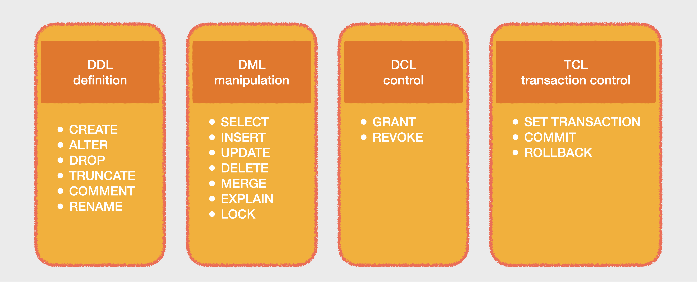

# 2일차. 아파치 스쿱을 통한 테이블 수집 실습 - Apache Sqoop
> 아파치 스쿱을 통해 다양한 수집 예제를 실습합니다


- 목차
  * [1. 최신버전 업데이트](#1-최신버전-업데이트)
  * [1-1. 아파치 스쿱 테이블 수집 예제 테이블](#아파치-스쿱-테이블-수집-예제-테이블)
  * [1-3. 유형별 테이블 수집](#유형별-테이블-수집)
  * [1-4. 파티션 테이블 수집](#파티션-테이블-수집)
  * [1-5. 증분 테이블 수집](#증분-테이블-수집)
  * [1-6. 모든 테이블 수집](#모든-테이블-수집)
  * [2. 아파치 스쿱을 통한 테이블 적재](#아파치-스쿱을-통한-테이블-적재)
  * [2-1. 새로운 테이블을 생성하고 적재](#새로운-테이블을-생성하고-적재)


## 1. 최신버전 업데이트
> 원격 터미널에 접속하여 관련 코드를 최신 버전으로 내려받고, 과거에 실행된 컨테이너가 없는지 확인하고 종료합니다

### 1-1. 최신 소스를 내려 받습니다
```bash
# terminal
cd /home/ubuntu/work/data-engineer-intermediate-training
git pull
```

### 1-2. 현재 기동되어 있는 도커 컨테이너를 확인하고, 종료합니다

#### 1-2-1. 현재 기동된 컨테이너를 확인합니다
```bash
# terminal
docker ps -a
```

#### 1-2-2. 기동된 컨테이너가 있다면 강제 종료합니다
```bash
# terminal 
docker rm -f `docker ps -aq`
```
> 다시 `docker ps -a` 명령으로 결과가 없다면 모든 컨테이너가 종료되었다고 보시면 됩니다
<br>


### 1-3. 실습을 위한 이미지를 내려받고 컨테이너를 기동합니다
```bash
# terminal
cd /home/ubuntu/work/data-engineer-intermediate-training/day2

docker compose pull
docker compose up -d
docker compose ps
```
<br>


### 1-4. SQL 기본 실습

#### 1-4-1. SQL 실습을 위해 root 유저로 데이터베이스 (foo) 생성
```bash
# terminal
docker compose exec mysql mysql -uroot -proot
```
* sqoop 유저가 해당 데이터베이스를 사용할 수 있도록 권한 부여를 합니다
```sql
# mysql>
CREATE DATABASE foo;
GRANT ALL ON foo.* TO 'sqoop'@'%';
```
> <kbd><samp>Ctrl</samp>+<samp>D</samp></kbd> 혹은 <kbd>exit</kbd> 명령으로 컨테이너에서 빠져나옵니다
<br>


#### 1-4-2. 테이블 확인 및 SQL 실습
```bash
# terminal
docker compose exec mysql mysql -usqoop -psqoop
```

#### 1-4-3. SQL 실습을 위해 sqoop 유저로 접속
```sql
# mysql>
use foo;
```

#### 1-4-4. 기본 SQL 명령어 리마인드



* [테이블 생성](https://dev.mysql.com/doc/refman/8.0/en/create-table.html)


```sql
# mysql>
CREATE TABLE table1 (
    col1 INT NOT NULL,
    col2 VARCHAR(10)
);

CREATE TABLE table2 (
    col1 INT NOT NULL AUTO_INCREMENT,
    col2 VARCHAR(10) NOT NULL,
    PRIMARY KEY (col1)
);

CREATE TABLE foo (
    foo INT
);

SHOW TABLES;
```

* [테이블 변경](https://dev.mysql.com/doc/refman/8.0/en/alter-table.html)
```sql
# mysql>
ALTER TABLE foo ADD COLUMN ( bar VARCHAR(10) );

DESC foo;
```

* [테이블 삭제](https://dev.mysql.com/doc/refman/8.0/en/drop-table.html)
```sql
# mysql>
DROP TABLE foo;

SHOW TABLES;
```

* [데이터 추가](https://dev.mysql.com/doc/refman/8.0/en/insert.html)
```sql
# mysql>
INSERT INTO table1 ( col1 ) VALUES ( 1 );
INSERT INTO table2 VALUES ( 1, 'one' );
INSERT INTO table2 VALUES ( 2, 'two' ), ( 3, 'three' );
```

* [데이터 조회](https://dev.mysql.com/doc/refman/8.0/en/select.html)
```sql
# mysql>
SELECT col1, col2
FROM table1;

SELECT col2
FROM table2
WHERE col2 = 'two';
```

* [데이터 변경](https://dev.mysql.com/doc/refman/8.0/en/update.html)
```sql
# mysql>
UPDATE table1 SET col1 = 100 WHERE col1 = 1;

SELECT col1, col2 FROM table1;
```

* [데이터 삭제](https://dev.mysql.com/doc/refman/8.0/en/delete.html)
```sql
# mysql>
DELETE FROM table1 WHERE col1 = 100;
DELETE FROM table2;
```

> <kbd><samp>Ctrl</samp>+<samp>D</samp></kbd> 혹은 <kbd>exit</kbd> 명령으로 컨테이너에서 빠져나옵니다
<br>


#### 1-4-5. 데이터베이스 삭제

> 테스트로 생성했던 foo 데이터베이스를 삭제합니다

```bash
# terminal
docker compose exec mysql mysql -uroot -proot
```
```sql
# mysql>
drop database foo;
```
> <kbd><samp>Ctrl</samp>+<samp>D</samp></kbd> 혹은 <kbd>exit</kbd> 명령으로 컨테이너에서 빠져나옵니다
<br>


### 1-5. 실습명령어 검증을 위한 ask 를 리뷰하고 실습합니다

> ask 명령어는 아래와 같이 전달받은 명령을 실행하는 스크립트입니다

```bash
#!/bin/bash
while true; do
    echo
    echo "$ $@"
    echo
    read -p "위 명령을 실행 하시겠습니까? [y/n] " yn
    case $yn in
        [Yy]* ) "$@"; break;;
        [Nn]* ) exit;;
        * ) echo "[y/n] 을 입력해 주세요.";;
    esac
done
```

#### 1-5-1. 스쿱 명령어 실습을 위해 컨테이너에 접속합니다
```bash
# terminal
docker compose exec sqoop bash
```

* 간단한 출력 명령을 수행합니다
```bash
# docker
ask echo hello world
```
<details><summary> 정답확인</summary>

> "hello world" 가 출력되면 정상입니다

</details>
<br>


#### 1-5-2. 데이터베이스, 테이블 목록 조회

> 스쿱을 이용하여 별도의 데이터베이스 접속 클라이언트가 없어도 기본적인 명령어(DDL, DML)을 수행할 수 있습니다

* 데이터베이스 목록을 조회합니다
```bash
# docker
sqoop list-databases --connect jdbc:mysql://mysql:3306 --username sqoop --password sqoop
```

* 테이블 목록을 조회합니다
```bash
# docker
sqoop list-tables --connect jdbc:mysql://mysql:3306/testdb --username sqoop --password sqoop
```

* 테이블 정보 및 조회를 합니다
```bash
# docker
sqoop eval --connect jdbc:mysql://mysql:3306/testdb --username sqoop --password sqoop -e "DESCRIBE user_20201025"
ask sqoop eval --connect jdbc:mysql://mysql:3306/testdb --username sqoop --password sqoop -e "SELECT * FROM user_20201025"
```

> 위와 같이 특정 데이터베이스에 계속 명령을 날리기에는 불편함이 있으므로 반복되는 명령어를 bash 쉘을 통해 만들어보면 편하게 사용할 수 있습니다

<details><summary>[실습] eval 명령을 쉽게 할 수 있는 간단한 bash 스크립트(예제: foo)를 만들어 보세요 </summary>

* 아래의 명령으로 터미널이 명령을 받을 준비를 하도록 하고
```bash
# docker
cat > foo
```
* 아래의 내용을 복사해서 붙여넣은 다음 <kbd><samp>Ctrl</samp>+<samp>C</samp></kbd> 명령으로 나오면 파일이 생성됩니다
```bash
#!/bin/bash
sqoop eval --connect jdbc:mysql://mysql:3306/testdb --username sqoop --password sqoop -e "$@"
```
* 실행 가능한 파일로 만들기 위해서 모드를 변경합니다
  - 실행 시에 반드시 쌍따옴표("")로 묶어야 제대로 수행됩니다
```bash
# docker
chmod +x foo
foo "DESCRIBE user_20201025"
```

</details>
<br>


#### 1-5-2. 테이블 조인, DDL, DML 명령어 수행

> eval 명령어를 이용하면 Join, Create, Insert, Select 등 DDL, DML 명령을 수행할 수 있으며, *실제 테이블 수집 시에도 다수의 테이블 대신 Join 한 결과를 사용하는 경우 효과적인 경우*도 있습니다

* 고객 테이블과 매출 테이블을 조인하는 예제
```sql
# docker
ask sqoop eval --connect jdbc:mysql://mysql:3306/testdb --username sqoop --password sqoop \
    -e "SELECT u.*, p.* FROM user_20201025 u JOIN purchase_20201025 p ON (u.u_id = p.p_uid) LIMIT 10"
```

* 테이블 생성 예제
```sql
# docker
ask sqoop eval --connect jdbc:mysql://mysql:3306/testdb --username sqoop --password sqoop \
    -e "CREATE TABLE tbl_salary (id INT NOT NULL AUTO_INCREMENT, name VARCHAR(30), salary INT, PRIMARY KEY (id))"
```

* 데이터 입력 예제
```sql
# docker
ask sqoop eval --connect jdbc:mysql://mysql:3306/testdb --username sqoop --password sqoop \
    -e "INSERT INTO tbl_salary (name, salary) VALUES ('suhyuk', 10000)"
```

* 데이터 조회 예제
```sql
# docker
ask sqoop eval --connect jdbc:mysql://mysql:3306/testdb --username sqoop --password sqoop \
    -e "SELECT * FROM tbl_salary"
```
<br>


#### 1-5-3. 실습 테이블 생성 및 수집 실습

##### 실습용 테이블 정보를 활용하여 테이블을 생성하세요

* 데이터베이스: testdb
* 테이블 이름: student 

| 컬럼명 | 컬럼유형 | 데이터 예제 |
| - | - | - |
| no | INT | `AUTO_INCREMENT` |
| name | VARCHAR(50) | 박수혁 |
| email | VARCHAR(50) | suhyuk.park@gmail.com |
| age | INT | 30 | 나이 |
| gender | VARCHAR(10) | 남 |

<details><summary>[실습] 위에서 명시한 student 테이블을 sqoop eval 명령어를 통해 testdb 에 생성하세요 </summary>

```bash
# terminal
docker compose exec mysql mysql -usqoop -psqoop
```
```sql
# mysql>
USE testdb;

CREATE TABLE student (
  no INT NOT NULL AUTO_INCREMENT
  , name VARCHAR(50)
  , email VARCHAR(50)
  , age INT
  , gender VARCHAR(10)
  , PRIMARY KEY (no)
);

DESC student;
```
* 아래와 같이 나오면 정답입니다
```text
+--------+-------------+------+-----+---------+----------------+
| Field  | Type        | Null | Key | Default | Extra          |
+--------+-------------+------+-----+---------+----------------+
| no     | INT(11)     | NO   | PRI | NULL    | AUTO_INCREMENT |
| name   | VARCHAR(50) | YES  |     | NULL    |                |
| email  | VARCHAR(50) | YES  |     | NULL    |                |
| age    | INT(11)     | YES  |     | NULL    |                |
| gender | VARCHAR(10) | YES  |     | NULL    |                |
+--------+-------------+------+-----+---------+----------------+
```

</details>
<br>


##### 실습용 데이터 정보를 활용하여 데이터를 입력하세요

* 고객 데이터 정보
```text
('권보안','Kwon.Boan@lgde.com',18,'여')
,('민의주','Min.Euiju@lgde.com',20,'여')
,('김혀시','Kim.Hyeosi@lgde.com',20,'남')
,('김유은','Kim.Yueun@lgde.com',38,'여')
,('박윤미','Park.Yoonmi@lgde.com',27,'여')
,('박예하','Park.Yeha@lgde.com',30,'남')
,('이병하','Lee.Byungha@lgde.com',21,'남')
,('김휘비','Kim.Hwibi@lgde.com',38,'남')
,('박재문','Park.Jaemoon@lgde.com',49,'남')
,('우소은','Woo.Soeun@lgde.com',30,'여')
```

<details><summary>[실습] sqoop eval 명령어를 통해 student 테이블에 입력하세요 </summary>

```sql
# mysql>
use testdb;

INSERT INTO student (name, email, age, gender) VALUES 
('권보안','Kwon.Boan@lgde.com',18,'여')
,('민의주','Min.Euiju@lgde.com',20,'여')
,('김혀시','Kim.Hyeosi@lgde.com',20,'남')
,('김유은','Kim.Yueun@lgde.com',38,'여')
,('박윤미','Park.Yoonmi@lgde.com',27,'여')
,('박예하','Park.Yeha@lgde.com',30,'남')
,('이병하','Lee.Byungha@lgde.com',21,'남')
,('김휘비','Kim.Hwibi@lgde.com',38,'남')
,('박재문','Park.Jaemoon@lgde.com',49,'남')
,('우소은','Woo.Soeun@lgde.com',30,'여');
SELECT * FROM student;
```
* 아래와 같이 나오면 정답입니다
```text
+----+-----------+-----------------------+------+--------+
| no | name      | email                 | age  | gender |
+----+-----------+-----------------------+------+--------+
|  1 | 권보안    | Kwon.Boan@lgde.com    |   18 | 여     |
|  2 | 민의주    | Min.Euiju@lgde.com    |   20 | 여     |
|  3 | 김혀시    | Kim.Hyeosi@lgde.com   |   20 | 남     |
|  4 | 김유은    | Kim.Yueun@lgde.com    |   38 | 여     |
|  5 | 박윤미    | Park.Yoonmi@lgde.com  |   27 | 여     |
|  6 | 박예하    | Park.Yeha@lgde.com    |   30 | 남     |
|  7 | 이병하    | Lee.Byungha@lgde.com  |   21 | 남     |
|  8 | 김휘비    | Kim.Hwibi@lgde.com    |   38 | 남     |
|  9 | 박재문    | Park.Jaemoon@lgde.com |   49 | 남     |
| 10 | 우소은    | Woo.Soeun@lgde.com    |   30 | 여     |
+----+-----------+-----------------------+------+--------+
10 rows in set (0.00 sec)
```

</details>
<br>


### 1-6. 로컬 프로세스로, 로컬 저장소에 텍스트 파일로 테이블 수집

> 스쿱은 분산 저장소와 분산 처리를 지원하지만, 로컬 리소스 (프로세스) 그리고 로컬 저장소 (디스크, SATA) 에도 저장하는 기능을 가지고 있습니다

* 컨테이너 로컬 디스크에 예제 테이블(student)을 수집합니다
  - <kbd>-jt local</kbd> : 로컬 프로세스로 (원격 분산처리가 아니라) 테이블을 수집
  - <kbd>-fs local</kbd> : 로컬 디스크에 (원격 부산저장소가 아니라) 테이블을 수집
  - <kbd>-m 1</kbd> : 하나의 프로세스로 실행
  - <kbd>--connect jdbc:mysql://mysql:3306/testdb</kbd> : 대상 서버 Connection String
  - <kbd>--username</kbd> : 이용자
  - <kbd>--password</kbd> : 패스워드
  - <kbd>--table</kbd> : 테이블이름
  - <kbd>--target-dir</kbd> : 저장경로 (컨테이너 내부의 로컬 저장소)
  - <kbd>--as-parquetfile</kbd> : 옵션을 추가하면 파케이 포맷으로 저장됩니다
  - <kbd>--fields-terminated-by '\t'</kbd> : 문자열을 구분자로 텍스트 파일로 저장됩니다 (파케이 옵션과 사용 불가)
  - <kbd>--relaxed-isolation</kbd> : 테이블에 Shared Lock 을 잡지 않고 가져옵니다
  - <kbd>--delete-target-dir</kbd> : 대상 경로가 있다면 삭제 후 수집합니다

* 테이블 수집 합니다
```bash
# docker
ask sqoop import -jt local -fs local -m 1 --connect jdbc:mysql://mysql:3306/testdb \
  --username sqoop --password sqoop --table student --target-dir /home/sqoop/target/student
```

* 로컬 저장소에 제대로 수집이 되었는지 확인합니다
```bash
# docker
ls /home/sqoop/target/student
ask cat /home/sqoop/target/student/part-m-00000
```
<br>


### 1-7. 저장 파일 포맷을 변경하며 수집

> 스쿱은 텍스트 파일 (TSV, CSV) 뿐만 아니라 파케이 (Parquet 컬럼지향 바이너리 압축 포맷) 포맷으로 저장이 가능합니다

#### 1-7-1. 탭 구분자 포맷으로 저장

<details><summary>[실습] 앞서 생성된 학생(student) 테이블을 탭으로 구분된 포맷으로 로컬 `/home/sqoop/target/student_tab` 경로에 저장하세요 </summary>

* 컨테이너에 접속되어 있지 않다면 접속합니다
```bash
# terminal
docker compose exec mysql mysql -usqoop -psqoop
```
* 스쿱 명령어로 테이블을 수집합니다
```bash
# docker
ask sqoop import -jt local -fs local -m 1 --connect jdbc:mysql://mysql:3306/testdb \
  --username sqoop --password sqoop --table student --target-dir /home/sqoop/target/student_tab \
  --fields-terminated-by '\t'
```
* 생성된 파일이 파케이로 저장되었는지 확인합니다
```
# docker
ls /home/sqoop/target/student_tab
```

</details>
<br>


#### 1-7-2. 파케이 포맷으로 저장

> 파케이 포맷 저장 <kbd>--as-parquetfile</kbd> 

<details><summary>[실습] 앞서 생성된 학생(student) 테이블을 파케이 포맷으로 로컬 `/home/sqoop/target/student_parquet` 경로에 저장하세요 </summary>

* 컨테이너에 접속되어 있지 않다면 접속합니다
```bash
# terminal
docker compose exec mysql mysql -usqoop -psqoop
```
* 스쿱 명령어로 테이블을 수집합니다
```bash
# docker
ask sqoop import -jt local -fs local -m 1 --connect jdbc:mysql://mysql:3306/testdb \
  --username sqoop --password sqoop --table student --target-dir /home/sqoop/target/student_parquet \
  --as-parquetfile
```
* 생성된 파일이 파케이로 저장되었는지 확인후 파일명을 기억해둡니다
```
# docker
ask ls -d1 /home/sqoop/target/student_parquet/*
```

</details>
<br>


#### 1-7-3. 파케이 포맷 읽기

> 파케이 포맷은 바이너리 포맷이라 문서편집기 등을 통해 직접 확인할 수 없기 때문에 별도의 도구를 통해서만 읽어들일 수 있습니다

* 생성된 파일이 파케이로 저장되었는지 확인후 파일명을 기억해둡니다
```bash
# docker
filename=`ls -d1 /home/sqoop/target/student_parquet/*`
```

* 파케이 포맷으로 저장된 테이블을 출력합니다 
  - 파케이 포맷의 파일은 바이너리 포맷이라 cat 혹은 vi 등으로 내용을 확인할 수 없습니다
  - 서버에 설치된 /jdbc/parquet-tools-1.8.1.jar 어플리케이션을 이용하여 확인이 가능합니다
```bash
# docker
hadoop jar /jdbc/parquet-tools-1.8.1.jar head file://${filename}
```

* 파케이 포맷 도구를 이용하여 사용가능한 기능
  - <kbd>head -n 5</kbd> : 상위 5개의 문서를 출력합니다 (default: 5)
  - <kbd>cat</kbd> : 문서를 그대로 출력합니다
  - <kbd>schema</kbd> : 테이블 스키마를 출력합니다
  - <kbd>meta</kbd> : 파케이 포맷의 메타데이터를 출력합니다 
  - <kbd>dump</kbd> : 텍스트 포맷으로 출력 합니다

<details><summary>[실습] 같은 방식으로 해당 파케이 파일의 상위(head) 3개문서, 스키마(schema), 메타(meta) 출력을 해보세요 </summary>

* 컨테이너에 접속되어 있지 않다면 접속합니다
```bash
# terminal
docker compose exec mysql mysql -usqoop -psqoop
```
* 상위 3개 문서 반환
```
# docker
ask hadoop jar /jdbc/parquet-tools-1.8.1.jar head -n 3 file://${filename}
```
* 스키마 출력 
```
# docker
ask hadoop jar /jdbc/parquet-tools-1.8.1.jar schema file://${filename}
```
* 메타정보 출력
```
# docker
ask hadoop jar /jdbc/parquet-tools-1.8.1.jar meta file://${filename}
```

</details>
<br>


### 1-8. 클러스터 환경에서 하둡 저장소로 예제 테이블 수집

> **"클러스터 모드"** 란? 분산 저장/처리 엔진을 활용하여 원격지 장비의 리소스를 활용하여 원격 디스크에 저장할 수 있는 모드입니다

* <kbd>-fs namenode:port</kbd> : File System 이 분산 파일시스템 의미 (Ex. HDFS)
* <kbd>-jt jobtracker:port</kbd> : Job Tracker 가 분산 처리시스템 의미 (Ex. YARN)
  - 본 예제에서는 관련 설정이 되어 있으므로 -fs, -jt 옵션을 지정하지 않아도 됩니다
  - 저장경로의 경우에도 hdfs:// 는 명시하지 않아도 hdfs 에 저장됩니다

#### 1-8-1. 클러스터 환경에서 에제 테이블 `seoul_popular_trip`을 수집 합니다

* 클러스터 환경의 경우 `-jt`, `-fs` 옵션이 없으며, 저장 경로를 하둡 경로로 인식합니다
  - 명시적으로 hdfs:// 를 넣어도 무관합니다
```bash
# docker
ask sqoop import -m 1 --connect jdbc:mysql://mysql:3306/testdb --username sqoop --password sqoop \
  --table seoul_popular_trip --target-dir /user/sqoop/target/seoul_popular_trip
```

* 원격 하둡 저장소에 제대로 수집이 되었는지 확인합니다
```bash
# docker
hadoop fs -ls /user/sqoop/target/seoul_popular_trip
ask hadoop fs -cat /user/sqoop/target/seoul_popular_trip/part-m-00000
```
<br>


## 2. 성능 향상 기법

>  스쿱을 통해 대용량 테이블 수집을 위해서는 다양한 방법으로 접근할 수 있는데, 수집 시에 성능을 향상 시키는 **병렬수집(split-by)**, 수집된 데이터가 너무 크거나 분할되어 있지 않다면 조회 및 처리 시에 영향을 주기 때문에 파티션 단위로 **분할저장(partition)** 하는 기법이 있고, 자주 사용되지는 않으나, 증분되는 데이터만 가져와서 지속적으로 **증분추가(append) 하는 기법**을 실습합니다


### 2-1. 병렬 수행을 통한 테이블 수집

> 한 번에 여러개의 작업이 기동되어 하나의 테이블을 조건을 나누어 분할하여 동시에 수집하는 기법이며, 이렇게 분할해서 수집하기 위해서는 min, max 값을 가질 수 있는 편중되지 않은 값을 가진 컬럼이 반드시 존재해야 합니다.

* 병렬수행 방식
  - 이용자 아이디가 (id int) 가 1부터 100만까지 존재하는 테이블이 있다면
  - 병렬 수행을 4개로 수행한다고 가정한다면, 내부적으로 `min(id), max(id) 값을 조회`합니다
  - 하여 조건 절에 `0 < id <= 25만, 25만 < id <= 50만 ... 75만 < id <= 100만 으로 4개 그룹`을 생성합니다
  - 각 `4개의 조건에 맞는 테이블 수집을 동시에 수집`하여 병렬성을 보장합니다
  - 단, 특정 컬럼이 `편중된 값을 가진다면 특정 작업만 느려`질 수 있으므로 데이터에 대한 이해가 필요합니다

* 병렬 수집 실습
```bash
# docker
ask sqoop import -m 4 --split-by id --connect jdbc:mysql://mysql:3306/testdb --username sqoop --password sqoop \
  --table seoul_popular_trip --target-dir /user/sqoop/target/seoul_popular_trip_split \
  --fields-terminated-by '\t' --delete-target-dir
```
<br>


### 2-2. 파티션 테이블 수집

> 하나의 테이블을 특정 조건에 따라 분산해서 저장히기 위해 id 값이 적절하다 판단되며, 이 값의 최소, 최대값을 확인해 봅니다

#### 2-2-1. id 필드의 최대, 최소값 확인
```bash
cmd "SELECT MIN(id), MAX(id) FROM seoul_popular_trip"
ask cmd "SELECT COUNT(1) FROM seoul_popular_trip"
```

<details><summary>[실습] 출력 결과 확인</summary>

> 출력 결과가 아래와 같다면 성공입니다

```bash
# SELECT MIN(id), MAX(id) FROM seoul_popular_trip;
---------------------------
| MIN(id)    | MAX(id)    |
---------------------------
| 34         | 29578      |
---------------------------

# SELECT COUNT(1) FROM seoul_popular_trip;
-----------------------
| COUNT(1)            |
-----------------------
| 1956                |
-----------------------
```

</details>
<br>


#### 2-2-2. 저장 경로 생성

* 테이블을 파티션 단위로 저장하기 위해서는 루트 경로를 생성해 두어야만 합니다
  - 하위에 key=value 형식의 경로로 저장할 예정이기 때문입니다
  - `seoul_popular_partition/id_range=1_10000`
  - `seoul_popular_partition/id_range=10000_20000`
  - `seoul_popular_partition/id_range=20000_30000`
```bash
hadoop fs -mkdir -p /user/sqoop/target/seoul_popular_partition
ask hadoop fs -ls /user/sqoop/target
```
<br>


#### 2-2-3. 파티션 별 테이블 수집

> 확인한 값의 범위를 이용하여 조건을 달리하여 하나의 테이블을 3번으로 나누어 수집을 수행합니다

* id 의 범위가 각각  <kbd>id < 10000</kbd>, <kbd>id > 10001 and id < 20000</kbd>, <kbd>id > 20001</kbd> 범위에 해당하는 값을 수집합니다
```bash
sqoop import --connect jdbc:mysql://mysql:3306/testdb --username sqoop --password sqoop \
  --delete-target-dir -m 1 --table seoul_popular_trip \
  --where "id < 10000" \
  --target-dir /user/sqoop/target/seoul_popular_partition/part=0
```
```bash
sqoop import --connect jdbc:mysql://mysql:3306/testdb --username sqoop --password sqoop \
  --delete-target-dir -m 1 --table seoul_popular_trip \
  --where "id > 10001 and id < 20000" \
  --target-dir /user/sqoop/target/seoul_popular_partition/part=10000
```
```bash
sqoop import --connect jdbc:mysql://mysql:3306/testdb --username sqoop --password sqoop \
  --delete-target-dir -m 1 --table seoul_popular_trip \
  --where "id > 20001" \
  --target-dir /user/sqoop/target/seoul_popular_partition/part=20000
```

* 테이블 수집이 정상적으로 수행 되었는지 하둡 명령어를 통해 확인해 봅니다
```bash
hadoop fs -ls -R /user/sqoop/target/seoul_popular_partition | grep SUCCESS
```

<details><summary>[실습] 출력 결과 확인</summary>

> 출력 결과가 아래와 같다면 성공입니다

```bash
# hadoop fs -ls -R /user/sqoop/target/seoul_popular_partition | grep SUCCESS
-rw-r--r--   1 root supergroup          0 2021-07-17 12:22 /user/sqoop/target/seoul_popular_partition/part=0/_SUCCESS
-rw-r--r--   1 root supergroup          0 2021-07-17 12:22 /user/sqoop/target/seoul_popular_partition/part=10000/_SUCCESS
-rw-r--r--   1 root supergroup          0 2021-07-17 12:23 /user/sqoop/target/seoul_popular_partition/part=20000/_SUCCESS

```

</details>
<br>


### 2-3. 증분 테이블 수집

> 테이블의 크기는 너무 크지만, 아주 작은 범위의 데이터가 추가되는 테이블의 경우 스냅샷으로 수집하는 것은 너무 부하가 크기 때문에 변경되는 증분만 수집해야 하는 경우가 있습니다. 이런 경우에 변경사항을 반영하는 테이블 컬럼 (ex_ timestamp)이 있어야 하지만, 효과적인 수집이 가능합니다

* 증분 테이블 수집의 제약 사항
  - 변경되는 정보를 확인할 수 있는 컬럼이 존재해야 합니다
  - 항상 append 되어야 수집 이후의 중복 문제가 없습니다

#### 2-3-1. 증분 테이블 실습을 위해, 예제 테이블을 생성합니다 `inc_table`
  - 아까 생성해 두었던 cmd 명령어를 이용해서 테스트 합니다
```bash
# docker
ask cmd "CREATE TABLE inc_table (
  id INT NOT NULL auto_increment
  , name VARCHAR(30)
  , salary INT
  , primary key (id)
);"
```

```bash
ask cmd "INSERT INTO inc_table (name, salary) VALUES ('suhyuk', 10000);"
```
<br>


#### 2-3-2. 증분 테이블 초기 수집은 --last-value 값을 0으로 두고 수집합니다
  * 증분 테이블 수집 후 마지막에 --last-value 값이 1인 점을 확인해 둡니다 (다음 수집 시에 사용할 예정입니다)
  * 수집 이후에 하둡 명령어로 파티션 파일이 잘 생성되었는지 확인합니다
```bash
# docker
sqoop import --table inc_table --incremental append --check-column id --last-value 0 --target-dir /user/sqoop/target/seoul_popular_inc
```
```
# docker
hadoop fs -ls /user/sqoop/target/seoul_popular_inc
hadoop fs -cat /user/sqoop/target/seoul_popular_inc/part-m-00000
```
<br>


#### 2-3-3. 초기 수집 이후에 데이터가 추가되었(증분)다는 것을 테스트하기 위해 데이터를 추가합니다
```bash
# terminal
docker exec -it mysql mysql -usqoop -psqoop
```
```sql
# mysql>
INSERT INTO inc_table (name, salary) VALUES ('psyoblade', 20000);
```
<br>


#### 2-3-4. 증분 테이블 수집을 위해 이전 --last-value 1 을 입력하고 다시 수집합니다
```bash
# docker
ask sqoop import --table inc_table \
  --incremental append \
  --check-column id --last-value 1 \
  --target-dir /user/sqoop/target/seoul_popular_inc
```
<br>


#### 2-3-5. 수집 된 테이블의 최종 결과 테이블에 파티션 파일이 어떻게 생성되고 있는지 확인합니다
```bash
# docker
hadoop fs -ls /user/sqoop/target/seoul_popular_inc
hadoop fs -cat /user/sqoop/target/seoul_popular_inc/part-m-00001
```
<br>


### 2-4. 수집 옵션 최적화

> 스쿱은 JDBC 를 통해 데이터를 수집하기 때문에 여러가지 JDBC 옵션을 통한 최적화가 가능합니다. 데이터베이스 엔진의 차이에 따른 옵션도 존재하므로, 개별 옵션을 확인해둘 필요가 있습니다


#### 2-4-1. 패치 크기 조정

#### 2-4-2. 배치 옵션

#### 2-4-3. 압축 옵션

#### 2-4-4. 필요한 컬럼만 선택

#### 2-4-5. 조인을 통한 최적화

<br>


## 3. 하둡에서 관계형 테이블로 적재

> 스쿱은 관계형 데이터를 하둡 분산 저장소에 저장(import)도 하지만, 반대로 관계형 데이터베이스에 다시 적재(export)하는 기능도 있습니다. 특히 **적재 서비스는 파일 스키마와 테이블 스키마가 다른 경우 전체 작업이 실패**하므로 사전에 확인해 둘 필요가 있습니다


### 3-1. 새로운 테이블을 생성하고 적재

#### 3-1-1. 동일한 스키마를 가진 테이블(`seoul_popular_exp`) 생성

```bash
# terminal
docker compose exec mysql mysql -usqoop -psqoop
```
* 테스트 적재를 위한 테이블을 생성합니다
```sql
# mysql>

use testdb;

CREATE TABLE testdb.seoul_popular_exp (
  category INT NOT NULL
  , id INT NOT NULL
  , name VARCHAR(100)
  , address VARCHAR(100)
  , naddress VARCHAR(100)
  , tel VARCHAR(20)
  , tag VARCHAR(500)
) CHARACTER SET UTF8 COLLATE UTF8_GENERAL_CI;

show tables;
```
<br>


### 3-2. 적재 오류시에 디버깅 하는방법

> 적재 서비스는 스키마 불일치에 따른 실패가 자주 발생하는데 의도적으로 발생시켜 디버깅하는 방법을 익힙니다

#### 3-2-1. 실패하는 테이블 적재 작업 디버깅

* 적재 작업을 수행하면 오류가 발생하고 예외가 발생하고, 정확한 오류를 확인할 수 없습니다
```bash
# docker
ask sqoop export -m 1 --connect jdbc:mysql://mysql:3306/testdb --username sqoop --password sqoop \
  --table seoul_popular_exp --export-dir /user/sqoop/target/seoul_popular_trip
```

* 오류 확인은 리소스매니저 (http://<cloud-public-ip>:8088) 사이트에서 할 수 있습니다
  * `application_id` 링크를 클릭하고 logs 경로를 클릭하면 http://9e48393c5f39:8042/ 와 같이 docker-container 아이로 redirect 됩니다
  * 해당 문자열을 자신의 클라우드 장비의 IP 혹은 DNS 주소로 변경하면 됩니다
  * 해당 로그 페이지에서 "syslog : Total file length is 49301 bytes." 링크를 클릭하고 "here" 링크를 클릭하면 전체 로그를 한 번에 확인할 수 있습니다
<br>


#### 3-2-2. 구분자 오류에 따른 실패 복구

* 수집한 테이블의 경우 콤마를 기준으로 수집했는데, 필드에 콤마(,)가 들어가 있어서 export 시에 필드의 개수가 맞지 않는다는 오류를 확인합니다
  - 적재 수행 시에 콤마 구분자로 수행하거나 (단, 이번 예제는 내부에 콤마가 들어가 있는 튜플이 있어서 사용할 수 없다)
  - 테이블 수집을 탭 구분자로 변경하거나 (하여 콤마 보다는 탭을 구분자로 선택하는 것이 좀 더 일반적입니다)

```bash
# docker
ask sqoop import -m 1 --connect jdbc:mysql://mysql:3306/testdb --username sqoop --password sqoop \
  --table seoul_popular_trip --target-dir /user/sqoop/target/seoul_popular_exp \
  --fields-terminated-by '\t' --delete-target-dir 
```

* 올바르게 수집 되었는지 데이터를 확인합니다
```bash
# docker
ask hadoop fs -cat /user/sqoop/target/seoul_popular_exp/part-m-00000 | more
```
```text
0	281	통인시장	110-043 서울 종로구 통인동 10-3 	03036 서울 종로구 자하문로15길 18 	02-722-0911	엽전도시락,종로통인시장,통인시장닭꼬치,런닝맨,엽전시장,통인시장데이트,효자베이커리,통인시장, 1박2일,기름떡볶이
0	345	타르틴	140-863 서울 용산구 이태원동 119-15 	04350 서울 용산구 이태원로23길 4 (이태원동) 	02-3785-3400	타르틴,이태원디저트카페,파이,런닝맨,파이맛집,이태원맛집, 유재석,식신로드,타르트맛집

```

* 탭 구분자로 익스포트된 경로의 파일을 이용하여 다시 익스포트를 수행합니다
```bash
ask sqoop export -m 1 --connect jdbc:mysql://mysql:3306/testdb --username sqoop --password sqoop \
  --table seoul_popular_exp --export-dir /user/sqoop/target/seoul_popular_exp \
  --fields-terminated-by '\t' 
```
```text
21/07/17 10:09:44 INFO mapreduce.ExportJobBase: Transferred 483.1064 KB in 12.7846 seconds (37.7882 KB/sec)
21/07/17 10:09:44 INFO mapreduce.ExportJobBase: Exported 1956 records.
```

```sql
# mysql>
SELECT category, id, name FROM seoul_popular_exp LIMIT 3;
```
```sql
# mysql>
SELECT category, id, name FROM seoul_popular_exp LIMIT 3;
```
```text
+----------+-----+--------------+
| category | id  | name         |
+----------+-----+--------------+
|        0 | 281 | 통인시장     |
|        0 | 345 | 타르틴       |
|        0 | 383 | 해랑         |
+----------+-----+--------------+
```
<br>


### 3-3. 테이블 익스포트 시에 스테이징을 통한 적재

> 적재 시에 도중에 일부 컬럼 때문에 실패하는 경우 대상 테이블에 일부 데이터만 적재되어 사용되는 경우가 있는데 이러한 경우를 회피하기 위해 스테이징 테이블을 사용할 수 있습니다. 즉, 한 번 테스트로 적재를 해보는 개념으로 이해하시면 됩니다

* 스테이징 테이블은 원본 테이블을 그대로 두고 별도의 스테이징 테이블에 적재 후 완전 export 가 성공하면 원본 테이블을 clear 후 적재합니다
* 아래와 같이 임시 스테이징 테이블을 동일한 스키마로 생성하고 익스포트를 수행합니다
```sql
# mysql>
CREATE TABLE testdb.seoul_popular_stg (
  category INT NOT NULL
  , id INT NOT NULL
  , name VARCHAR(100)
  , address VARCHAR(100)
  , naddress VARCHAR(100)
  , tel VARCHAR(20)
  , tag VARCHAR(500)
) CHARACTER SET UTF8 COLLATE UTF8_GENERAL_CI;

show tables;
```

* 이미 적재된 테이블에 다시 적재하는 경우는 중복 데이터가 생성되므로  삭제 혹은 TRUNCATE 는 수작업으로 수행되어야만 합니다
  - 수행 시에 맵 갯수를 4개로 늘려서 테스트 해보겠습니다
```bash
sqoop eval --connect jdbc:mysql://mysql:3306/testdb --username sqoop --password sqoop \
  -e "TRUNCATE seoul_popular_exp"

ask sqoop export -m 4 --connect jdbc:mysql://mysql:3306/testdb --username sqoop --password sqoop \
  --table seoul_popular_exp --export-dir /user/sqoop/target/seoul_popular_exp \
  --fields-terminated-by '\t' --staging-table seoul_popular_stg --clear-staging-table
```
* 적재 과정에서 stg 및 exp 테이블을 조회해 보면 상태를 확인할 수 있습니다
```sql
# mysql>
SELECT COUNT(1) FROM seoul_popular_stg;
SELECT COUNT(1) FROM seoul_popular_exp;
```

> 적재시에 4개의 맵 작업수로 수행된 사항에 대해서도 디버깅 해보시면 어떻게 동작하는 지 확인할 수 있습니다

<br>


## 4. 유틸리티

### 4-1. 모든 테이블 수집

> 데이터베이스에 존재하는 모든 테이블을 순차적으로 백업하는 기능입니다. 자주 사용되지는 않지만, 전체 데이터 백업 시에 참고해볼 만한 도구입니다

* 모든 테이블 수집을 위한 데이터베이스(testdb) 경로를 하나 생성합니다
```bash
# docker
hadoop fs -mkdir /user/sqoop/target/testdb
```

* 생성된 경로를 루트로 하위로 모든 테이블을 수집합니다
  - 반드시 --autoreset-to-one-mapper 를 지정해 주어야 primary key 가 없는 경우에도 -m 1 으로 수집이 됩니다
```bash
# docker
ask sqoop import-all-tables --connect jdbc:mysql://mysql:3306/testdb --username sqoop --password sqoop \
  --autoreset-to-one-mapper --warehouse-dir /user/sqoop/target/testdb
```
<br>


### 4-2. 컨테이너 정리
* 테스트 작업이 완료되었으므로 모든 컨테이너를 종료합니다 (한번에 실행중인 모든 컨테이너를 종료합니다)
```bash
cd /home/ubuntu/work/data-engineer-intermediate-training/day2
docker compose down
```
