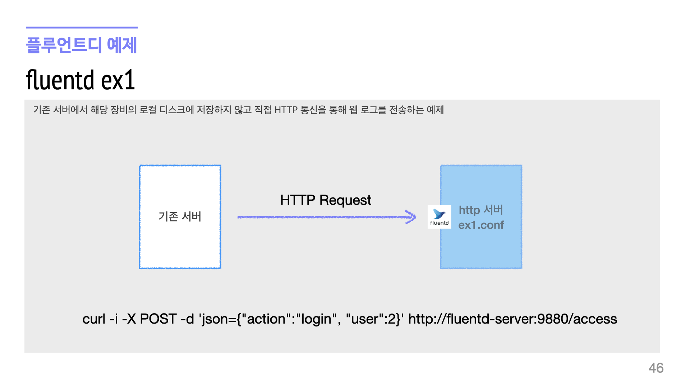
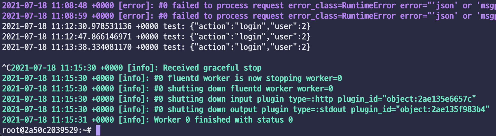

# 2일차. 플루언트디를 통한 파일 데이터 수집 - Fluentd
> 플루언트디를 통해 다양한 수집 예제를 실습합니다
> 이번 장에서 사용하는 외부 오픈 포트는 22, 80, 5601, 8080, 9880, 50070 입니다


- 목차
  * [1. 웹 서버를 통해서 전송 받은 데이터를 표준 출력으로 전달](#1-웹-서버를-통해서-전송-받은-데이터를-표준-출력으로-전달)
  * [2. 더미 에이전트를 통해 생성된 이벤트를 로컬 저장소에 저장](#2-더미-에이전트를-통해-생성된-이벤트를-로컬-저장소에-저장)
  * [3. 시스템 로그를 테일링 하면서 표준 출력으로 전달](#3-시스템-로그를-테일링-하면서-표준-출력으로-전달)
  * [4. 트랜스포머를 통한 시간 데이터 변환](#4-트랜스포머를-통한-시간-데이터-변환)
  * [5. 컨테이너 환경에서의 로그 전송](#5-컨테이너-환경에서의-로그-전송)
  * [6. 도커 컴포즈를 통한 로그 전송 구성](#6-도커-컴포즈를-통한-로그-전송-구성)
  * [7. 멀티 프로세스를 통한 성능 향상](#7-멀티-프로세스를-통한-성능-향상)
  * [8. 멀티 프로세스를 통해 하나의 위치에 저장](#8-멀티-프로세스를-통해-하나의-위치에-저장)
  * [9. 전송되는 데이터를 분산 저장소에 저장](#9-전송되는-데이터를-분산-저장소에-저장)


## 1. 최신버전 업데이트
> 원격 터미널에 접속하여 관련 코드를 최신 버전으로 내려받고, 과거에 실행된 컨테이너가 없는지 확인하고 종료합니다

### 1-1. 최신 소스를 내려 받습니다
```bash
# terminal
cd /home/ubuntu/work/data-engineer-intermediate-training
git pull
```

### 1-2. 현재 기동되어 있는 도커 컨테이너를 확인하고, 종료합니다

#### 1-2-1. 현재 기동된 컨테이너를 확인합니다
```bash
# terminal
docker ps -a
```

#### 1-2-2. 기동된 컨테이너가 있다면 강제 종료합니다
```bash
# terminal 
docker rm -f `docker ps -aq`
```
> 다시 `docker ps -a` 명령으로 결과가 없다면 모든 컨테이너가 종료되었다고 보시면 됩니다
<br>


### 1-3. 이번 실습은 예제 별로 다른 컨테이너를 사용합니다

> `cd /home/ubuntu/work/data-engineer-intermediate-training/day3/`<kbd>ex1</kbd> 와 같이 마지막 경로가 다른 점에 유의 하시기 바랍니다

* 1번 실습의 경로는 <kbd>ex1</kbd>이므로 아래와 같습니다
```bash
# terminal
cd /home/ubuntu/work/data-engineer-intermediate-training/day3/ex1
```
<br>


## 2. 플루언트디를 웹서버처럼 사용하기

> 플루언트디 로그 수집기는 **에이전트 방식의 데몬 서버**이기 때문에 일반적인 웹서버 처럼 *http 프로토콜을 통해서도 로그를 전송받을 수 있습*니다

* 가장 일반적인 데이터 포맷인 *JSON 으로 로그를 수신하고, 표준출력(stdout)으로 출력*하는 예제를 실습해봅니다
* 다른 부서 혹은 팀내의 다른 애플리케이션 간의 **로그 전송 프로토콜이 명확하지 않은 경우 가볍게 연동해볼 만한 모델**입니다



### 2-1. 도커 컨테이너 기동
```bash
cd /home/ubuntu/work/data-engineer-intermediate-training/day3/ex1
docker compose pull
docker compose up -d
```

### 2-2. 도커 및 플루언트디 설정파일 확인

> 기본 설정은 /etc/fluentd/fluent.conf 파일을 바라보는데 예제 환경에서는 `docker-compose.yml` 설정에서 해당 위치에 ex1/fluent.conf 파일을 마운트해 두었기 때문에 컨테이너 환경 내에서 바로 실행을 해도 잘 동작합니다. 별도로 `fluentd -c /etc/fluentd/fluent.conf` 로 실행해도 동일하게 동작합니다

#### 2-2-1 도커 컴포즈 파일 구성 `docker compose.yml`

```yml
version: "3"

services:
  fluentd:
    container_name: fluentd
    image: psyoblade/data-engineer-fluentd:2.1
    user: root
    tty: true
    ports:
      - 9880:9880
    volumes:
      - ./fluent.conf:/etc/fluentd/fluent.conf
      - ./send_http.sh:/home/root/send_http.sh
    working_dir: /home/root

networks:
  default:
    name: default_network
```
> 플루언트디가 9880 포트를 통해 http 웹서버를 기동했기 때문에 컴포즈 파일에서 해당 포트를 노출시킨 점도 확인합니다

#### 2-2-2 플루언트디 파일 구성 `fluent.conf`
```xml
<source>
    @type http
    port 9880
    bind 0.0.0.0
</source>

<match test>
    @type stdout
</match>
```
<br>


### 2-3. 플루언트디 기동 및 확인

#### 2-3-1. 에이전트 기동을 위해 컨테이너로 접속 후, 에이전트를 기동합니다
```bash
# terminal
docker compose exec fluentd bash
```
```bash
# docker
fluentd
```
* `fluentd -c /etc/fluentd/fluent.conf`로 기동해도 동일하게 동작합니다

<details><summary>[실습] 출력 결과 확인</summary>

> 출력 결과가 오류가 발생하지 않고, 아래와 유사하다면 성공입니다

```bash
[Default] Start fluentd agent w/ default configuration
/opt/td-agent/embedded/bin/fluentd -c /etc/fluentd/fluent.conf
2021-07-18 11:03:23 +0000 [info]: parsing config file is succeeded path="/etc/fluentd/fluent.conf"
2021-07-18 11:03:23 +0000 [info]: using configuration file: <ROOT>
  <source>
    @type http
    port 9880
    bind "0.0.0.0"
  </source>
  <match test>
    @type stdout
  </match>
</ROOT>
2021-07-18 11:03:23 +0000 [info]: starting fluentd-1.11.5 pid=22 ruby="2.4.10"
2021-07-18 11:03:23 +0000 [info]: spawn command to main:  cmdline=["/opt/td-agent/embedded/bin/ruby", "-Eascii-8bit:ascii-8bit", "/opt/td-agent/embedded/bin/fluentd", "-c", "/etc/fluentd/fluent.conf", "--under-supervisor"]
2021-07-18 11:03:24 +0000 [info]: adding match pattern="test" type="stdout"
2021-07-18 11:03:24 +0000 [info]: adding source type="http"
2021-07-18 11:03:24 +0000 [info]: #0 starting fluentd worker pid=31 ppid=22 worker=0
2021-07-18 11:03:24 +0000 [info]: #0 fluentd worker is now running worker=0
```

</details>
<br>


#### 2-3-2. 별도의 터미널에서 CURL 명령으로 확인합니다

* 웹 브라우저를 통해 POST 전달이 안되기 때문에 별도 터미널로 접속합니다
  - 클라우드 터미널에 curl 설치가 되어있지 않을 수도 있으므로 도커 컨테이너에 접속합니다
```bash
# terminal
docker compose exec fluentd bash
```
```bash
# docker
curl -i -X POST -d json={"action":"login","user":2} http://localhost:9880/test
HTTP/1.1 200 OK
Content-Type: text/plain
Connection: Keep-Alive
Content-Length: 0
```
> 사전에 배포된 `send_http.sh` 를 실행해도 동일한 결과를 얻습니다

<details><summary>[실습] 출력 결과 확인</summary>

> 에이전트가 기동된 컨테이너의 화면에는 아래와 같이 수신된 로그를 출력하면 성공입니다

```text
2021-07-18 11:12:47.866146971 +0000 test: {"action":"login","user":2}
2021-07-18 11:13:38.334081170 +0000 test: {"action":"login","user":2}
```

</details>
<br>


#### 2-3-3. 실습이 끝났으므로 플루언트디 에이전트를 컨테이너 화면에서 <kbd><samp>Ctrl</samp>+<samp>C</samp></kbd> 명령으로 종료합니다



#### 2-3-4. 1번 예제 실습이 모두 종료되었으므로 <kbd><samp>Ctrl</samp>+<samp>D</samp></kbd> 혹은 <kbd>exit</kbd> 명령으로 컨테이너를 종료합니다

> 컨테이너가 종료된 터미널의 프롬프트(도커의 경우 root@2a50c30293829 형식)를 통해 확인할 수 있습니다

<br>


## 3. 수신된 로그를 로컬에 저장하는 예제

> 로그를 전송해 주는 서비스 혹은 애플리케이션을 별도로 기동하는 것도 귀찮은 일이기 때문에, 플루언트디에서 제공하는 로그를 자동으로 발생시키는 더미 로그 플러그인을 이용하여 로그를 발생시키고, 발생된 로그를 로컬 저장소에 저장하는 예제를 실습합니다

* 플루언트디 더미 에이전트를 이용하여 임의의 로그를 자동으로 발생시킴
* 발생된 로그(이벤트)를 로컬 저장소에 임의의 경로에 저장합니다

### 3-1. 이전 컨테이너 종료 및 컨테이너 기동

> 이전 실습에서 기동된 컨테이너를 종료 후, 기동합니다.

```bash
cd /home/ubuntu/work/data-engineer-intermediate-training/day3/ex1
docker compose down

cd /home/ubuntu/work/data-engineer-intermediate-training/day3/ex2
docker compose pull
docker compose up -d
```
<br>


#### 3-1-1 도커 컴포즈 파일 구성 `docker compose.yml`

```yml
version: "3"

services:
  fluentd:
    container_name: fluentd
    image: psyoblade/data-engineer-fluentd:2.1
    user: root
    tty: true
    ports:
      - 9880:9880
    volumes:
      - ./fluent.conf:/etc/fluentd/fluent.conf
      - ./target:/fluentd/target
    working_dir: /home/root

networks:
  default:
    name: default_network
```
> 저장되는 로그를 호스트 장비의 볼륨에 마운트하여 컨테이너가 종료되는 경우에도 유지될 수 있도록 구성합니다

#### 3-1-2 플루언트디 파일 구성 `fluent.conf`
```xml
<source>
    @type dummy
    tag lgde.info
    size 5
    rate 1
    auto_increment_key seq
    dummy {"info":"hello-world"}
</source>

<source>
    @type dummy
    tag lgde.debug
    size 3
    rate 1
    dummy {"debug":"hello-world"}
</source>

<filter lgde.info>
    @type record_transformer
    <record>
        table_name ${tag_parts[0]}
    </record>
</filter>

<match lgde.info>
    @type file
    path_suffix .log
    path /fluentd/target/${table_name}/%Y%m%d/part-%Y%m%d.%H%M
    <buffer time,table_name>
        timekey 1m
        timekey_wait 10s
        timekey_use_utc false
        timekey_zone +0900
    </buffer>
</match>

<match lgde.debug>
    @type stdout
</match>
```
> 더미 에이전트가 로그를 발생시키고, 발생된 로그를 로컬 저장소에 저장합니다. 

* 더미 에이전트 로그 생성
  - lgde.info 와 lgde.debug 2가지 이벤트가 발생
  - info 이벤트만 filter, match 되도록 구성
  - debug 이벤트는 stdout 출력만 되도록 구성
* 필터 플러그인 구성
  - `record_transformer`를 통해 별도의 필트를 추가합니다
  - `${tag_parts[0]}` : 태그의 0번째 즉 lgde 를 말합니다
  - `record` : 앨리먼트를 통해서 `table_name`:`lgde` 라는 값이 추가됩니다
* 매치 플러그인 구성
  - 지정된 경로에 log 파일로 생성합니다
  - 1분에 한 번 저장하되 10초 까지 지연된 로그를 저장합니다
  - 한국 시간 기준으로 포맷을 생성 유지합니다

<br>


### 3-2. 에이전트 기동 및 확인

#### 3-2-1. 에이전트 기동을 위해 컨테이너로 접속 후, 에이전트를 기동합니다

```bash
# terminal
docker compose exec fluentd bash
```
```bash
# docker
fluentd
```
* 아래와 같이 출력되고 있다면 정상입니다 (lgde.debug)
```bash
# docker
2021-07-18 11:52:24 +0000 [info]: #0 starting fluentd worker pid=58 ppid=49 worker=0
2021-07-18 11:52:24 +0000 [info]: #0 fluentd worker is now running worker=0
2021-07-18 11:52:25.081705098 +0000 lgde.debug: {"debug":"hello-world"}
2021-07-18 11:52:25.081710640 +0000 lgde.debug: {"debug":"hello-world"}
```

#### 3-2-2. 별도의 터미널에서 생성되는 로그 파일을 확인합니다

```bash
# terminal
docker compose exec fluentd bash
```
```bash
# docker
tree /fluentd/target/
```

<details><summary>[실습] 출력 결과 확인</summary>

> 출력 결과가 오류가 발생하지 않고, 아래와 유사하다면 성공입니다

```text

root@7d33f313cc13:~# 
/fluentd/target/
├── ${table_name}
│   └── %Y%m%d
│       └── part-%Y%m%d.%H%M
│           ├── buffer.b5c7647447f29a8c135e1164e39113f3b.log
│           └── buffer.b5c7647447f29a8c135e1164e39113f3b.log.meta
└── lgde
    └── 20210718
        └── part-20210718.2051_0.log

5 directories, 3 files
```

</details>
<br>

### 3-3. 에이전트 및 컨테이너 종료

#### 3-3-1. 실습이 끝났으므로 플루언트디 에이전트를 컨테이너 화면에서 <kbd><samp>Ctrl</samp>+<samp>C</samp></kbd> 명령으로 종료합니다

#### 3-3-2. 1번 예제 실습이 모두 종료되었으므로 <kbd><samp>Ctrl</samp>+<samp>D</samp></kbd> 혹은 <kbd>exit</kbd> 명령으로 컨테이너를 종료합니다

<br>


## 4. 서버에 남는 로그를 지속적으로 모니터링하기

> 앞의 예제에서는 로그가 자동으로 생성된다는 것을 가정했는데, 이번 예제에서는 실제 로그가 생성되는 것을 재현해보고, 임의의 아파치 웹서버로그가 생성되는 것을 잘 모니터링하면서 수집하는 지를 실습합니다


### 4-1. 이전 컨테이너 종료 및 컨테이너 기동

> 이전 실습에서 기동된 컨테이너를 종료 후, 기동합니다.

```bash
cd /home/ubuntu/work/data-engineer-intermediate-training/day3/ex2
docker compose down

cd /home/ubuntu/work/data-engineer-intermediate-training/day3/ex3
docker compose pull
docker compose up -d
```
<br>


#### 4-1-1 도커 컴포즈 파일 구성 `docker compose.yml`

```yml
version: "3"

services:
  fluentd:
    container_name: fluentd
    image: psyoblade/data-engineer-fluentd:2.1
    user: root
    tty: true
    volumes:
      - ./apache_logs:/home/root/apache_logs
      - ./flush_logs.py:/home/root/flush_logs.py
      - ./fluent.conf:/etc/fluentd/fluent.conf
      - ./source:/fluentd/source
      - ./target:/fluentd/target
    working_dir: /home/root

networks:
  default:
    name: default_network
```
> 아파치 웹서버의 로그가 생성될 source 경로와 수집된 로그가 저장될 target 경로를 호스트 경로에 마운트 되었습니다.


#### 4-1-2 플루언트디 파일 구성 `fluent.conf`

```xml
<source>
    @type tail
    @log_level info
    path /fluentd/source/accesslogs
    pos_file /fluentd/source/accesslogs.pos
    refresh_interval 5
    multiline_flush_interval 5
    rotate_wait 5
    open_on_every_update true
    emit_unmatched_lines true
    read_from_head false
    tag weblog.info
    <parse>
        @type apache2
    </parse>
</source>

<match weblog.info>
    @type file
    @log_level info
    add_path_suffix true
    path_suffix .log
    path /fluentd/target/${tag}/%Y%m%d/accesslog.%Y%m%d.%H
    <buffer time,tag>
        timekey 1h
        timekey_use_utc false
        timekey_wait 10s
        timekey_zone +0900
        flush_mode immediate
        flush_thread_count 8
    </buffer>
</match>

<match weblog.debug>
    @type stdout
    @log_level debug
</match>
```
> 소스 경로에 저장되는 로그를 모니터링하여 타겟 경로에 저장합니다 

* 소스 플러그인 설정
  - 로그 레벨은 info 로 지정된 경로에서 tail 플러그인으로 모니터링합니다
  - weblog.info 태그를 이용하였으며, apache2 로그를 파싱합니다
  - 로그파일이 새로 작성(log-rotate) 되더라도 최대 5초간 대기합니다
* 매치 플러그인 설정
  - 즉각적인 확인을 위해 최대한 자주 플러시 하도록 설정 했습니다
<br>

#### 4-1-3. 아파치 로그 생성기 (`flush_logs.py`) 코드를 분석합니다

> 아파치 웹서버의 로그를 실제와 유사하게 저장하고, 롤링까지 하게 만들기 위해서 별도의 파이썬 스크립트가 필요합니다.

```python
#!/usr/bin/env python
import sys, time, os, shutil

# 1. read apache_logs flush every 100 lines until 1000 lines
# 2. every 1000 lines file close & rename file with seq
# 3. create new accesslogs and goto 1.

def readlines(fp, num_of_lines):
    lines = ""
    for line in fp:
        lines += line
        num_of_lines = num_of_lines - 1
        if num_of_lines == 0:
            break
    return lines

fr = open("apache_logs", "r")
for x in range(0, 10):
    fw = open("source/accesslogs", "w+")
    for y in range(0, 10):
        lines = readlines(fr, 100)
        fw.write(lines)
        fw.flush()
        time.sleep(0.1)
        sys.stdout.write(".")
        sys.stdout.flush()
    fw.close()
    print("file flushed ... sleep 10 secs")
    time.sleep(10)
    shutil.move("source/accesslogs", "source/accesslogs.%d" % x)
    print("renamed accesslogs.%d" % x)
fr.close()
```
> 원본 로그를 읽어서 source 경로에 저장하는 스크립트

* 한 번에 100 라인씩을 읽어서 source 의 accesslogs 에 flush 합니다
* 매 1000라인 마다 마치 용량이 커서 롤링된 것처럼 파일명을 변경합니다
* 롤링된 이후에는 원본 accesslogs 파일에 계속 append 합니다
<br>


### 4-2. 에이전트 기동 및 확인

#### 4-2-1. 에이전트 기동을 위해 컨테이너로 접속 후, 에이전트를 기동합니다

```bash
# terminal
docker compose exec fluentd bash
```
```bash
# docker
fluentd
```
> 플루언트디의 경우 기동 시에 오류가 없었다면 정상적으로 기동 되었다고 보시면 됩니다


#### 4-2-2. 시스템 로그를 임의로 생성

> 웹서버의 로그를 생성하기 어렵기 때문에 기존에 적재된 액세스로그를 읽어서 주기적으로 accesslog 파일에 append 하는 프로그램(`flush_logs.py`)을 통해서 시뮬레이션 합니다

* 로그 생성기를 통해 accesslog 파일을 계속 source 경로에 append 하고, target 경로에서는 수집되는지 확인합니다

```bash
# terminal
docker compose exec fluentd bash
```
```bash
python flush_logs.py
```
```
for x in $(seq 1 100); do tree -L 1 /fluentd/source; tree -L 2 /fluentd/target; sleep 10; done
```
> 위의 명령어로 주기적으로 출력 경로를 확인할 수 있습니다

<details><summary>[실습] 출력 결과 확인</summary>

> 출력 결과가 오류가 발생하지 않고, 아래와 유사하다면 성공입니다

```bash
021-07-18 13:01:20 +0000 [info]: #0 detected rotation of /fluentd/source/accesslogs
2021-07-18 13:01:20 +0000 [info]: #0 following tail of /fluentd/source/accesslogs
2021-07-18 13:01:31 +0000 [info]: #0 detected rotation of /fluentd/source/accesslogs
2021-07-18 13:01:31 +0000 [info]: #0 following tail of /fluentd/source/accesslogs
2021-07-18 13:01:32 +0000 [warn]: #0 pattern not matched: "46.118.127.106 - - [20/May/2015:12:05:17 +0000] \"GET /scripts/grok-py-test/configlib.py HTTP/1.1\" 200 235 \"-\" \"Mozilla/5.0 (compatible; Googlebot/2.1; +http://www.google.com/bot.html"
2021-07-18 13:01:43 +0000 [info]: #0 detected rotation of /fluentd/source/accesslogs
2021-07-18 13:01:43 +0000 [info]: #0 following tail of /fluentd/source/accesslogs
2021-07-18 13:01:54 +0000 [info]: #0 detected rotation of /fluentd/source/accesslogs; waiting 5.0 seconds
```

```bash
root@2cf7c79e8367:~# for x in $(seq 1 100); do tree -L 1 /fluentd/source; tree -L 2 /fluentd/target; sleep 10; done
/fluentd/source
├── accesslogs.0
├── accesslogs.1
├── accesslogs.2
├── accesslogs.3
├── accesslogs.4
├── accesslogs.5
├── accesslogs.6
├── accesslogs.7
├── accesslogs.8
├── accesslogs.9
└── accesslogs.pos

0 directories, 11 files
/fluentd/target
├── ${tag}
│   └── %Y%m%d
└── weblog.info
    ├── 20150517
    ├── 20150518
    ├── 20150519
    ├── 20150520
    ├── 20150521
    └── 20210718
```

</details>
<br>

### 4-3. 에이전트 및 컨테이너 종료

#### 4-3-1. 실습이 끝났으므로 플루언트디 에이전트를 컨테이너 화면에서 <kbd><samp>Ctrl</samp>+<samp>C</samp></kbd> 명령으로 종료합니다

#### 4-3-2. 1번 예제 실습이 모두 종료되었으므로 <kbd><samp>Ctrl</samp>+<samp>D</samp></kbd> 혹은 <kbd>exit</kbd> 명령으로 컨테이너를 종료합니다

<br>


## 5. 데이터 변환 플러그인을 통한 시간 변경 예제

> 로그 수집 및 적재 시에 가장 민감한 부분이 시간이며, 이에 따라 지연, 유실 등의 다양한 문제의 원인이 되기도 합니다. 원본 로그에는 Unix Timestamp 형식의 로그로 저장되는 것이 일반적이므로 이를 어떻게 수신, 분석 및 저장하는 지에 대한 실습을 합니다


### 5-1. 이전 컨테이너 종료 및 컨테이너 기동

> 이전 실습에서 기동된 컨테이너를 종료 후, 기동합니다.

```bash
cd /home/ubuntu/work/data-engineer-intermediate-training/day3/ex3
docker compose down

cd /home/ubuntu/work/data-engineer-intermediate-training/day3/ex4
docker compose pull
docker compose up -d
```
<br>


#### 5-1-1 도커 컴포즈 파일 구성 `docker compose.yml`

```yml
version: "3"

services:
  fluentd:
    container_name: fluentd
    image: psyoblade/data-engineer-fluentd:2.1
    user: root
    tty: true
    ports:
      - 8080:8080
    volumes:
      - ./fluent.conf:/etc/fluentd/fluent.conf
    working_dir: /home/root

networks:
  default:
    name: default_network

```
> 시간 정보를 담은 JSON 을 전송할 포트를 8080 으로 정했습니다  

#### 5-1-2 플루언트디 파일 구성 `fluent.conf`

```xml
<source>
    @type http
    port 8080
    <parse>
        @type json
        time_type float
        time_key logtime
        types column1:integer,column2:string,logtime:time:unixtime
        localtime true
        keep_time_key true
    </parse>
</source>

<filter lgde>
    @type record_transformer
    enable_ruby
    <record>
        filtered_logtime ${Time.at(time).strftime('%Y-%m-%d %H:%M:%S')}
    </record>
</filter>

<match lgde>
    @type stdout
    <format>
        @type json
        time_format %Y-%m-%d %H:%M:%S.%L
        timezone +09:00
    </format>
</match>
```
> HTTP 서버를 통해 JSON 수신 및 변환 이후에 화면에 출력합니다

* 소스 HTTP 플러그인 구성
  - 입력 데이터의 포맷은 column1, column2, logtime 이며 JSON 형식입니다 
  - 각 컬럼별 데이터 타입을 지정 할 수 있으며 time 컬럼은 logtime 입니다
  - 기존의 시간 컬럼은 유지합니다
* 필터 및 매치 플러그인 구성
  - lgde 태그를 통해 전송되는 로그에 대해서 '2021-07-18 22:28:00' 포맷으로 변환합니다
  - `filtered_logtime` 컬럼이 추가됩니다
  - 출력 포맷 또한 JSON 이며 현재 시간을 기준으로 출력됩니다


### 5-2. 에이전트 기동 및 확인

#### 5-2-1. 에이전트 기동을 위해 컨테이너로 접속 후, 에이전트를 기동합니다

```bash
# terminal
docker compose exec fluentd bash
```
```bash
# docker
fluentd
```

#### 5-2-2. 컨테이너에 접속하여 시간을 포함한 JSON 을 POST 로 전송합니다

> Epoch 시간은 https://www.epochconverter.com/ 사이트를 활용합니다

* 별도로 컨테이너에 접속하여 예제로 현재 시간을 넣고 로그를 출력합니다
```bash
# terminal
docker compose exec fluentd bash
```
```
# docker
curl -X POST -d '{ "column1":"1", "column2":"hello-world", "logtime": 1593379470 }' http://localhost:8080/lgde
```

#### 5-2-3. 1시간 단위로 시간을 늘려가며 전송하는 테스트를 해봅니다

> seq 라는 커맨드라인을 이용하여 `2021-07-17 ~ 2021-08-17` 까지 1시간(3600초)씩 늘려가면서 로그를 전송해봅니다

* bash 에서 실행 시에 JSON 이 POST 데이터로 제대로 넘어가기 위해서는 escape 문자(back-slash`\`)를 이용해야 합니다

```bash
for x in $(seq 1626479572 3600 1726479572); do \
	curl -X POST -d "{ \"column1\":\"1\", \"column2\":\"hello-world\", \"logtime\": \"$x\" }" \
	http://localhost:8080/lgde; \
	sleep 1; \
done
```

<details><summary>[실습] 출력 결과 확인</summary>

> 출력 결과가 오류가 발생하지 않고, 아래와 유사하다면 성공입니다

```bash
2021-07-18 13:22:39 +0000 [info]: starting fluentd-1.11.5 pid=196 ruby="2.4.10"
2021-07-18 13:22:39 +0000 [info]: spawn command to main:  cmdline=["/opt/td-agent/embedded/bin/ruby", "-Eascii-8bit:ascii-8bit", "/opt/td-agent/embedded/bin/fluentd", "-c", "/etc/fluentd/fluent.conf", "--under-supervisor"]
2021-07-18 13:22:39 +0000 [info]: adding filter pattern="test" type="record_transformer"
2021-07-18 13:22:40 +0000 [info]: adding match pattern="test" type="stdout"
2021-07-18 13:22:40 +0000 [info]: adding source type="http"
2021-07-18 13:22:40 +0000 [info]: #0 starting fluentd worker pid=205 ppid=196 worker=0
2021-07-18 13:22:40 +0000 [info]: #0 fluentd worker is now running worker=0
{"column1":1,"column2":"hello-world","logtime":1626479572,"filtered_logtime":"2021-07-16 23:52:52"}
{"column1":1,"column2":"hello-world","logtime":1626483172,"filtered_logtime":"2021-07-17 00:52:52"}
{"column1":1,"column2":"hello-world","logtime":1626486772,"filtered_logtime":"2021-07-17 01:52:52"}
{"column1":1,"column2":"hello-world","logtime":1626490372,"filtered_logtime":"2021-07-17 02:52:52"}
{"column1":1,"column2":"hello-world","logtime":1626493972,"filtered_logtime":"2021-07-17 03:52:52"}
{"column1":1,"column2":"hello-world","logtime":1626497572,"filtered_logtime":"2021-07-17 04:52:52"}
{"column1":1,"column2":"hello-world","logtime":1626501172,"filtered_logtime":"2021-07-17 05:52:52"}
```

</details>
<br>


### 5-3. 에이전트 및 컨테이너 종료

#### 5-3-1. 실습이 끝났으므로 플루언트디 에이전트를 컨테이너 화면에서 <kbd><samp>Ctrl</samp>+<samp>C</samp></kbd> 명령으로 종료합니다

#### 5-3-2. 1번 예제 실습이 모두 종료되었으므로 <kbd><samp>Ctrl</samp>+<samp>D</samp></kbd> 혹은 <kbd>exit</kbd> 명령으로 컨테이너를 종료합니다

<br>


## 5. 컨테이너 환경에서의 로그 전송
> 도커 어플리케이션에서 발생하는 로그를 플루언트디로 적재합니다
### 1. 도커 로그 수집 컨테이너를 기동합니다
```bash
cd /home/ubuntu/work/data-engineer-intermediate-training/day3/ex5
./start_fluentd.sh
```
* 위와 같이 명령을 수행하고 Ctrl+P,Q 를 누르고 컨테이너를 종료하지 않고 밖으로 빠져나옵니다
### 2. 더미 어플리케이션을 기동하여 도커로그 수집기로 로그를 전송합니다
```bash
./start_application.sh
```
### 3. 다시 로그 수집기(aggregator)에 로그가 정상적으로 수신되는지 확인합니다
```bash
docker logs -f aggregator
```
### 3. Fluentd 구성 파일을 분석합니다
* aggregator.conf
```conf
<source>
    @type forward
    port 24224
    bind 0.0.0.0
</source>

<filter docker.*>
    @type parser
    key_name log
    reserve_data true
    <parse>
        @type json
    </parse>
</filter>

<filter docker.*>
    @type record_transformer
    <record>
        table_name ${tag_parts[1]}
    </record>
</filter>

<match docker.*>
    @type stdout
</match>
```
* start\_fluentd.sh
```bash
#!/bin/bash
if [ -z $PROJECT_HOME ]; then
    echo "\$PROJECT_HOME 이 지정되지 않았습니다"
    exit 1
fi
docker run --name aggregator -it -p 24224:24224 -v $PROJECT_HOME/aggregator.conf:/fluentd/etc/fluent.conf fluent/fluentd
```
* start dummy docker container
```bash
./start_fluentd.sh
```
* execute my container and generate my message with --log-driver
  * [By default, the logging driver connects to localhost:24224](https://docs.docker.com/config/containers/logging/fluentd/)
```bash
docker run --rm --log-driver=fluentd ubuntu echo '{"message":"null tag message"}'
docker run --rm --log-driver=fluentd --log-opt tag=docker.{{.ID}} ubuntu echo '{"message":"send message with id"}'
docker run --rm --log-driver=fluentd --log-opt tag=docker.{{.Name}} ubuntu echo '{"message":"send message with name"}'
docker run --rm --log-driver=fluentd --log-opt tag=docker.{{.FullID}} ubuntu echo '{"message":"send message with full-id"}'

# in case of connect other container
aggregator_address=`docker inspect -f '{{range .NetworkSettings.Networks}}{{.IPAddress}}{{end}}' aggregator`
docker run --rm --log-driver=fluentd --log-opt tag=docker.helloworld --log-opt fluentd-address=$aggregator_address:24224 ubuntu echo '{"message":"exact ip send message"}'
```
* stop and remove container
```bash
docker stop aggregator
docker rm aggregator
```
### 4. 기동된 Fluentd 를 종료합니다
```bash
docker stop aggregator
docker rm aggregator
docker ps -a
```


## 6. 도커 컴포즈를 통한 로그 전송 구성
### 1. 도커 로그 수집 컨테이너를 기동하고, web, kibana, elasticsearch 모두 떠 있는지 확인합니다
```bash
cd /home/ubuntu/work/data-engineer-intermediate-training/day3/ex6
docker compose up -d
docker ps
```
### 2. 키바나를 통해 엘라스틱 서치를 구성합니다
* 키바나 사이트에 접속하여 색인을 생성
  * 1. http://student{id}.lgebigdata.com:5601 사이트에 접속 (모든 컴포넌트 기동에 약 3~5분 정도 소요됨)
  * 2. Explorer on my Own 선택 후, 좌측 "Discover" 메뉴 선택
  * 3. Step1 of 2: Create Index with 'fluentd-\*' 까지 치면 아래에 색인이 뜨고 "Next step" 클릭
  * 4. Step2 of 2: Configure settings 에서 @timestamp 필드를 선택하고 "Create index pattern" 클릭
  * 5. Discover 메뉴로 이동하면 전송되는 로그를 실시간으로 확인할 수 있음
* 웹 사이트에 접속을 시도
  * 1. http://student{id}.lgebigdata.com 사이트에 접속하면 It works! 가 뜨면 정상
  * 2. 다시 Kibana 에서 Refresh 버튼을 누르면 접속 로그가 전송됨을 확인

### 3. Fluentd 구성 파일을 분석합니다
* docker compose.yml
```yml
version: "3"
services:
  web:
    container_name: web
    image: httpd
    ports:
      - 80:80
    links:
      - fluentd
    logging:
      driver: fluentd
      options:
        fluentd-address: localhost:24224
        tag: httpd.access
  fluentd:
    container_name: fluentd
    image: psyoblade/data-engineer-fluentd
    volumes:
      - ./fluentd/fluent.conf:/fluentd/etc/fluent.conf
    links:
      - elasticsearch
    ports:
      - 24224:24224
      - 24224:24224/udp
  elasticsearch:
    container_name: elasticsearch
    image: elasticsearch:7.8.0
    command: elasticsearch
    environment:
      - cluster.name=demo-es
      - discovery.type=single-node
      - http.cors.enabled=true
      - http.cors.allow-credentials=true
      - http.cors.allow-headers=X-Requested-With,X-Auth-Token,Content-Type,Content-Length,Authorization
      - http.cors.allow-origin=/https?:\/\/localhost(:[0-9]+)?/
      - "ES_JAVA_OPTS=-Xms512m -Xmx512m"
    ulimits:
      memlock:
        soft: -1
        hard: -1
    expose:
      - 9200
    ports:
      - 9200:9200
    volumes:
      - ./elasticsearch/data:/usr/share/elasticsearch/data
      - ./elasticsearch/logs:/usr/share/elasticsearch/logs
    healthcheck:
      test: curl -s https://localhost:9200 >/dev/null; if [[ $$? == 52 ]]; then echo 0; else echo 1; fi
      interval: 30s
      timeout: 10s
      retries: 5
  kibana:
    container_name: kibana
    image: kibana:7.8.0
    links:
      - elasticsearch
    ports:
      - 5601:5601
```
### 4. 기동된 Fluentd 를 종료합니다
```bash
docker compose down
docker ps -a
```


## 7. 멀티 프로세스를 통한 성능 향상
### 1. 서비스를 기동하고 별도의 터미널을 통해서 멀티프로세스 기능을 확인합니다 (반드시 source 경로를 호스트에서 생성합니다)
```bash
cd /home/ubuntu/work/data-engineer-intermediate-training/day3/ex7
mkdir source
./startup.sh
```
### 2. 새로운 터미널에서 다시 아래의 명령으로 2가지 테스트를 수행합니다.
* 첫 번째 프로세스가 파일로 받은 입력을 표준 출력으로 내보내는 프로세스입니다
```bash
cd /home/ubuntu/work/data-engineer-intermediate-training/day3/ex7
for x in $(seq 1 1000); do echo "{\"hello\":\"world\"}" >> source/start.log; done
```
* 두 번째 프로세스는 HTTP 로 입력 받은 내용을 표준 출력으로 내보내는 프로세스입니다
```bash
curl -XPOST -d "json={\"hello\":\"world\"}" http://localhost:9880/test
```
### 3. Fluentd 구성 파일을 분석합니다
* fluent.conf
```conf
<system>
    workers 2
    root_dir /fluentd/log
</system>
<worker 0>
    <source>
        @type tail
        path /fluentd/source/*.log
        pos_file /fluentd/source/local.pos
        tag worker.tail
        <parse>
            @type json
        </parse>
    </source>
    <match>
        @type stdout
    </match>
</worker>
<worker 1>
    <source>
        @type http
        port 9880
        bind 0.0.0.0
    </source>
    <match>
        @type stdout
    </match>
</worker>
```
* startup.sh
```bash
#!/bin/bash
export PROJECT_HOME=`pwd`
name="multi-process"
echo "docker run --name $name -u root -p 9880:9880 -v $PROJECT_HOME/fluent.conf:/fluentd/etc/fluent.conf -v $PROJECT_HOME/source:/fluentd/source -v $PROJECT_HOME/target:/fluentd/target -it psyoblade/data-engineer-fluentd"
docker run --name $name -u root -p 9880:9880 -v $PROJECT_HOME/fluent.conf:/fluentd/etc/fluent.conf -v $PROJECT_HOME/source:/fluentd/source -v $PROJECT_HOME/target:/fluentd/target -it psyoblade/data-engineer-fluentd
```
* shutdown.sh
```bash
#!/bin/bash
name="multi-process"
container_name=`docker ps -a --filter name=$name | grep -v 'CONTAINER' | awk '{ print $1 }'`
docker rm -f $container_name
```
### 4. 기동된 Fluentd 를 종료합니다
```bash
./shutdown.sh
docker ps -a
```


## 8. 멀티 프로세스를 통해 하나의 위치에 저장
### 1. 서비스를 기동하고 별도의 터미널을 통해서 멀티프로세스 기능을 확인합니다 (반드시 source 경로를 호스트에서 생성합니다)
```bash
cd /home/ubuntu/work/data-engineer-intermediate-training/day3/ex8
mkdir source
./startup.sh
```
### 2. 별도의 터미널에서 아래의 명령으로 멀티 프로세스를 통해 하나의 위치에 저장되는 것을 확인합니다
```bash
tree target
```
### 3. Fluentd 구성 파일을 분석합니다
* fuent.conf
```conf
<system>
    workers 2
    root_dir /fluentd/log
</system>

<worker 0>
    <source>
        @type http
        port 9880
        bind 0.0.0.0
    </source>
    <match debug>
        @type stdout
    </match>
    <match test>
        @type file
        @id out_file_0
        path "/fluentd/target/#{worker_id}/${tag}/%Y/%m/%d/testlog.%H%M"
        <buffer time,tag>
            timekey 1m
            timekey_use_utc false
            timekey_wait 10s
        </buffer>
    </match>
</worker>

<worker 1>
    <source>
        @type http
        port 9881
        bind 0.0.0.0
    </source>
    <match debug>
        @type stdout
    </match>
    <match test>
        @type file
        @id out_file_1
        path "/fluentd/target/#{worker_id}/${tag}/%Y/%m/%d/testlog.%H%M"
        <buffer time,tag>
            timekey 1m
            timekey_use_utc false
            timekey_wait 10s
        </buffer>
    </match>
</worker>
```
* startup.sh
```bash
#!/bin/bash
export PROJECT_HOME=`pwd`
name="multi-process-ex"
echo "docker run --name $name -u root -p 9880:9880 -p 9881:9881 -v $PROJECT_HOME/fluent.conf:/fluentd/etc/fluent.conf -v $PROJECT_HOME/source:/fluentd/source -v $PROJECT_HOME/target:/fluentd/target -it psyoblade/data-engineer-fluentd"
docker run --name $name -u root -p 9880:9880 -p 9881:9881 -v $PROJECT_HOME/fluent.conf:/fluentd/etc/fluent.conf -v $PROJECT_HOME/source:/fluentd/source -v $PROJECT_HOME/target:/fluentd/target -it psyoblade/data-engineer-fluentd
```
* progress.sh
```bash
#!/bin/bash
max=60
dot="."
for number in $(seq 0 $max); do
    for port in $(seq 9880 9881); do
        # echo curl -XPOST -d "json={\"hello\":\"$number\"}" http://localhost:$port/test
        curl -XPOST -d "json={\"hello\":\"$number\"}" http://localhost:$port/test
    done
    echo -ne "[$number/$max] $dot\r"
    sleep 1
    dot="$dot."
done
tree
```
* shutdown.sh
```bash
#!/bin/bash
name="multi-process-ex"
container_name=`docker ps -a --filter name=$name | grep -v 'CONTAINER' | awk '{ print $1 }'`
docker rm -f $container_name
```
### 4. 기동된 Fluentd 를 종료합니다
```bash
Ctrl+C
docker compose down
docker ps -a
```


## 9. 전송되는 데이터를 분산 저장소에 저장
### 1. 서비스를 기동합니다
```bash
cd /home/ubuntu/work/data-engineer-intermediate-training/day3/ex9
./startup.sh
```
### 2. 별도의 터미널에서 모든 서비스(fluentd, namenode, datanode)가 떠 있는지 확인합니다
```bash
docker ps
```
### 3. HTTP 로 전송하고 해당 데이터가 하둡에 저장되는지 확인합니다
  * http://student#.lgebigdata.com:50070/explorer.html 에 접속하여 확인합니다
  * 혹은 namenode 에 설치된 hadoop client 로 확인 합니다
  * WARN: 현재 노드수가 1개밖에 없어서 Replication 오류가 나고 있습니다. 
```
./progress.sh
docker exec -it namenode hadoop fs -ls /user/fluent/webhdfs/
```
### 4. Fluentd 구성 파일을 분석합니다
* fluent.conf
```conf
version: '2'
services:
  namenode:
    container_name: namenode
    image: bde2020/hadoop-namenode:1.1.0-hadoop2.8-java8
    volumes:
      - ./hadoop/namenode:/hadoop/dfs/name
    environment:
      - CLUSTER_NAME=test
    env_file:
      - ./hadoop/hadoop.env
    ports:
      - 50070:50070
  datanode:
    container_name: datanode
    image: bde2020/hadoop-datanode:1.1.0-hadoop2.8-java8
    depends_on:
      - namenode
    volumes:
      - ./hadoop/datanode:/hadoop/dfs/data
    env_file:
      - ./hadoop/hadoop.env
    ports:
      - 50075:50075
  fluentd:
    container_name: fluentd
    image: psyoblade/data-engineer-fluentd
    depends_on:
      - namenode
      - datanode
    user: root
    ports:
      - 9880:9880
    tty: true
    volumes:
      - ./fluentd/fluent.conf:/fluentd/etc/fluent.conf
volumes:
  namenode:
  datanode:
```
* start container
```bash
docker compose up -d
```
* generate logs with progress.sh
```bash
#!/bin/bash
max=60
dot="."
for number in $(seq 0 $max); do
    curl -XPOST -d "json={\"hello\":\"$number\"}" http://localhost:9880/test.info
    echo -ne "[$number/$max] $dot\r"
    sleep 1
    dot="$dot."
done
```
### 4. 기동된 Fluentd 를 종료합니다
```bash
Ctrl+C
docker compose down
docker ps -a
```
