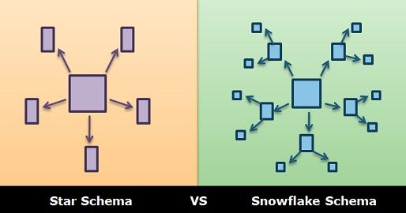

# 4일차. 아파치 하이브 데이터 적재

> 아파치 하이브를 통해 다양한 데이터 웨어하우스 예제를 실습합니다

- 범례
  * :green_book: : 기본, :blue_book: : 중급, :closed_book: : 고급

- 목차
  * [1. 최신버전 업데이트](#1-최신버전-업데이트)
  * [2. 하이브 기본명령어 가이드](#2-하이브-기본-명령어-가이드)
    - [2-1. 하이브 데이터베이스 DDL 가이드](#2-1-하이브-데이터베이스-DDL-가이드)
    - [2-2. 하이브 테이블 DDL 가이드](#2-2-하이브-테이블-DDL-가이드)
    - [2-3. 하이브 DML 가이드](#2-3-하이브-DML-가이드)
    - [2-4. 하이브 외부 저장소 테이블](#2-4-하이브-외부-저장소-테이블)
  * [3. 하이브 트러블슈팅 가이드](#3-하이브-트러블슈팅-가이드)
    - [3-1. 파티셔닝을 통한 성능 개선](#3-1-파티셔닝을-통한-성능-개선)
    - [3-2. 파일포맷 변경을 통한 성능 개선](#3-2-파일포맷-변경을-통한-성능-개선)
    - [3-3. 비정규화를 통한 성능 개선](#3-3-비정규화를-통한-성능-개선)
    - [3-4. 글로벌 정렬 회피를 통한 성능 개선](#3-4-글로벌-정렬-회피를-통한-성능-개선)
    - [3-5. 버킷팅을 통한 성능 개선](#3-5-버킷팅을-통한-성능-개선)
  * [4. 참고 자료](#참고-자료)

<br>


## 1. 최신버전 업데이트
> 원격 터미널에 접속하여 관련 코드를 최신 버전으로 내려받고, 과거에 실행된 컨테이너가 없는지 확인하고 종료합니다

### 1-1. 최신 소스를 내려 받습니다
```bash
# terminal
cd /home/ubuntu/work/data-engineer-intermediate-training/day4
docker-compose down
git pull
```
<br>

### 1-2. 현재 기동되어 있는 도커 컨테이너를 확인하고, 종료합니다

#### 1-2-1. 현재 기동된 컨테이너를 확인합니다
```bash
# terminal
docker ps -a
```
<br>


#### 1-2-2. 기동된 컨테이너가 있다면 강제 종료합니다
```bash
# terminal 
docker rm -f `docker ps -aq`
```
> 다시 `docker ps -a` 명령으로 결과가 없다면 모든 컨테이너가 종료되었다고 보시면 됩니다
<br>


#### 1-2-3. 하이브 실습을 위한 컨테이너를 기동합니다
```bash
# terminal
cd /home/ubuntu/work/data-engineer-intermediate-training/day4
docker-compose pull
docker-compose up -d
docker-compose ps
```
<br>


#### 1-2-4. 실습에 필요한 IMDB 데이터를 컨테이너로 복사합니다
```bash
# terminal
docker cp data/imdb.tsv hive-server:/opt/hive/examples/imdb.tsv
docker-compose exec hive-server ls /opt/hive/examples
```

> 마지막 ls /opt/hive/examples 명령어 결과로 imdb.tsv 파일이 확인되면 정상입니다
<br>


#### 1-2-5. 하이브 컨테이너로 접속합니다
```bash
# terminal
echo "하이브 서버가 기동 되는데에 시간이 좀 걸립니다... 30초 후에 접속합니다"
sleep 30 
docker-compose exec hive-server bash
```
<br>


#### 1-2-6. beeline 프로그램을 통해 hive 서버로 접속합니다

> 여기서 `beeline` 은 Hive (벌집)에 접속하여 SQL 명령을 수행하기 위한 커맨드라인 프로그램이며, Oracle 의 SQL\*Plus 와 같은 도구라고 보시면 됩니다

* 도커 컨테이너에서 beeline 명령을 수행하면 프롬프트가 `beeline>` 으로 변경되고, SQL 명령의 수행이 가능합니다
```bash
# docker
beeline
```
<br>


* beeline 프롬프트가 뜨면 Hive Server 에 접속하기 위해 대상 서버로 connect 명령을 수행합니다
```bash
# beeline
!connect jdbc:hive2://localhost:10000 scott tiger
```
> 아래와 같은 메시지가 뜨면 성공입니다

```bash
Connecting to jdbc:hive2://localhost:10000
Connected to: Apache Hive (version 2.3.2)
Driver: Hive JDBC (version 2.3.2)
Transaction isolation: TRANSACTION_REPEATABLE_READ
```

[목차로 돌아가기](#4일차-아파치-하이브-데이터-적재)

<br>
<br>


## 2 하이브 기본 명령어 가이드 

### 2-1 하이브 데이터베이스 DDL 가이드

#### 2-1-1. 데이터베이스 생성 - CREATE

```sql
/** Usages
    CREATE (DATABASE|SCHEMA) [IF NOT EXISTS] database_name
        [COMMENT database_comment]
        [LOCATION hdfs_path]
        [WITH DBPROPERTIES (property_name=property_value, ...)]; 
*/
```
* 테스트 데이터베이스 testdb 를 생성합니다
```sql
# beeline>
create database if not exists testdb comment 'test database'
location '/user/hive/warehouse/testdb' with dbproperties ('createdBy' = 'psyoblade');
```
<br>


#### 2-1-2. 데이터베이스 목록 출력 - SHOW

```sql
/** Usages
    SHOW (DATABASES|SCHEMAS);
*/
```

* 데이터베이스 목록 전체를 출력합니다
```sql
# beeline> 
show databases;
```
<br>


#### 2-1-3. 데이터베이스 정보를 출력합니다 - DESCRIBE

```sql
/** Usages
    DESCRIBE DATABASE/SCHEMA [EXTENDED] db_name;
*/
```
* 데이터베이스 생성 정보를 출력합니다
  - EXTENDED 키워드는 보다 상세한 정보를 출력합니다
```sql
# beeline> 
describe database testdb;
```
<br>


#### 2-1-4. 지정한 데이터베이스를 사용합니다 - USE
```sql
/** Usages
    USE database_name;
*/
```
* 위에서 생성한 testdb 를 현재 세션에서 사용하도록 선언합니다
```sql
# beeline> 
use testdb;
```
<br>


#### 2-1-5. 데이터베이스를 삭제합니다 - DROP
```sql
/** Usages
    DROP (DATABASE|SCHEMA) [IF EXISTS] database_name [RESTRICT|CASCADE];
*/
```
* 지정한 데이터베이스를 삭제하며, 테이블이 존재하는 경우 오류가 발생합니다 (default:RESTRICT)
  - CACADE 옵션을 주는 경우 포함하고 있는 모든 테이블까지 삭제됩니다
```sql
# beeline> 
drop database testdb;
show databases;
```
<br>


#### 2-1-6. 데이터베이스의 정보를 변경합니다 - ALTER
> 데이터베이스에는 크게 DBPROPERTIES 와 OWNER 속성 2가지를 가지고 있습니다

##### DBPROPERTIES 속성
* `키=값` 쌍으로 다양한 용도로 사용되는 값을 넣는 Map 같은 메타데이터 정보입니다
```sql
/** Usages
    ALTER (DATABASE|SCHEMA) database_name SET DBPROPERTIES (property_name=property_value, ...);
*/
```
* 데이터베이스 생성자 혹은 필요에 따라 원하는 메타데이터 정보를 데이터베이스 생성 시에 추가할 수 있습니다
```sql
# beeline> 
create database if not exists testdb comment 'test database' 
location '/user/hive/warehouse/testdb' with dbproperties ('createdBy' = 'psyoblade');
```
<br>

* 이미 생성된 데이터베이스는 ALTER 명령어로 수정이 가능합니다
```sql
alter database testdb set dbproperties ('createdfor'='park.suhyuk');
```
* 수정된 DBPROPERTIES 정보를 확인합니다
```sql
describe database extended testdb;
```
<br>


##### OWNER 속성
* 데이터베이스 관리를 어떤 기준(User or Role)으로 할 지를 결정합니다 
```sql
/** Usages
    ALTER (DATABASE|SCHEMA) database_name SET OWNER [USER|ROLE] user_or_role;
*/
```
* 테스트 데이터베이스 `testdb` 에 대해 `admin` 이라는 `role` 기반으로 관리하도록 설정합니다
  - 계정 단위로 관리하는 것은 번거롭고 관리 비용이 커질 수 있습니다
```sql
# beeline> 
alter database testdb set owner role admin;
```
<br>

* 수정된 OWNER 정보를 확인합니다 
```sql
describe database extended testdb;
```

[목차로 돌아가기](#4일차-아파치-하이브-데이터-적재)

<br>
<br>


### 2-2 하이브 테이블 DDL 가이드

#### 2-2-1. 테이블 생성 - CREATE

> 테이블 생성 구문에 대부분의 중요한 키워드가 포함되어 있으므로 잘 이해하고 넘어가시길 바랍니다

```sql
/** Usages
    CREATE TABLE [IF NOT EXISTS] [db_name.] table_name [(col_name data_type [COMMENT col_comment], ...)]
        [COMMENT table_comment]
        [ROW FORMAT row_format]
        [STORED AS file_format]
        [LOCATION hdfs_path];

    data_type
      : primitive_type
      | array_type
      | map_type
      | struct_type
      | union_type  -- (Note: Available in Hive 0.7.0 and later)
     
    primitive_type
      : TINYINT
      | SMALLINT
      | INT
      | BIGINT
      | BOOLEAN
      | FLOAT
      | DOUBLE
      | DOUBLE PRECISION -- (Note: Available in Hive 2.2.0 and later)
      | STRING
      | BINARY      -- (Note: Available in Hive 0.8.0 and later)
      | TIMESTAMP   -- (Note: Available in Hive 0.8.0 and later)
      | DECIMAL     -- (Note: Available in Hive 0.11.0 and later)
      | DECIMAL(precision, scale)  -- (Note: Available in Hive 0.13.0 and later)
      | DATE        -- (Note: Available in Hive 0.12.0 and later)
      | VARCHAR     -- (Note: Available in Hive 0.12.0 and later)
      | CHAR        -- (Note: Available in Hive 0.13.0 and later)

    array_type
      : ARRAY < data_type >
     
    map_type
      : MAP < primitive_type, data_type >
     
    struct_type
      : STRUCT < col_name : data_type [COMMENT col_comment], ...>
     
    union_type
       : UNIONTYPE < data_type, data_type, ... >  -- (Note: Available in Hive 0.7.0 and later)

    row_format
      : DELIMITED [FIELDS TERMINATED BY char [ESCAPED BY char]] [COLLECTION ITEMS TERMINATED BY char]
            [MAP KEYS TERMINATED BY char] [LINES TERMINATED BY char]
            [NULL DEFINED AS char]   -- (Note: Available in Hive 0.13 and later)
      | SERDE serde_name [WITH SERDEPROPERTIES (property_name=property_value, property_name=property_value, ...)]

    file_format:
      : SEQUENCEFILE
      | TEXTFILE    -- (Default, depending on hive.default.fileformat configuration)
      | RCFILE      -- (Note: Available in Hive 0.6.0 and later)
      | ORC         -- (Note: Available in Hive 0.11.0 and later)
      | PARQUET     -- (Note: Available in Hive 0.13.0 and later)
      | AVRO        -- (Note: Available in Hive 0.14.0 and later)
      | JSONFILE    -- (Note: Available in Hive 4.0.0 and later)
      | INPUTFORMAT input_format_classname OUTPUTFORMAT output_format_classname
*/
```
<br>


* 실습을 위한 고객 테이블 (employee)을 생성합니다
```sql
# beeline> 
create table if not exists employee (
    emp_id string comment 'employee id',
    emp_name string comment 'employee name', 
    emp_salary bigint comment 'employee salary'
  )
  comment 'test employee table' 
  row format delimited 
  fields terminated by ','
  stored as textfile;
```
<br>


#### 2-2-2. 테이블 목록 조회 - SHOW
```sql
/** Usages
    SHOW TABLES [IN database_name];
*/
```
* 테이블 목록을 조회합니다 
```sql
# beeline> 
show tables;
```
<br>

* 부분일치 하는 테이블 목록을 조회합니다
  - like 연산자와 유사하게 동작합니다
```sql
# beeline> 
show tables 'emp*';
```
<br>


#### 2-2-3. 테이블 정보 조회 - DESCRIBE
```sql
/** Usages
    DESCRIBE [EXTENDED|FORMATTED] [db_name.] table_name[.col_name ( [.field_name])];
*/
```
* 테이블 기본 정보를 조회 합니다
  - EXTENDED : 부가정보를 출력합니다
  - FORMATTED : 부가정보를 포맷에 맞추어 출력합니다
```sql
# beeline> 
describe employee;
```
<details><summary> :green_book: 1. [기본] EXTENDED 및 FORMATTED 명령을 통해 테이블 정보를 조회합니다 </summary>

```sql
describe extended employee;
describe formatted employee;
```

</details>
<br>


#### 2-2-4. 테이블 삭제 - DROP
```sql
/** Usages
    DROP TABLE [IF EXISTS] table_name ;
*/
```
* 테이블을 삭제합니다
```sql
# beeline> 
drop table if exists employee;
show tables;
```
<br>


#### 2-2-5. 테이블 변경 - ALTER

> 테이블 변경 구문에는 RENAME, ADD COLUMNS 등의 구문이 존재합니다

* 테이블 이름 변경 - RENAME TO
```sql
/** Usages
    ALTER TABLE table_name RENAME TO new_table_name;
*/
```
* 고객 테이블을 생성합니다
```sql
# beeline> 
create table if not exists employee (
        emp_id string comment 'employee id',
        emp_name string comment 'employee name', 
        emp_salary bigint comment 'employee salary'
    )
    comment 'test employee table' 
    row format delimited 
    fields terminated by ','
    stored as textfile;
```

<details><summary> :green_book: 2. [기본] 테이블 이름을 `employee` 에서 `renamed_emp` 로 변경합니다 </summary>

```sql
# beeline>
alter table employee rename to renamed_emp;
show tables;
```
> 변경된 테이블이름(`renamed_emp`)가 나오면 정답입니다

</details>
<br>


* 테이블 컬럼 추가 - ADD COLUMNS
```sql
/** Usages
    ALTER TABLE table_name ADD COLUMNS (column1, column2) ;
*/
```
* 고객 테이블을 생성합니다
```sql
# beeline> 
create table if not exists employee (
    emp_id string comment 'employee id',
    emp_salary bigint comment 'employee salary'
  )
  comment 'test employee table' 
  row format delimited 
  fields terminated by ','
  stored as textfile;
```

<details><summary> :green_book: 3. [기본] 코멘트 'employee name' 을 가진 고객 이름(`emp_name` string) 컬럼을 추가하세요 </summary>

```sql
alter table employee add columns (
  emp_name string comment 'employee name'
);
desc employee;
desc renamed_emp;
```
> 고객 이름이 추가되었다면 정답입니다

</details>
<br>


#### 2-2-6. 테이블 데이터 제거 - TRUNCATE

```sql
/** Usages
    TRUNCATE TABLE table_name;
*/
```
* 테이블에 임의의 데이터를 추가 후, 데이터를 조회합니다
  - 데이터 값은 자신의 이름으로 넣어도 좋습니다
```sql
# beeline> 
use testdb;
insert into renamed_emp values (1, 'suhyuk', 1000);
select * from renamed_emp;
```

<details><summary> :green_book: 4. [기본] TRUNCATE 구문으로 `renamed_emp` 테이블의 데이터를 삭제해 보세요 </summary>

```sql
# beeline>
truncate table renamed_emp;
select count(1) from renamed_emp;
```
> 결과가 0으로 나오면 정답입니다

</details>

[목차로 돌아가기](#4일차-아파치-하이브-데이터-적재)

<br>
<br>


### 2-3 하이브 DML 가이드

#### 2-3-1. LOAD

> 로컬(LOCAL) 혹은 클러스터 저장된 데이터를 하둡 클러스터에 업로드(Managed) 혹은 링크(External) 합니다

```sql
/** Usages
    LOAD DATA [LOCAL] INPATH 'filepath' [OVERWRITE] INTO TABLE tablename [PARTITION (partcol1=val1, partcol2=val2 ...)];
*/
```
* 테이블이 존재하면 제거하고, 실습을 위한 IMDB 영화(`imdb_movies`) 테이블을 생성합니다
```sql
# beeline> 
drop table if exists imdb_movies;

create table imdb_movies (
  rank int
  , title string
  , genre string
  , description string
  , director string
  , actors string
  , year string
  , runtime int
  , rating string
  , votes int
  , revenue string
  , metascore int
) row format delimited fields terminated by '\t';
```
<br>

* 생성된 테이블에 로컬에 존재하는 파일을 업로드합니다
```sql
load data local inpath '/opt/hive/examples/imdb.tsv' into table imdb_movies;
```

<details><summary> :green_book: 5. [기본] 별도 터미널을 통해 하둡 명령어로 적재된 파일을 확인해 보세요 </summary>

```bash
# terminal
docker-compose exec hive-server bash
hadoop fs -ls /user/hive/warehouse/testdb/
```
> 적재된 테이블이 출력되면 정답입니다

</details>
<br>


#### 2-3-2. 데이터 조회 - SELECT

```sql
/** Usages
    SELECT [ALL | DISTINCT] select_expr, select_expr, ...
        FROM table_reference
        [WHERE where_condition]
        [GROUP BY col_list]
        [ORDER BY col_list [ASC | DESC]]
    [LIMIT [offset,] rows]
*/
```
<br>

* 테이블에 저장된 레코드를 SQL 구문을 통해서 조회합니다
  - SELECT : 출력하고자 하는 컬럼을 선택 
  - GROUP BY : 집계 연산을 위한 컬럼을 선택
  - ORDER BY : 정렬을 위한 컬럼을 선택 (ASC: 오름차순, DESC: 내림차순)
  - LIMIT : 조회 레코드의 수를 제한
* 제목 오름차순으로 장르와 제목을 조회합니다
```sql
# beeline> 
describe formatted imdb_movies;
```
```sql
select genre, title from imdb_movies order by title asc;
```

<details><summary> :green_book: 6. [기본] 랭킹(rank) 오름차순(ASC)으로 장르(genre), 제목(title) 정보를 상위 10개만 출력하세요 </summary>

```bash
# beeline>
select rank, genre, title from imdb_movies order by rank asc limit 10;
```
> 랭킹이 1 ~ 10위가 나오면 정답입니다

</details>
<br>


#### 2-3-3. 데이터 입력 - INSERT ... FROM
* 테이블로부터 또 다른 테이블에 레코드를 저장합니다 
  - INSERT INTO 는 기본 동작이 Append 로 항상 추가됩니다
```sql
/** Usages
    INSERT INTO TABLE tablename1 [PARTITION (partcol1=val1, partcol2=val2 ...)] select_statement1 FROM from_statement;
*/
```
* 제목만 가진 `imdb_title`이라는 테이블을 생성합니다
```sql
# beeline> 
create table if not exists imdb_title (title string);
```
<br>

* INSERT ... FROM 구문을 이용하여 `imdb_movies` 테이블로부터 제목만 읽어와서 저장합니다
```sql
insert into table imdb_title select title from imdb_movies limit 5;
select title from imdb_title;
```

<details><summary> :green_book: 7. [기본] 제목(title) 오름차순으로 5건, 내림차순으로 5건 각각 `imdb_title` 테이블에 입력하세요  </summary>

```sql
insert into table imdb_title select title from imdb_movies order by title asc limit 5;
select title from imdb_title;
```
```sql
insert into table imdb_title select title from imdb_movies order by title desc limit 5;
select title from imdb_title;
```
> 15건의 결과가 나오면 정답입니다

</details>
<br>


* 테이블에 해당 데이터를 덮어씁니다
  - INSERT OVERWITE 는 기본 동작이 Delete & Insert 로 삭제후 추가됩니다
```sql
/** Usages
    INSERT OVERWRITE TABLE tablename1 [PARTITION (partcol1=val1, ..) [IF NOT EXISTS]] select_statement FROM from_statement;
*/
```
<br>

* 제목만 가진 테이블에 OVERWRITE 키워드로 입력합니다
```sql
# beeline> 
create table if not exists imdb_title (title string);
```
```sql
insert overwrite table imdb_title select description from imdb_movies;
select title from imdb_title limit 5;
```
<br>


* 임의의 데이터를 직접 입력합니다 - INSERT VALUES
```sql
/** Usages
    INSERT INTO TABLE tablename [PARTITION (partcol1[=val1], partcol2[=val2] ...)] 
        VALUES values_row [, values_row ...];
*/
```
* 여러 레코드를 괄호를 통해서 입력할 수 있습니다
```sql
# beeline> 
insert into imdb_title values ('1 my first hive table record'), ('2 my second records'), ('3 third records');
```
<br>

* like 연산을 이용하여 특정 레코드만 가져옵니다
```sql
select title from imdb_title where title like '%record%';
```

<details><summary> :green_book: 8. [기본] `imdb_movies` 테이블로부터 OVERWRITE 옵션으로 모든 제목(title)을 `imdb_title` 테이블에 입력하세요 </summary>

```sql
insert overwrite table imdb_title select title from imdb_movies;
select count(1) from imdb_title;
```
> 1000개 결과가 나오면 정답입니다

</details>
<br>


#### 2-3-4. 테이블 데이터 삭제 - DELETE
> Hive 2.3.2 버전에서 ACID-based transaction 을 지원하는 것은 Bucketed ORC 파일만 지원합니다
  * [Hive Transactions](https://cwiki.apache.org/confluence/display/Hive/Hive+Transactions) 
```sql
/** Usages
    DELETE FROM tablename [WHERE expression]
*/
```
* 트랜잭션 설정을 위한 ORC `imdb_orc` 테이블을 생성합니다 
  - 아래와 같이 ORC 수행이 가능하도록 트랜잭션 설정이 사전에 수행되어야만 합니다
```sql
# beeline> 
create table imdb_orc (rank int, title string) clustered by (rank) into 4 buckets 
  stored as orc tblproperties ('transactional'='true');
set hive.support.concurrency=true;
set hive.enforce.bucketing=true;
set hive.exec.dynamic.partition.mode=nonstrict;
set hive.txn.manager=org.apache.hadoop.hive.ql.lockmgr.DbTxnManager;
set hive.compactor.initiator.on=true;
set hive.compactor.worker.threads=1;
```
<br>

* 해당 테이블에 2개의 레코드를 아래와 같이 입력합니다
```sql
insert into table imdb_orc values (1, 'psyoblade'), (2, 'psyoblade suhyuk'), (3, 'lgde course');
```

* 제대로 설정되지 않은 경우 아래와 같은 오류를 발생시킵니다
```sql
/**
  delete from imdb_orc where rank = 1;
  Error: Error while compiling statement: FAILED: SemanticException [Error 10294]: 
  Attempt to do update or delete using transaction manager that does not support these operations. (state=42000,code=10294)
*/
```

<details><summary> :green_book: 9. [기본] WHERE 절에 랭크(rank)가 1인 레코드를 삭제 후, 조회해 보세요 </summary>

```sql
delete from imdb_orc where rank = 2;
```
```sql
select * from imdb_orc;
```

</details>
<br>


#### 2-3-5. 컬럼 값 갱신 - UPDATE

> 대상 테이블의 컬럼을 업데이트 합니다. 단, 파티셔닝 혹은 버킷팅 컬럼은 업데이트 할 수 없습니다

```sql
/** Usages
    UPDATE tablename SET column = value [, column = value ...] [WHERE expression];
*/
```
* 랭크(rank)가 1인 값의 제목을 임의의 제목으로 변경합니다
```sql
# beeline> 
update imdb_orc set title = 'modified title' where rank = 1;
```
```sql
select * from imdb_orc;
```
<br>


#### 2-3-6. 테이블 백업 - EXPORT

> 테이블 메타데이터(\_metadata)와 데이터(data) 정보를 HDFS 경로에 백업 합니다

```sql
/** Usages
    EXPORT TABLE tablename [PARTITION (part_column="value"[, ...])] TO 'export_target_path' [ FOR replication('eventid') ];
*/
```
* 테이블을 하둡의 임의의 경로에 백업합니다
```sql
# beeline> 
export table imdb_orc to '/user/ubuntu/archive/imdb_orc';
```

<details><summary> :green_book: 10. [기본] 별도의 터미널을 통해 익스포트 된 결과를 확인합니다 </summary>

```bash
# terminal
cd /home/ubuntu/work/data-engineer-intermediate-training/day4
docker-compose exec hive-server bash
```
```bash
# docker
hadoop fs -ls /user/ubuntu/archive/imdb_orc
```
```bash
# -rwxr-xr-x   3 root supergroup       1244 2020-08-23 14:17 /user/ubuntu/archive/imdb_orc/_metadata
# drwxr-xr-x   - root supergroup          0 2020-08-23 14:17 /user/ubuntu/archive/imdb_orc/data
```

</details>
<br>


#### 2-3-7. IMPORT

> 백업된 데이터로 새로운 테이블을 생성합니다

```sql
/** Usages
    IMPORT [[EXTERNAL] TABLE new_or_original_tablename [PARTITION (part_column="value"[, ...])]] 
      FROM 'source_path' [LOCATION 'import_target_path'];
*/
```
* 백업된 경로로부터 새로운 테이블을 생성합니다
```sql
# beeline> 
import table imdb_orc_imported from '/user/ubuntu/archive/imdb_orc';
```
```sql
select * from imdb_orc_imported;
```

<details><summary> :green_book: 11. [기본] `imdb_title` 테이블을 `/user/ubuntu/archive/imdb_title` 경로로 백업후, `imdb_recover` 테이블로 복원해 보세요 </summary>

```sql
export table imdb_title to '/user/ubuntu/archive/imdb_title';
```
```sql
import table imdb_recover from '/user/ubuntu/archive/imdb_title';
```
```sql
select * from imdb_recover;
```
* 아래와 유사한 결과가 나오면 정답입니다
```text
+----------------------------------------------------+
|                 imdb_recover.title                 |
+----------------------------------------------------+
| "Alexander and the Terrible, Horrible, No Good, Very Bad Day" |
| "Crazy, Stupid, Love."                             |
| "Hail, Caesar!"                                    |
| "Hello, My Name Is Doris"                          |
| "I, Daniel Blake"                                  |
| Zootopia                                           |
| Zoolander 2                                        |
| Zombieland                                         |
| Zodiac                                             |
| Zipper                                             |
+----------------------------------------------------+
```

</details>

[목차로 돌아가기](#4일차-아파치-하이브-데이터-적재)

<br>
<br>


## 2-4. 하이브 외부 저장소 테이블

> 하이브의 경우 local 데이터를 하둡에 load 하여 Managed 테이블을 생성할 수도 있지만, 대게 외부 데이터 수집 및 적재의 경우 External 테이블로 생성합니다

### 2-4-1. 매출 테이블의 외부 제공을 위해 외부 테이블로 생성합니다

> 로컬 경로에 수집되었던 테이블 parquet 파일이 존재하므로, 해당 파일을 이용하여 생성합니다


```bash
# terminal
cd /home/ubuntu/work/data-engineer-intermediate-training/day4
git pull
```

* 하이브 컨테이너로 접속합니다
```bash
# terminal
docker-compose exec hive-server bash
```
<br>

* 원본 파일의 스키마를 확인 및 파일을 하둡 클러스터에 업로드합니다
```
hadoop jar /tmp/source/parquet-tools-1.8.1.jar schema file:///tmp/source/purchase/20201025/38dc1f5b-d49d-436d-a84a-4e5c2a4022a5.parquet
```
```text
message purchase_20201025 {
  optional binary p_time (UTF8);
  optional int32 p_uid;
  optional int32 p_id;
  optional binary p_name (UTF8);
  optional int32 p_amount;
}
```
<br>

* 경로 확인 및 생성
```bash
hadoop fs -mkdir -p /user/lgde/purchase/dt=20201025
hadoop fs -mkdir -p /user/lgde/purchase/dt=20201026
```
```sql
hadoop fs -put /tmp/source/purchase/20201025/* /user/lgde/purchase/dt=20201025
hadoop fs -put /tmp/source/purchase/20201026/* /user/lgde/purchase/dt=20201026
```

* 하이브 명령 수행을 위해 beeline 을 실행합니다
```bash
beeline
```
* 콘솔로 접속하여 데이터베이스 및 테이블을 생성합니다 
```bash
# beeline>
!connect jdbc:hive2://localhost:10000 scott tiger
```
```sql
# beeline>
create database if not exists testdb comment 'test database' 
  location '/user/lgde/warehouse/testdb'
  with dbproperties ('createdBy' = 'lgde');
```
```sql
use testdb;

create external table if not exists purchase (
  p_time string
  , p_uid int
  , p_id int
  , p_name string
  , p_amount int
) partitioned by (dt string) 
row format delimited 
stored as parquet 
location 'hdfs:///user/lgde/purchase';
```
```sql
alter table purchase add if not exists partition (dt = '20201025') location 'hdfs:///user/lgde/purchase/dt=20201025';
alter table purchase add if not exists partition (dt = '20201026') location 'hdfs:///user/lgde/purchase/dt=20201026';
```
<br>


* 생성된 하이브 테이블을 조회합니다
```sql
# beeline>
show partitions purchase;
select * from purchase where dt = '20201025';
```
<br>

* 일자별 빈도를 조회합니다
```sql
# beeline>
select dt, count(1) as cnt from purchase group by dt;
```

### 2-4-2. 고객 테이블의 외부 제공을 위해 외부 테이블로 생성합니다

> 마찬가지로 유사한 방식으로 적재 및 테이블 생성을 수행합니다

* 하이브 컨테이너로 접속합니다
```bash
# terminal
docker-compose exec hive-server bash
```

* 파일 업로드 및 스키마 확인, 경로 생성 및 업로드

```bash
# docker
hadoop fs -mkdir -p /user/lgde/user/dt=20201025
hadoop fs -mkdir -p /user/lgde/user/dt=20201026
```
```sql
hadoop fs -put /tmp/source/user/20201025/* /user/lgde/user/dt=20201025
hadoop fs -put /tmp/source/user/20201026/* /user/lgde/user/dt=20201026
```
```sql
hadoop jar /tmp/source/parquet-tools-1.8.1.jar schema file:///tmp/source/user/20201025/2e3738ff-5e2b-4bec-bdf4-278fe21daa3b.parquet
```
```text
message user_20201025 {
  optional int32 u_id;
  optional binary u_name (UTF8);
  optional binary u_gender (UTF8);
  optional int32 u_signup;
}
```
<br>


* 하이브 명령 수행을 위해 beeline 을 실행합니다
```bash
beeline
```
* 하이브 테이블 생성 및 조회
```bash
# beeline>
!connect jdbc:hive2://localhost:10000 scott tiger
```
```sql
# beeline>
drop table if exists `user`;

create external table if not exists `user` (
  u_id int
  , u_name string
  , u_gender string
  , u_signup int
) partitioned by (dt string)
row format delimited 
stored as parquet 
location 'hdfs:///user/lgde/user';
```
```sql
alter table `user` add if not exists partition (dt = '20201025') location 'hdfs:///user/lgde/user/dt=20201025';
alter table `user` add if not exists partition (dt = '20201026') location 'hdfs:///user/lgde/user/dt=20201026';
```
<br>

* 생성된 결과를 확인합니다
```sql
# beeline>
select * from `user` where dt = '20201025';
```
```sql
select dt, count(1) as cnt from `user` group by dt;
```
<br>


### 2-4-3. Parquet 포맷과 Hive 테이블 데이터 타입
| Parquet | Hive | Description |
| - | - | - |
| int32 | int | 32비트 정수 |
| int64 | bigint | 64비트 정수 |
| float | float | 실수형 |
| double | double | 실수형 |
| binary | string | 문자열 |
<br>

[목차로 돌아가기](#4일차-아파치-하이브-데이터-적재)

<br>
<br>


## 3 하이브 트러블슈팅 가이드

> IMDB 영화 예제를 통해 테이블을 생성하고, 다양한 성능 개선 방법을 시도해보면서 왜 그리고 얼마나 성능에 영향을 미치는 지 파악합니다


### 3-1 파티셔닝을 통한 성능 개선

#### 3-1.1. 하이브 서버로 접속합니다

* 하이브 터미널을 통해 JDBC Client 로 하이브 서버에 접속합니다
  - 이미 접속된 세션이 있다면 그대로 사용하셔도 됩니다
```bash
# terminal
docker-compose exec hive-server bash
```
* Beeline 통해서 하이브 서버로 접속 후, testdb 를 이용합니다
```sql
# beeline> 
!connect jdbc:hive2://localhost:10000 scott tiger
use testdb;
```
<br>


#### 3-1.2. 데이터집합의 스키마를 확인하고 하이브 테이블을 생성합니다
* 데이터집합은 10년(2006 ~ 2016)의 가장 인기있는 1,000개의 영화에 대한 데이터셋입니다

| 필드명 | 설명 |
| --- | --- |
| Title | 제목 |
| Genre | 장르 |
| Description | 설명 |
| Director | 감독 |
| Actors | 배우 |
| Year | 년도 |
| Runtime | 상영시간 |
| Rating | 등급 |
| Votes | 투표 |
| Revenue | 매출 |
| Metascrore | 메타스코어 |

<br>

* 실습을 위해 `imdb_movies` 테이블을 생성합니다
```sql
# beeline> 
drop table if exists imdb_movies;

create table imdb_movies (
  rank int
  , title string
  , genre string
  , description string
  , director string
  , actors string
  , year string
  , runtime int
  , rating string
  , votes int
  , revenue string
  , metascore int
) row format delimited fields terminated by '\t';

load data local inpath '/opt/hive/examples/imdb.tsv' into table imdb_movies;
```

<details><summary> :blue_book: 12. [중급] 년도(year) 별 개봉된 영화의 수를 년도 오름차순(asc)으로 출력하세요 </summary>

```sql
select year, count(title) as movie_count from imdb_movies group by year order by year asc;
```
* 아래와 유사하게 나오면 정답입니다
```text
+-------+--------------+
| year  | movie_count  |
+-------+--------------+
| 2006  | 44           |
| 2007  | 53           |
| 2008  | 52           |
| 2009  | 51           |
| 2010  | 60           |
| 2011  | 63           |
| 2012  | 64           |
| 2013  | 91           |
| 2014  | 98           |
| 2015  | 127          |
| 2016  | 297          |
+-------+--------------+
```

</details>
<br>

* 문자열을 숫자로 캐스팅 하기위한 함수
  - `imdb_movies` 의 `revenue` 컬럼은 문자열이므로 float, double 로 형변환이 필요합니다
  - cast ( column as type ) as `new_column` 

<details><summary> :blue_book: 13. [중급] 2015년도 개봉된 영화 중에서 최고 매출 Top 3 영화 제목과 매출금액을 출력하세요 </summary>

```sql
select title, cast(revenue as float) as rev from imdb_movies where year = '2015' order by rev desc limit 3;
```
* 아래와 유사하게 나오면 정답입니다
```text
+---------------------------------------------+---------+
|                    title                    |   rev   |
+---------------------------------------------+---------+
| Star Wars: Episode VII - The Force Awakens  | 936.63  |
| Jurassic World                              | 652.18  |
| Avengers: Age of Ultron                     | 458.99  |
+---------------------------------------------+---------+
```

</details>
<br>


#### 3-1.3. 파티션 구성된 테이블을 생성합니다

> 파티션이란 데이터의 특정 컬럼 혹은 값을 기준으로, 물리적으로 다른 경로에 저장하는 기법을 말합니다. 즉, 년도 별로 다른 경로에 저장하거나, 특정 카테고리 값(동물,식물 등)으로 구분하여 저장하여 성능을 높이는 기법입니다. **주로 자주 조회되는 컬럼을 기준으로 파티셔닝 하는 것이 가장 효과적입니다** 


* 가장 일반적으로 많이 사용하는 년도를 파티션 값으로 지정하여 따로 저장합니다
  - [다이나믹 파티션은 마지막 SELECT 절 컬럼을 사용합니다](https://cwiki.apache.org/confluence/display/Hive/LanguageManual+DML#LanguageManualDML-DynamicPartitionInserts)
  - partitioned by (year string) : 경로별로 나뉘어 저장한다는 것을 선언
  - dynamic.partition=true : 데이터 값에 따라 동적으로 저장함을 지정
  - dynamic.partition.mode=nonsstrict : strict 로 지정하는 경우 실수로 overwrite 를 막기 위해 저장시에 반드시 1개 이상의 파티션을 명시해야만 수행되는 엄격한 옵션
<br>

```sql
# beeline> 
drop table if exists imdb_partitioned;

create table imdb_partitioned (
  rank int
  , title string
  , genre string
  , description string
  , director string
  , actors string
  , runtime int
  , rating string
  , votes int
  , revenue string
  , metascore int
) partitioned by (year string) row format delimited fields terminated by '\t';

set hive.exec.dynamic.partition=true;
set hive.exec.dynamic.partition.mode=nonstrict;
```
<br>

* 기존 테이블로부터 데이터를 가져와서 동적으로 파티셔닝하여 저장합니다
```sql
insert overwrite table imdb_partitioned partition (year) 
  select rank, title, genre, description, director, actors, runtime, rating, votes, revenue, metascore, year 
  from imdb_movies;
```
* 신규로 생성된 파티션 테이블을 통해 집계 연산을 수행합니다
```sql
select year, count(1) as cnt from imdb_partitioned group by year;
```
<br>

* Explain 명령을 통해서 2가지 테이블 조회 시의 차이점을 비교합니다
  - explain 명령은 실제 조회작업을 수행하지 않고 어떻게 수행할 계획을 출력하는 옵션입니다
```sql
# beeline> 
explain select year, count(1) as cnt from imdb_movies group by year;
explain select year, count(1) as cnt from imdb_partitioned group by year;
```
<br>

* **일반 테이블과, 파티셔닝 테이블의 성능을 비교합니다**
```bash
# terminal
cd /home/ubuntu/work/data-engineer-intermediate-training/day4/ex1
vimdiff agg.imdb_movies.out agg.imdb_partitioned.out
```
* 관련 링크
  * [Hive Language Manul DML](https://cwiki.apache.org/confluence/display/Hive/LanguageManual+DML#LanguageManualDML-DynamicPartitionInserts)

[목차로 돌아가기](#4일차-아파치-하이브-데이터-적재)

<br>
<br>


### 3-2 파일포맷 변경을 통한 성능 개선

> 파일포맷을 텍스트 대신 파케이 포맷으로 변경하는 방법을 익히고, 예상한 대로 결과가 나오는지 확인합니다 

#### 3-2-1. 파케이 포맷과 텍스트 파일포맷의 성능차이 비교

* 파케이 포맷 기반의 테이블을 CTAS (Create Table As Select) 통해 생성합니다 (단, CTAS 는 SELECT 절을 명시하지 않습니다)
```sql
# beeline>
drop table if exists imdb_parquet;

create table imdb_parquet row format delimited stored
    as parquet as select * 
    from imdb_movies;

select year, count(1) as cnt from imdb_parquet group by year;
```
<br>


* **파티셔닝 테이블과 파케이 포맷 테이블의 성능을 비교합니다**
```bash
# terminal
cd /home/ubuntu/work/data-engineer-intermediate-training/day4/ex1
vimdiff agg.imdb_partitioned.out agg.imdb_parquet.out
```
<br>


#### 3-2-2. 텍스트, 파티션 및 파케이 테이블의 성능차이 비교
```sql
# beeline>
explain select year, count(1) as cnt from imdb_movies group by year;
# Statistics: Num rows: 3096 Data size: 309656 Basic stats: COMPLETE Column stats: NONE

explain select year, count(1) as cnt from imdb_partitioned group by year;
# Statistics: Num rows: 1000 Data size: 302786 Basic stats: COMPLETE Column stats: NONE

explain select year, count(1) as cnt from imdb_parquet group by year;
#  Statistics: Num rows: 1000 Data size: 12000 Basic stats: COMPLETE Column stats: NONE
```
<br>


#### 3-2-3. 필요한 컬럼만 유지하는 것도 성능에 도움이 되는지 비교
* 파케이 포맷의 정렬된 테이블을 생성합니다
```sql
# beeline>
create table imdb_parquet_small stored as parquet 
  as select title, rank, metascore, year 
  from imdb_movies sort by metascore;

explain select rank, title, metascore from imdb_parquet order by metascore desc limit 10;
# Statistics: Num rows: 1000 Data size: 12000 Basic stats: COMPLETE Column stats: NONE

explain select rank, title, metascore from imdb_parquet_sorted order by metascore desc limit 10;
# Statistics: Num rows: 1000 Data size: 4000 Basic stats: COMPLETE Column stats: NONE

explain select rank, title, metascore from imdb_parquet_small order by metascore desc limit 10;
# Statistics: Num rows: 1000 Data size: 4000 Basic stats: COMPLETE Column stats: NONE
```
<br>


* **필요한 컬럼만 유지하는 경우에도 성능개선의 효과가 있는지 비교합니다**
```bash
cd /home/ubuntu/work/data-engineer-intermediate-training/day4/ex2
vimdiff sort.imdb_parquet.out sort.imdb_parquet_small.out
```

[목차로 돌아가기](#4일차-아파치-하이브-데이터-적재)

<br>
<br>


### 3-3. 비정규화를 통한 성능 개선

> 일반적으로 관계형 데이터베이스의 경우 Redundent 한 데이터 적재를 피해야만 Consistency 문제를 회피할 수 있고 변경 시에 일관된 데이터를 저장할 수 있습니다. 그래서 **PK, FK 등으로 Normalization & Denormalization 과정**을 거치면서 모델링을 하게 됩니다. 하지만 **분산 환경에서의 정규화 했을 때의 관리 비용 보다 Join 에 의한 리소스 비용이 더 큰** 경우가 많고 Join 의 문제는 Columnar Storage 나 Spark 의 도움으로 많은 부분 해소될 수 있기 때문에 ***Denormalization 을 통해 Superset 데이터를 가지는 경우***가 더 많습니다. 

> Daily Batch 작업에서 아주 큰 Dimension 데이터를 생성하고 Daily Logs 와 Join 한 모든 데이터를 가진 Fact 데이터를 생성 (User + Daily logs) 하고 이 데이터를 바탕으로 일 별 Summary 혹은 다양한 분석 지표를 생성하는 것이 효과적인 경우가 많습니다

#### 3-4-1. 분산환경의 모델링 방향
* 트랜잭션 및 Consistency 성능을 희생하여 처리량과 조회 레이턴시를 향상
* OLAP 성 데이터 분석 조회는 Join 대신 모든 필드를 하나의 테이블에 다 가진 Superset 테이블이 더 효과적입니다



[목차로 돌아가기](#4일차-아파치-하이브-데이터-적재)

<br>
<br>


### 3-4. 글로벌 정렬 회피를 통한 성능 개선

>  Order By, Group By, Distribute By, Sort By, Cluster By 실습을 통해 차이점을 이해하고 활용합니다


#### 3-4-1. 실습을 위한 employee 및 department 테이블을 생성합니다

* 컨테이너에 접속된 세션이 없다면 하이브 서버에 접속합니다
```bash
# terminal
docker-compose exec hive-server bash
```
* 중복제거 하여 `emp.uniq.txt` 파일을 생성합니다
```bash
# docker
cd /opt/hive/examples/files
cat emp.txt | sort | uniq > emp.uniq.txt
cat emp.uniq.txt
```
<br>

* 최종 결과 파일은 다음과 같습니다
```sql
/**
John|31|6
Jones|33|2
Rafferty|31|1
Robinson|34|4
Smith|34|5
Steinberg|33|3
*/
```

* Beeline 커맨드를 통해 직원 및 부서 테이블을 생성합니다
```bash
# terminal
beeline jdbc:hive2://localhost:10000 scott tiger
use testdb;
```
<br>


* 직원(employee) 테이블을 생성합니다, 데이터를 로딩합니다
```sql
# beeline>
drop table if exists employee;

create table employee (
  name string
  , dept_id int
  , seq int
) row format delimited fields terminated by '|';
```
```sql
load data local inpath '/opt/hive/examples/files/emp.uniq.txt' into table employee;
```
<br>


* 부서 테이블 정보
  - 테이블 이름 : department
  - 테이블 파일 : /opt/hive/examples/files/dept.txt
  - 테이블 스키마 : (id int, name string) 

<details><summary> :blue_book: 14. [중급] 유사한 방식으로  부서(department) 테이블을 생성하고 데이터를 로딩하세요 </summary>

```sql
drop table if exists department;

create table department (
  id int
  , name string
) row format delimited fields terminated by '|';

load data local inpath '/opt/hive/examples/files/dept.txt' into table department;
```

</details>
<br>


* 테이블 스키마 정보와 데이터를 눈으로 확인합니다
```
# beeline>
desc employee;
select * from employee;

desc department;
select * from department;
```  

<details><summary> :blue_book: 15. [중급] employee + department 정보를 가진 테이블을 조회하는 SQL문을 수행하세요 </summary>

```sql
# beeline
select e.dept_id, e.name, e.seq, d.id, d.name from employee e join department d on e.dept_id = d.id;
```
> 아래와 유사하게 나오면 정답입니다
```bash
+------------+------------+--------+-------+--------------+
| e.dept_id  |   e.name   | e.seq  | d.id  |    d.name    |
+------------+------------+--------+-------+--------------+
| 31         | John       | 6      | 31    | sales        |
| 33         | Jones      | 2      | 33    | engineering  |
| 31         | Rafferty   | 1      | 31    | sales        |
| 34         | Robinson   | 4      | 34    | clerical     |
| 34         | Smith      | 5      | 34    | clerical     |
| 33         | Steinberg  | 3      | 33    | engineering  |
+------------+------------+--------+-------+--------------+
```

</details>
<br>


* `직원 테이블 (emp_dept)` 생성
  - 테이블 이름 : `emp_dept`
  - 테이블 스키마 : (id int, seq int, name string, dept name) 

<details><summary> :blue_book: 16. [중급] CTAS 구문을 이용하여 아이디(id), 순번(seq), 이름(name), 부서(dept) 를 가진 테이블을 생성하세요 </summary>

```sql
create table emp_dept as select e.dept_id as dept_id, e.seq as seq, e.name as name, d.name as dept 
    from employee e join department d on e.dept_id = d.id;

desc emp_dept;
```
* 아래와 유사하게 나오면 정답입니다
```bash
+-----------+------------+----------+
| col_name  | data_type  | comment  |
+-----------+------------+----------+
| dept_id   | int        |          |
| seq       | int        |          |
| name      | string     |          |
| dept      | string     |          |
+-----------+------------+----------+
```

</details>
<br>


#### 3-4-2. Order By
```sql
# beeline>
select * from employee order by dept_id;
```
##### Order By : 모든 데이터가 해당 키에 대해 정렬됨을 보장합니다
```bash
+----------------+-------------------+---------------+
| employee.name  | employee.dept_id  | employee.seq  |
+----------------+-------------------+---------------+
| Rafferty       | 31                | 1             |
| John           | 31                | 6             |
| Steinberg      | 33                | 3             |
| Jones          | 33                | 2             |
| Smith          | 34                | 5             |
| Robinson       | 34                | 4             |
+----------------+-------------------+---------------+
```
<br>


#### 3-4-3. Group By
```sql
# beeline>
select dept_id, count(*) from employee group by dept_id;
```
##### Group By : 군집 후 집계함수를 사용할 수 있습니다
```bash
+----------+------+
| dept_id  | _c1  |
+----------+------+
| 31       | 2    |
| 33       | 2    |
| 34       | 2    |
+----------+------+
```
<br>


#### 3-4-4. Sort By
```sql
# beeline>
set mapred.reduce.task = 2;
select * from employee sort by dept_id desc;
```
##### Sort By : 해당 파티션 내에서만 정렬을 보장합니다
* mapred.reduce.task = 2 라면 2개의 개별 파티션 내에서만 정렬됩니다
```bash
+----------------+-------------------+---------------+
| employee.name  | employee.dept_id  | employee.seq  |
+----------------+-------------------+---------------+
| Smith          | 34                | 5             |
| Robinson       | 34                | 4             |
| Steinberg      | 33                | 3             |
| Jones          | 33                | 2             |
| Rafferty       | 31                | 1             |
| John           | 31                | 6             |
+----------------+-------------------+---------------+
```
<br>


#### 3-4-5. Distribute By
```sql
# beeline>
select * from employee distribute by dept_id;
```
##### Distribute By : 단순히 해당 파티션 별로 구분되어 실행됨을 보장합니다 - 정렬을 보장하지 않습니다.
```bash
+----------------+-------------------+---------------+
| employee.name  | employee.dept_id  | employee.seq  |
+----------------+-------------------+---------------+
| Steinberg      | 33                | 3             |
| Smith          | 34                | 5             |
| Robinson       | 34                | 4             |
| Rafferty       | 31                | 1             |
| Jones          | 33                | 2             |
| John           | 31                | 6             |
+----------------+-------------------+---------------+
```
<br>


#### 3-4-6. Distribute By + Sort By
```sql
# beeline>
select * from employee distribute by dept_id sort by dept_id asc, seq desc;
```
##### Distribute By Sort By : 파티션과 해당 필드에 대해 모두 정렬을 보장합니다
```bash
+----------------+-------------------+---------------+
| employee.name  | employee.dept_id  | employee.seq  |
+----------------+-------------------+---------------+
| John           | 31                | 6             |
| Rafferty       | 31                | 1             |
| Steinberg      | 33                | 3             |
| Jones          | 33                | 2             |
| Smith          | 34                | 5             |
| Robinson       | 34                | 4             |
+----------------+-------------------+---------------+
```

#### 3-4-7. Cluster By
```sql
# beeline>
select * from employee cluster by dept_id;
```
##### Cluster By : 파티션 정렬만 보장합니다 - 특정필드의 정렬이 필요하면 Distribute By Sort By 를 사용해야 합니다
```bash
+----------------+-------------------+---------------+
| employee.name  | employee.dept_id  | employee.seq  |
+----------------+-------------------+---------------+
| Rafferty       | 31                | 1             |
| John           | 31                | 6             |
| Steinberg      | 33                | 3             |
| Jones          | 33                | 2             |
| Smith          | 34                | 5             |
| Robinson       | 34                | 4             |
+----------------+-------------------+---------------+
```
<br>


#### 3-4-7. Global Top One

> 레코드 수가 하나의 장비에서 정렬하기 어려울 만큼 충분히 많은 경우 Global Order 대신 어떤 방법을 쓸 수 있을까?

* Differences between rank and `row_number` : rank 는 tiebreak 시에 같은 등수를 매기고 다음 등수가 없으나 `row_number` 는 아님
```sql
# beeline>
select * from (
    select name, dept_id, seq, rank() over (
        partition by dept_id order by seq desc
    ) as rank from employee 
) t where rank < 2;
```

* 클러스터 별 상위 1명을 출력합니다
```
+------------+------------+--------+---------+
|   t.name   | t.dept_id  | t.seq  | t.rank  |
+------------+------------+--------+---------+
| John       | 31         | 6      | 1       |
| Steinberg  | 33         | 3      | 1       |
| Smith      | 34         | 5      | 1       |
+------------+------------+--------+---------+
```

[목차로 돌아가기](#4일차-아파치-하이브-데이터-적재)

<br>
<br>


### 3-5 버킷팅을 통한 성능 개선

> 버킷팅을 통해 생성된 테이블의 조회 성능이 일반 파케이 테이블과 얼마나 성능에 차이가 나는지 비교해봅니다


#### 3-5-1. 파티션과 버킷을 모두 사용하여 테이블을 생성합니다

* 파케이 테이블의 생성시에 버킷을 통한 인덱스를 추가해서 성능을 비교해 봅니다
  -  단, CTAS 에서는 partition 혹은 clustered 를 지원하지 않습니다
```sql
# beeline>
create table imdb_parquet_bucketed (
    rank int
  , title string
  , genre string
  , description string
  , director string
  , actors string
  , runtime int
  , rating string
  , votes int
  , revenue string
  , metascore int
) partitioned by (year string) 
clustered by (rank) sorted by (metascore) into 10 buckets 
row format delimited 
fields terminated by ',' stored as parquet;
set hive.exec.dynamic.partition=true;
set hive.exec.dynamic.partition.mode=nonstrict;
```
<br>


* 프로그래밍을 하면 더  좋지만, 현재는 수작업으로 직접 넣어주겠습니다 
```
insert overwrite table imdb_parquet_bucketed partition(year='2006') 
    select rank, title, genre, description, director, actors, runtime, rating, votes, revenue, metascore 
    from imdb_movies where year = '2006';

insert overwrite table imdb_parquet_bucketed partition(year='2007') 
    select rank, title, genre, description, director, actors, runtime, rating, votes, revenue, metascore 
    from imdb_movies where year = '2007';

insert overwrite table imdb_parquet_bucketed partition(year='2008') 
    select rank, title, genre, description, director, actors, runtime, rating, votes, revenue, metascore 
    from imdb_movies where year = '2008';

insert overwrite table imdb_parquet_bucketed partition(year='2009') 
    select rank, title, genre, description, director, actors, runtime, rating, votes, revenue, metascore 
    from imdb_movies where year = '2009';

insert overwrite table imdb_parquet_bucketed partition(year='2010') 
    select rank, title, genre, description, director, actors, runtime, rating, votes, revenue, metascore 
    from imdb_movies where year = '2010';

insert overwrite table imdb_parquet_bucketed partition(year='2011') 
    select rank, title, genre, description, director, actors, runtime, rating, votes, revenue, metascore 
    from imdb_movies where year = '2011';

insert overwrite table imdb_parquet_bucketed partition(year='2012') 
    select rank, title, genre, description, director, actors, runtime, rating, votes, revenue, metascore 
    from imdb_movies where year = '2012';

insert overwrite table imdb_parquet_bucketed partition(year='2013') 
    select rank, title, genre, description, director, actors, runtime, rating, votes, revenue, metascore 
    from imdb_movies where year = '2013';

insert overwrite table imdb_parquet_bucketed partition(year='2014') 
    select rank, title, genre, description, director, actors, runtime, rating, votes, revenue, metascore 
    from imdb_movies where year = '2014';

insert overwrite table imdb_parquet_bucketed partition(year='2015') 
    select rank, title, genre, description, director, actors, runtime, rating, votes, revenue, metascore 
    from imdb_movies where year = '2015';

insert overwrite table imdb_parquet_bucketed partition(year='2016') 
    select rank, title, genre, description, director, actors, runtime, rating, votes, revenue, metascore 
    from imdb_movies where year = '2016';
```
<br>


* 생성된 파케이 테이블이 정상적으로 버킷이 생성되었는지 확인합니다
```sql
# beeline>
desc formatted imdb_parquet_bucketed;
```
* 버킷 컬럼과, 정렬 컬럼을 확인합니다
```bash
...
| Num Buckets:                  | 10                                                 | NULL                        |
| Bucket Columns:               | [rank]                                             | NULL                        |
| Sort Columns:                 | [Order(col:metascore, order:1)]                    | NULL                        |
...
```

* 일반 파케이 테이블과 버킷이 생성된 테이블의 스캔 성능을 비교해봅니다

> TableScan 텍스트 대비 레코드 수에서는 2% (44/1488 Rows)만 읽어오며, 데이터 크기 수준에서는 약 0.1% (484/309,656 Bytes)만 읽어오는 것으로 성능 향상이 있습니다

```sql
# beeline>
explain select rank, metascore, title from imdb_movies where year = '2006' and rank < 101 order by metascore desc;
# Statistics: Num rows: 1488 Data size: 309656 Basic stats: COMPLETE Column stats: NONE

explain select rank, metascore, title from imdb_parquet where year = '2006' and rank < 101 order by metascore desc;
# Statistics: Num rows: 1000 Data size: 12000 Basic stats: COMPLETE Column stats: NONE

explain select rank, metascore, title from imdb_parquet_bucketed where year = '2006' and rank < 101 order by metascore desc;
# Statistics: Num rows: 44 Data size: 484 Basic stats: COMPLETE Column stats: NONE
```

[목차로 돌아가기](#4일차-아파치-하이브-데이터-적재)

<br>
<br>


### 참고 자료
  * [Hive Language Manual DDL](https://cwiki.apache.org/confluence/display/Hive/LanguageManual+DDL)
  * [Hive Language Manual DML](https://cwiki.apache.org/confluence/display/Hive/LanguageManual+DML)
  * [Top 7 Hive DDL Commands](https://data-flair.training/blogs/hive-ddl-commands/)
  * [Top 7 Hive DML Commands](https://data-flair.training/blogs/hive-dml-commands/)
  * [IMDB data from 2006 to 2016](https://www.kaggle.com/PromptCloudHQ/imdb-data)
  * [Hive update, delete ERROR](https://community.cloudera.com/t5/Support-Questions/Hive-update-delete-and-insert-ERROR-in-cdh-5-4-2/td-p/29485)


[목차로 돌아가기](#4일차-아파치-하이브-데이터-적재)

<br>
