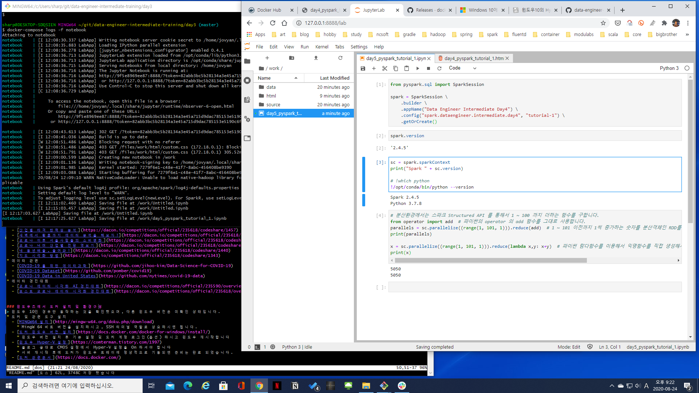

# 7일차. 샌드박스 환경에서 데이터 가공 및 시각화 실습
> 조별 프로젝트를 진행하기에 앞서 스파크를 통해 데이터 가공 및 시각화에 이르는 실습을 통해 내가 집중해서 진행해야 할 파트를 검토하고, 보다 집중해서 진행하고 싶은 프로젝트의 방향을 정하기 위한 실습입니다


## 스파크 실습을 위한 도커 컨테이너를 기동합니다
* 최신 소스를 내려 받습니다
```bash
cd /home/ubuntu/work/data-engineer-intermediate-training
git pull
```
* 스파크 워크스페이스로 이동하여 도커를 기동합니다
```bash
cd /home/ubuntu/work/data-engineer-intermediate-training/day7
docker-compose up -d
docker-compose logs -f notebook
```
* 출력되는 로그 가운데 마지막에 URL 이 출력되는데 해당 URL에서 127.0.0.1 값을 student#.lgebigdata.com 으로 변경하여 접속합니다
  * http://student#.lgebigdata.com:8888/?token=d508d3a860cbc00c1095b078f9f7bd755a3b3f95f715692e
  * 접속하면 jupyter notebook lab 이 열리고 work 폴더가 보이면 정상 기동 된 것입니다
* 프로젝트 실습을 위한 샌드박스 환경의 노트북을 엽니다
  * work/day6\_visualization.ipynb


## 대용량 데이터 다운로드
* 아래의 파일을 주피터 노트북 data 경로에 다운로드 합니다
```bash
cd /home/ubuntu/work/data-engineer-intermediate-training/day7
./download-lgebigdata.sh
```


## 참고자료
* 시각화 예제
  - [포스트 코로나 소비와 흥미의 변화는?](https://dacon.io/competitions/official/235618/codeshare/1419)
  - [산업별 타격 탄력성 분석](https://dacon.io/competitions/official/235618/codeshare/1457)
  - [새벽에서 황혼까지 데이터 분석을 해보자!](https://dacon.io/competitions/official/235618/codeshare/1430)
  - [코로나 이후 서울사람들의 소비변화](https://dacon.io/competitions/official/235618/codeshare/1437)
  - [코로나 너머 산업별 전망 엿보기](https://dacon.io/competitions/official/235618/codeshare/1399)
  - [내 동년배들, 들어와!](https://dacon.io/competitions/official/235618/codeshare/1440)
  - [지도 시각화 방법](https://dacon.io/competitions/official/235618/codeshare/1343)
* 데이터 관련
  - [COVID-19 를 위한 데이터과학](https://github.com/jihoo-kim/Data-Science-for-COVID-19)
  - [COVID-19 Dataset](https://github.com/pomber/covid19)
  - [COVID-19 Data in United States](https://github.com/nytimes/covid-19-data)
* 데이터 경진대회
  - [코로나 데이터 시각화 AI 경진대회](https://dacon.io/competitions/official/235590/overview/)
  - [포스트 코로나 데이터 시각화 경진대회](https://dacon.io/competitions/official/235618/overview/)


### 윈도우즈에서 도커 설치 및 환경구성
> 윈도우 10인 경우만 동작하는 것을 확인했으며, 다른 윈도우 버전은 미확인 상태입니다.
* 도커 및 관련 도구 설치 
  - [MINGW64 설치](http://mingw-w64.org/doku.php/download)
    * MingW 64 비트 버전을 설치하시고, SSH 터미널 역할로 사용하시면 됩니다.
  - [도커 윈도우 버전 설치](https://docs.docker.com/docker-for-windows/install/)
    * 윈도우 버전 설치 후 기본 설정 및 도커 계정 로그인(옵션) 하시고 윈도우 재시작합니다 
  - [윈도우 Hyper-V 설정](https://comterman.tistory.com/1997)
    * 블로그 글대로 CMOS 설정에서 Hyper-V 설정을 On 하셔야 합니다 
    * 서버 재시작 후에 도커가 윈도우 트레이에 정상적으로 기동되면 준비는 완료 되었습니다.
  - [도커 관련문서](https://docs.docker.com/)
 


